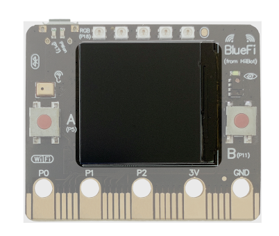

====================
1.1 显示屏
====================

在BlueFi上，最为显眼的就是位于BlueFi正面的LCD屏（如图1）。它是BlueFi上最主要的信息输出设备，通过显示图形或文字的形式来与外界进行信息的交互。

图1  BlueFi  LCD屏

BlueFi上使用的LCD屏的分辨率为240*240，与microbit的5*5点阵屏相比，LCD屏可以显示更为复杂的信息。从LCD屏的使用角度来看，它的主要功能是显示图形以及文字信息。

在后续的编程学习中，我们会逐渐接触到LCD屏的各种使用方式。

通过文本显示功能，我们可以获取传感器数值；使用图形绘制功能制作数据图表；利用画笔工具在LCD屏上自由绘画等。