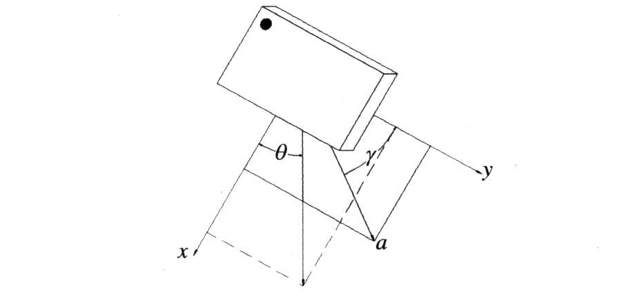
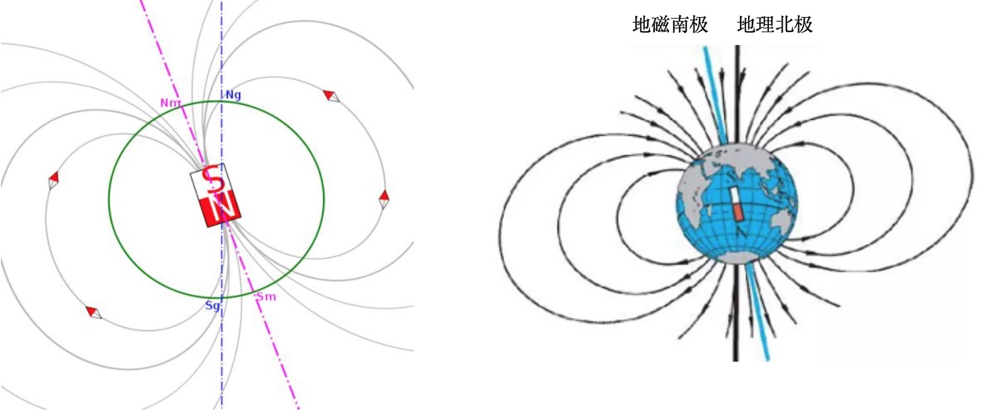

====================
1.2 输入
====================

按钮A(B)
===============

在LCD屏的两侧是两个按钮A、B(见图1-2)，它们是BlueFi上最为基本的输入装置，可以对它们进行编程来控制程序。
例如按下按钮后发送信息到LCD屏上、用按钮来控制LED灯的亮灭等。

按钮A、B与我们日常生活中见到的灯的开关不同，它只有在按下时状态为“on”，松开后状态则变为“off”，被称为瞬时开关。
我们可以想象有一个电路，它由开关、电源和用电器串联组成，开关处于常开状态。当我们按下按钮A(B)，就相当于令开关闭合，用电器开始工作；
松开按钮A(B)后，开关恢复断开状态，用电器停止工作。

触摸盘
===========

在控制的器件或程序进程状态多的情况下，我们需要更多的按钮来帮助我们实现程序功能，这时我们就可以用触摸盘(见图1-2)来增加按钮数量。
在BlueFi上，总共有3个触摸输入(P0、P1、P2)，它们的功能与瞬时开关类似，触摸时状态为“on”，放开后状态为“off”。

这些触摸盘不仅能感知你触摸他们，还允许你使用鳄鱼夹电线将触摸盘与某些导体或相当于导体的材料相连接，
如锡箔纸、导电不干胶、水果、蔬菜、盛有水的杯子等，用手触摸这些导体或材料时，等同于触摸到BlueFi的触摸盘。

.. image:: ../_static/images/c1/正面输入.png
  :scale: 30%
  :align: center

图1-2  BlueFi正面输入元件

在BlueFi的正反两个面上，布置着各种传感元件，它们起着与人体的感觉器官类似的功能，用来获取外界以及自身的信息。

位于正面的传感器有麦克风和光学传感器(见图1-2)。

麦克风
==========

麦克风是收集外部声音的传感器，起到“耳朵”的作用，它可以得到外部声音的分贝大小。闻声而亮的楼道灯就是用到了麦克风的功能来控制灯的亮灭。
标准的桌面计算机内置声音的输入和输出设备，此类音频接口俗称声卡，将耳机或音箱音频线插入声卡后我们能听到声音，
将麦克风音频线插入声卡后可以使用计算机录音。

光学传感器
=============

光学传感器上集成了多种功能，它可以识别三原色、获取光的亮度、感知接近度以及识别手势，就如同人眼一样。人眼对事物颜色的视觉反应取决于环境光，
以及事物对光谱成分有选择性地吸收、透射和反射特性，模拟人眼的机器视觉传感器都遵循这一科学原理。

BlueFi的集成光学传感器使用红外光谱进行接近度识别和手势识别，这个工作模式下仅仅对红外光敏感，如果你用极少红外光成分的手机照明灯、
手电筒等发出的强光照射BlueFi的集成光学传感器，但你会发现这些强光几乎不会干扰识别结果！但由于太阳光有较强的红外光成分，
在强太阳光照射下，BlueFi的集成光学传感器几乎无法正确地工作。

由于颜色和环境光照的光线强度具有强相关性，BlueFi的集成光学传感器也能测量环境光亮度。
BlueFi的集成光学传感器能够给出4个通道的可见光数据：R、G、B和C，前三个通道的数据分别是三基色分量，C则是光亮度分量。

在了解了集成光学传感器的各个功能后，我们可以将它用于各种实际的场景中。如识别垃圾桶的颜色投放相应的垃圾、根据当前光亮度自动调节屏幕亮度等。

.. image:: ../_static/images/c1/背面输入.png
  :scale: 30%
  :align: center

图1-3  BlueFi背面输入元件

位于BlueFi背面的传感器有运动传感器、地磁传感器和环境温湿度传感器(见图1-3)。

运动传感器
===========

运动传感器内置有3轴加速度传感器以及3轴陀螺仪，用来获取BlueFi当前的运动姿态。

加速度传感器是惯性导航装置中最重要的一个组件，这是一种利于地球重力场的物理特性的传感器，并组合敏感元件、特殊设计的机械结构。
由于加速度传感器是基于地球重力场的物理特性设计制作的，因此无法用于地外太空领域。

今天的惯性测量装置几乎是所有飞行器的关键元件，没有这些元件我们的飞机无法准确地抵达目的地，无人机无法稳定停留在空中帮你拍照。
加速度计使用近地空间不变的重力场方向和重力常数(g)，借助于压电效应、容变、热变等敏感元件、特定机械结构和测量电路，
根据牛顿第三定律当物体姿态发生改变时的加速度变化对传感器内部的质量块/热气腔产生反作用力，
敏感元件和测量电路能够精确地测量力的大小，从而得到加速度的变化。

根据加速度计的设计，加速度计分为动态型和动静态型两类。采用压电效应的加速度传感器只能感知加速度的“动态”变化，
无法感知确定静态时的物体姿态，此类传感器必须借助于姿态估算算法和动态加速度变化信息来确定物体的当前姿态；
采用容变和热变的加速度传感器， 特殊的机械结构、敏感元件和测量电路设计使得他们不仅能感知加速度的动态变化，还能测量静态的姿态。
基于中学的物理知识(力的分量和合成)，结合下图我们就能想象得出加速度计的基本原理：

图1-4  加速度分解图

上图展示的是平面内加速度的分解。BlueFi采用的是3维动静态型加速度计，即使在静止状态，BlueFi的加速度传感器也能给出自己的准确姿势。

尽管通过加速度传感器获取BlueFi的姿态非常准确方便，但当BlueFi不是绕水平轴旋转，而是平躺在水平面上绕竖直方向旋转来改变姿态时，
加速度传感器的数据几乎不变！换句话说，加速度传感器并不能告诉我们，BlueFi的金手指朝向那个方向。同理，飞机在飞行过程中该如何确定
自身的飞行方向呢？需要借助陀螺仪。

当我们玩指尖陀螺时，会发现一旦让陀螺旋转起来，无论手势如何变化，陀螺的旋转轴向保持不变。人们在19世纪末就发现了陀螺轴向不变的现象，
今天我们知道这是向心力的作用。陀螺仪正是利用这一特性，能够测量出当物体的姿态或运动发生变化时的角速度。

地磁传感器
============

地磁传感器是用测量地球磁场极性的方法来确定物体水平方向(与地面垂直的方向)上的朝向。四大发明之一的指南针就是用到了地球磁场的原理制作的。
由于地磁南北极与地理上的南北极正好相反，因此，指南针的北极被地磁上的南极吸引，使它指向地理上的北极。
由于指南针的磁极指向始终保持不变，这样就可以帮助我们确定一个固定的方向。指南针的诞生对大航海时代的发展起到积极推进作用，
那个时代在海上行船全靠指南针(罗盘)和北斗星的指引，他们都具有始终不变的方向。

今天的我们知道地球磁场并不稳定，它是在不断移动的，在地球历史上曾多次发生过磁极反转，上一次的磁极反转发生于七十万年前。如下图所示，
两对极点(地磁极点与地理极点)连线之间存在夹角。

图1-5  地球磁场

环境温湿度传感器
==================

温度传感器是指能感受温度并转换成可用输出信号的传感器。按测量方式可分为接触式和非接触式两大类，
按照传感器材料及电子元件特性分为热电阻和热电偶两类。

湿度传感器是指能将湿度量转换成容易被测量处理的电信号的装置。湿度传感器作为湿敏元件，主要分为电阻式与电容式两种。

环境温湿度传感器的功能是用来获取当前环境的温湿度数值。在得到温湿度数值后，我们可以根据实际场景(如温室大棚)设置阈值，
实现报警提醒功能。

CPU温度传感器
=================

CPU温度传感器位于BlueFi的内部，用于测量CPU芯片的温度。

你的电脑电风扇是自动开启和关闭的，计算机系统根据CPU芯片、计算机主板的温度自动控制其风扇的开关。为什么CPU需要风扇来散热？
事实上，所有电子元件在工作时都会发热，只是大多数电子元件的发热量非常小，几乎被我们忽略，因为他们发热的量小于环境散热量，
他们所产生 的热量不会积累而不会出现高温。引起电子元件发热的主要因素是他的工作电流和内阻，根据焦耳热定律，
电子元件产生的热量与内阻成正比，与电流的平方成正比。因此所有大功率电子元件都会产生很大的热量。
现代高性能处理器由于工作速度很高需要消耗较大电流，自然会产生很多热量，如果不能即使散热让产生的热量积累起来，
将使芯片的温度越来越高，当温度超过芯片能承受的最大温度时，其内部电子单元会被热击穿而损坏。
反过来，低功耗的CPU，意味着工作速度比较低，产生的热量很少，无需风扇。

BlueFi使用的是低功耗的32位处理器，主时钟速度仅仅64MHz，与仅仅是桌面计算机CPU速度的2~5%，所以工作电流极小，
处理一般性的I/O控制事物，BlueFi的主CPU几乎不发热，或者更准确地说其发热量小于环境对其散热量。
