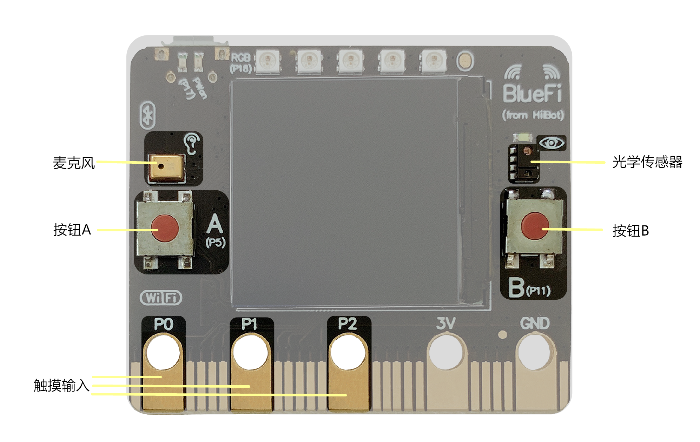
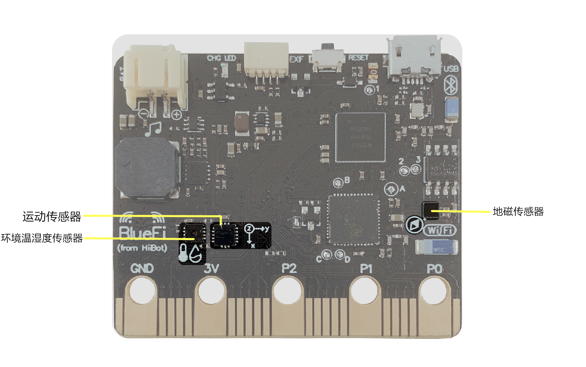

====================
1.2 输入
====================

在LCD屏的两侧是两个按钮A、B(见图1-2)，它们是BlueFi上最为基本的输入装置，可以对它们进行编程来控制程序。例如按下按钮后发送信息到LCD屏上，用按钮来控制LED灯的亮灭等。

按钮A、B与我们日常生活中见到的灯的开关不同，它只有在按下时状态为“on”，松开后状态则变为“off”，被称为瞬时开关。

在某些情况下，我们需要更多的按钮来控制程序的进程，这时我们就要用到触摸按键(如图1-2)。在BlueFi上，总共有3个触摸输入按键(P0、P1、P2)，它们的功能与瞬时开关类似，触摸时状态为“on”，放开后状态为“off”。

通过使用触摸按键，我们还可以实现“水果钢琴”这一有趣的实例。只需使用鳄鱼夹将P0(P1、P2)与水果连接在一起，就可以通过触摸水果达到与触摸P0(P1、P2)相同的效果。

图1-2  BlueFi正面输入元件

在BlueFi的正反两个面上，布置着各种传感元件，它们起着与人体的感觉器官类似的功能，用来获取外界以及自身的信息。

位于正面的传感器有麦克风和光学传感器(见图1-2)。

麦克风是收集外部声音的传感器，起到耳朵的作用，它可以得到外部声音的分贝大小。闻声而亮的楼道灯就是用到了麦克风的功能来控制灯的亮灭。

光学传感器上集成了多种功能，它可以识别三原色、获取光的亮度、感知接近度以及识别手势。由于其强大的功能，我们可以将它用于各种实际的场景中。如识别垃圾桶的颜色投放相应的垃圾、根据当前光亮度自动调节屏幕亮度等。

图1-3  BlueFi背面输入元件

位于BlueFi背面的传感器有运动传感器、环境温湿度传感器和地磁传感器(见图1-3)。

运动传感器内置有3轴加速度传感器以及3轴陀螺仪，用来获取BlueFi当前的运动姿态。通过加速度传感器，可以得到BlueFi在x、y、z三个轴上的加速度数值，静止平放于桌面时，只存在一个z轴方向上的重力加速度。通过陀螺仪，可以得到BlueFi绕着x、y、z三个轴旋转时的角加速度，静止时，三个数值都为零。我们日常生活中常用的计步功能就可以通过运动传感器来实现。

环境温湿度传感器的功能是用来获取当前环境的温湿度数值。在得到温湿度数值后，我们可以根据实际场景(如温室大棚)设置阈值，实现报警提醒功能。

地磁传感器是用测量地球磁场的方法来确定物体水平方向(与地面垂直的方向)上的朝向。四大发明之一的指南针就是用到了地磁的原理制作的。

