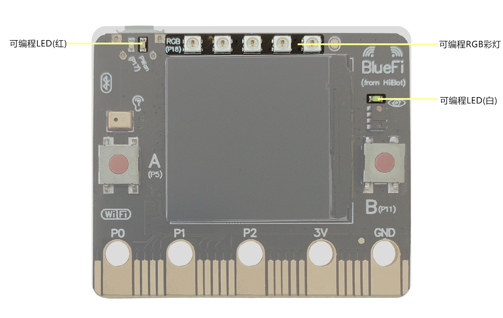
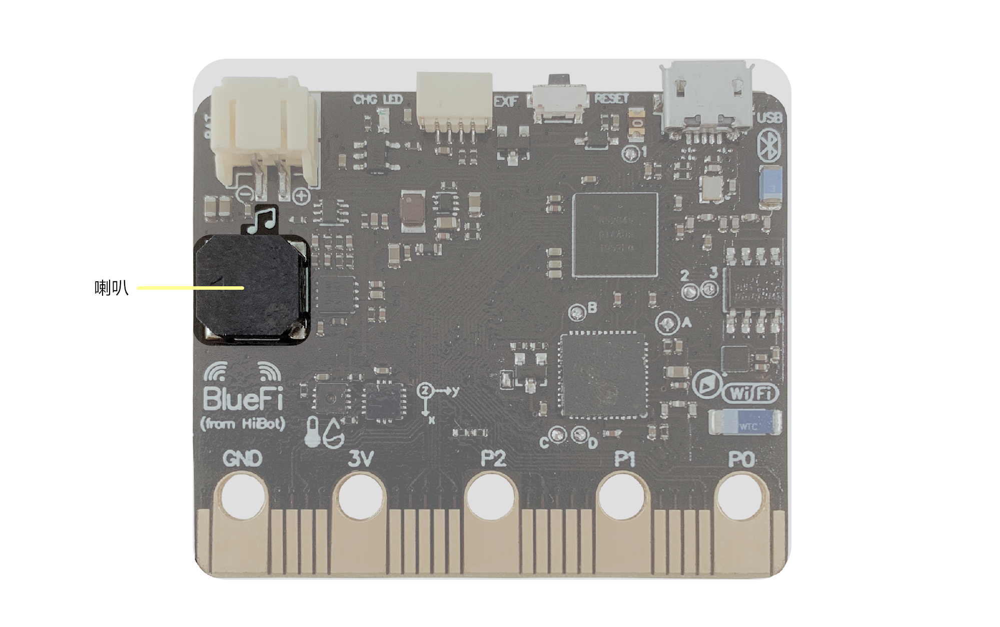

====================
1.3 输出
====================

输入是为了获取外界的信息，而输出则是对外界进行信息的反馈。输入和输出共同组成了完整的信息交互过程。

与“输入”章节相同，我们依次对BlueFi的正反两面上的输出元件进行介绍。

图1-5  BlueFi正面输出元件

在BlueFi的正面上(见图1-4)，位于LCD屏周围的是最简单的输出元件LED灯(红、白)，它用闪灯的方式简单直白地进行信息反馈。

LED灯除了可用于检验程序是否正常运行之外，还可用PWM信号控制，制作呼吸灯。

位于LCE屏正上方的是5颗可编程RGB灯珠，与LED灯的单一颜色不同的是，RGB灯珠支持RGB自由调色，总共有24位色可以选择。
通过改变RGB灯珠的颜色以及持续时间，可以轻松地实现各种灯光效果。

图1-6  BlueFi背面输出元件

除了正面的视觉输出外，还有位于BlueFi背面的喇叭(见图1-5)作为声音输出装置。

喇叭在整个BlueFi的背面占据了较大的一部份区域，它的作用就相当于是人的声带，用来发声。

BlueFi的喇叭支持输出音调可调，通过调节midi号和节拍，我们可以自制旋律。音乐文件也同样可以放到BlueFi上进行播放，
但要注意音乐文件的大小不能大于1.5MB，否则会将BlueFi的磁盘塞满。

配合之前介绍过的触摸按键，我们可以制作“水果钢琴”；音乐文件的播放可以选用“欢迎光临”、“谢谢惠顾”等简单的语句，
用于相应的实际场景。
