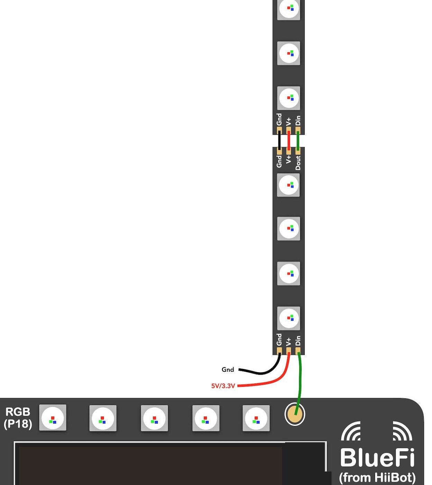
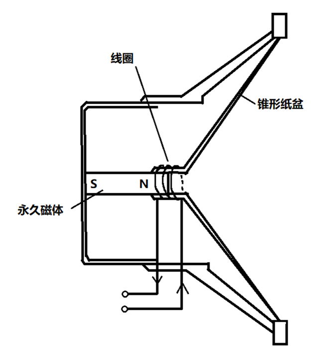

====================
1.3 输出
====================

输入是为了获取外界的信息，而输出则是对外界进行信息的反馈。输入和输出共同组成了完整的信息交互过程。

与“输入”章节相同，我们依次对BlueFi的正反两面上除了LCD屏(见1.1小节)的输出元件进行介绍。

.. image:: ../_static/images/c1/正面输出.png
  :scale: 30%
  :align: center

图1-6  BlueFi正面输出元件

LED灯(红、白)
================

在BlueFi的正面(见图1-6)，位于LCD屏周围的是最简单的输出元件LED灯(红、白)，它是最基本的信息反馈方式。

最初LED用作仪器仪表的指示光源，后来各种光色的LED在交通信号灯和大面积显示屏中得到了广泛应用，产生了很好的经济效益和社会效益。
以红色交通信号灯为例，以白炽灯作为光源时，要将白光转化为红光，需经过红色的滤光片，在这个过程中，光能将损失90%，只剩下10%光能的红光。
而LED灯可以方便地通过化学修饰方法，调整材料的能带结构和带隙，实现红黄绿兰橙等多色发光，无需经过滤光片，因此可以用更低的能耗实现相同的
光照效果。

汽车信号灯也是LED光源应用的重要领域。1987年，我国开始在汽车上安装高位刹车灯，由于LED响应速度快(纳秒级)，
可以及早让尾随车辆的司机知道行驶状况，减少汽车追尾事故的发生。

在BlueFi上，我们通常使用LED灯来检验程序是否正常运行。

RGB灯珠
================

位于LCD屏正上方的是5颗可编程RGB灯珠。RGB灯的成像原理是以光学三原色共同交集成像，光学三原色指的是红(R)、绿(G)、蓝(B)，
为什么命名这三种颜色为光学三原色呢？主要原因是人眼对这三种颜色的光的波长最敏感，且大多数颜色可以通过红、绿、蓝三色按照
不同的比例合成产生。同样，绝大多数单色光也可以分解成红、绿、蓝三种色光，这是色度学的最基本的原理，也称为三原色原理。

根据三原色原理，我们只需要把要传送的各种彩色分解成红、绿、蓝三个基色，然后再将它们变成三种电信号进行传送。在接收端用这三种信号分别控制
红、绿、蓝三色光的彩色显象管，就能实现彩色图像。彩色电视就是基于这一原理用电信号来传送彩色图像。

在日常生活中，RGB彩灯由于其可随意调色的特点，它的用法比LED灯更为多样，展现的效果更为吸引人。但在照明方面，
RGB彩灯的光通量、使用寿命等方面不如LED灯，因此，RGB彩灯主要用于装饰、灯光效果等方面。

BlueFi上的5颗RGB灯珠支持通过编程对RGB自由调色，总共有24位色可供选择。通过改变RGB灯珠的颜色以及持续时间，
可以轻松地实现各种灯光效果。

如果在使用RGB灯珠时，觉得5颗灯珠数量不足，BlueFi还支持自行串联RGB灯带(见图1-7)。自购RGB像素灯珠时，
务必注意需要兼容WS2812B型灯珠，工作电压必须兼容5V和3.3V！只需将灯带上的V+和GND与外接电源(电压与BlueFi电压一致)正负极相连，
Din信号线与BlueFi上的焊盘相连，就可以编程控制外接的灯带。如果需要继续级连下另一串灯珠，只需要将前一串灯珠的Dout与下一串灯珠的Din连接，
电源仍保持一一对应的正确连接即可。

图1-7  扩展RGB灯珠

.. image:: ../_static/images/c1/背面输出.png
  :scale: 30%
  :align: center

图1-8  BlueFi背面输出元件

喇叭
=================

除了正面的视觉输出外，还有位于BlueFi背面的喇叭(见图1-7)作为声音输出装置。

喇叭在整个BlueFi的背面占据了较大的一部份区域，它的作用就相当于是人的声带，用来发声。

图1-9  喇叭结构示意图

喇叭主要由永久磁体、线圈、锥形纸盆组成，如上图1-9所示。根据法拉第定律，力与电流、磁场方向互相垂直，受力大小与电流，导线长度、磁通密度成正比。
当向线圈中输入交变音频电流时，线圈在永久磁体产生的磁场中受到一个交变推动力产生交变运动，带动纸盆振动，反复推动空气而发声。
总之，喇叭是一个通过磁场这一中介将电信号转换为声信号的装置，它广泛应用于我们的日常生活，如手机、音响等方面。

BlueFi的喇叭支持输出音调可调，通过调节midi号和节拍，我们可以自制旋律。音乐文件也同样可以放到BlueFi上进行播放，
BlueFi的磁盘存储内存为2MB，其中一部分内存需用于存放程序文件，因此，音频文件的大小不能过大。

配合之前介绍过的触摸盘，我们可以制作“水果钢琴”，通过触摸P0、P1、P2来播放不同音调的旋律。
在日常生活的应用中，我们可以将“欢迎光临”、“谢谢惠顾”等简单的音频文件放入BlueFi中，实现自动的语音播报功能。
