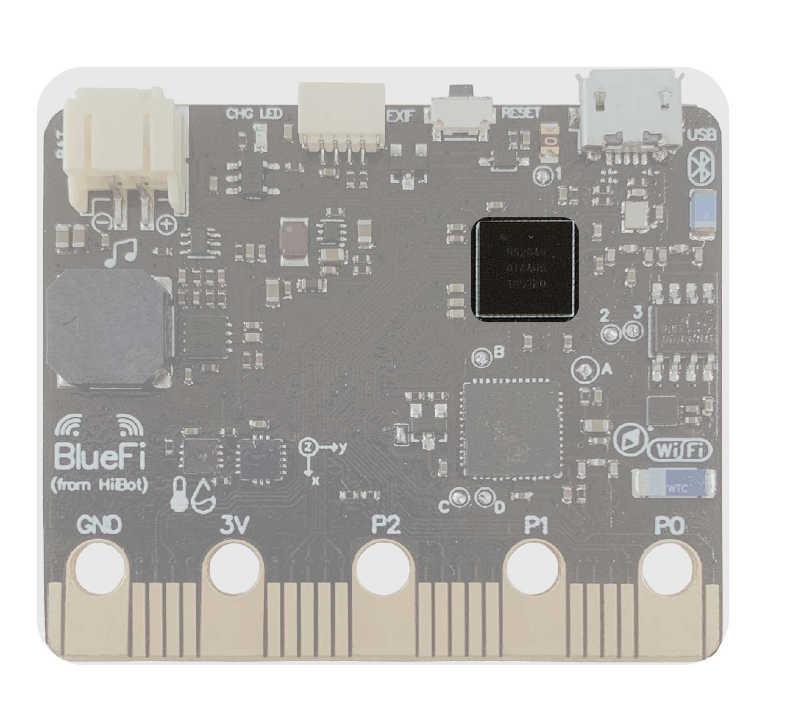

====================
1.4 主控CPU
====================

计算机上的处理器常常被称为是计算机的“大脑”，用来协调控制各个部件的工作。

BlueFi上的处理器位于BlueFi背面的右上方(见图1-6)，外形为一块黑色的正方形方块，大小与小拇指的指甲盖类似。
尽管它的体积非常小，但它在BlueFi上起着非常重要的作用。当我们对BlueFi进行编程时，我们的程序和程序内定义的变量就储存在处理器中。
对于BlueFi上其他元件(喇叭、温湿度传感器等)的控制，也是通过控制处理器上的引脚来对其进行操作。

图1-6  BlueFi 主控CPU

与电脑计算机不同的是，电脑计算机上的CPU、ROM、RAM等是分离的，而单片机上的处理器集成了所有的功能部件，
被称为system-on-chip(SoC，片上系统)。

BlueFi采用Nordic的nRF52840(64MHz ARM Cortex-M4F)作为主控CPU。nRF52840是一款先进的多协议的SoC，非常适合超低功耗的无线应用。
nRF52840拥有一颗32位ARM Cortex M4F的微处理器，片上带有1MB的FLASH和256KB的RAM空间，用于存储程序和数据。