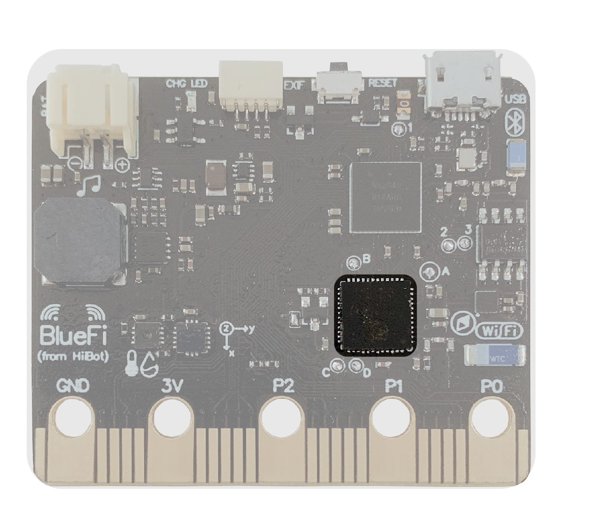

====================
1.5 网络协处理器
====================

协处理器是一种协助中央处理器完成其无法执行或执行效率、效果低下的处理工作而开发和应用的处理器。
BlueFi上的网络协处理器位于主控CPU的下方(见图1-7)，大小与主控CPU类似，其主要功能是处理WiFi无线通讯事务，用于上网。

图1-8  BlueFi 网络协处理器

网络协处理器的型号采用的是上海乐鑫(Espressif)的ESP32(240MHz Tensilica LX6双核处理器)作为网络协处理器，
支持 http/https和MQTT等物联网(IoT)应用协议。
