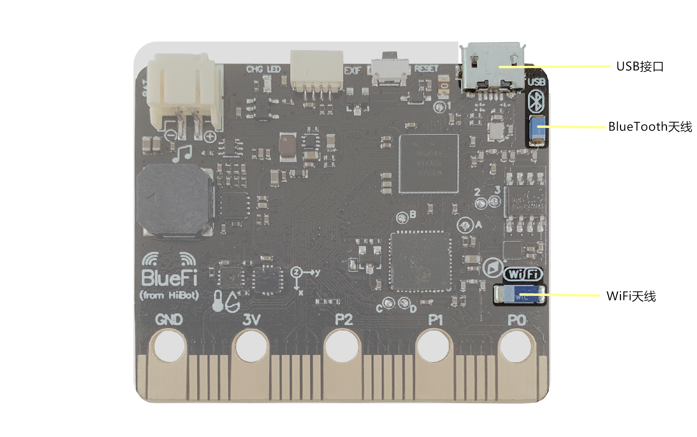

====================
1.6 通讯接口
====================

在BlueFi的背面，有三个通讯接口(见图1-10)，分别是USB接口、WiFi天线和BlueTooth天线，
它们是BlueFi与其它主机或网络进行数据交流的通道。

图1-12  BlueFi 通讯接口

1.6.1 USB接口
==================

在使用USB接口时，我们只需一根USB数据线(非USB充电线)就可以将BlueFi与手机、电脑或其它主机相连，BlueFi就会以磁盘的形式出现在主机上，
这时我们就可以通过任意的文本编辑器对BlueFi上的程序进行编辑，然后对程序文件进行拖放就可以实现对程序的更新。现有的USB接口标准有USB2.0(Low Speed)、
USB2.0(Full Speed)、USB2.0(High Speed)、USB3.2 Gen 1、USB3.2 Gen 2、USB3.2 Gen 2x2、USB4.0。随着USB版本的演变，其传输速率
不断提高，从最初的USB2.0(Low Speed)，也叫USB1.0，传输速率为1.5 Mbps，到了现在USB4.0的40 Gbps。BlueFi上的USB接口版本为
USB2.0(Full Speed),数据的传输速率为12 Mbps，即1.5 MB/s，由于BlueFi的磁盘容量不大于4 MB，因此，1.5 MB/s的传输速率足以满足
程序文件传输速率的需求。

在连接USB数据线和USB接口时，需要注意连接处的方向不能接反，否则在通电后，会烧坏BlueFi内部电路。在插拔接口时，不要扭动，请沿着
拔出(插入)方向笔直地将其拔出(插入)，扭动或倾斜地插拔会对接口造成损坏，接口一旦损坏，将无法与主机进行数据通讯。

1.6.2 BlueTooth天线
==================

BlueTooth天线主要有两个功能，第一个是蓝牙功能，它可以使BlueFi与其它具有蓝牙功能的电子设备进行数据传输，
如手机、电脑等，因此，可以通过BlueFi制作蓝牙键盘来代替电脑的键盘。第二个是可以与其他BlueFi或电子设备进行无线广播通讯，无需使用数据线相连
就可以实现1对1、1对多、多对多的通讯方式。

蓝牙是BlueFi的特色功能，这应归功于Nordic半导体在蓝牙通讯领域的世界领先技术，近些年Nordic半导体几乎引领着全球的蓝牙通讯
技术发展。BlueFi的主CPU采用Nordic的最新的ARM CM4F微控制器——nRF52840，支持BlueTooth5，通讯速度高达2.5Mbps。

蓝牙主要应用领域是10米范围内的近距离无线通讯领域，目前出货量最大的蓝牙产品主要包括，蓝牙耳机、蓝牙鼠标、蓝牙键盘和手环等。
在蓝牙通讯技术成熟之前，耳机、鼠标、键盘等标准的计算机周边I/O设备几乎都是有线的，虽然仅有1米左右长度的一段通讯线，我们仍觉得
极为不方便，蓝牙通讯技术成熟后，几乎迅速地替代掉这些电线。尤其蓝牙耳机，去掉那一段耳机线很容易，
需要让体积极小的耳机能够在有限电池容量的条件下支持数小时的使用时间，这是一件比较棘手的技术工作。
曾经大家对无线通讯的共识是，功耗很大，尤其无线发射器的功率很大。当然，随着半导体技术和材料技术的发展，
蓝牙设备的功耗已经降到非常低。

无线电波通讯是BlueTooth通讯与WiFi通讯的基础，它的出现使得用信使、烽火传递消息的时代拉下了帷幕。无线电对于第一、第二次世界
大战起着十分重要的影响，它建立了指挥部与战地之间的联络通道，不受地形、长距离的影响，保证了战时信息的即时性。
但由于无线电波是一种开放的电磁波，发送信号的电波频段同样可以被敌方扫描到，因此人们就发明了密码学和信息加密技术，
将作战指令先加密后再用无线电波发送出去，即使敌方能够接收到这些指令，但没有解密的密码本也无法获取真正的作战指令。

二战后，随着集成电路技术、微型计算机和微处理器的快速发展，无线电移动通讯逐渐进入了人们的日常生活。

1.6.3 WiFi天线
==================

在现在的信息时代，WiFi的存在使得上网不受地点的约束。与蓝牙相比，WiFi的传输距离更远，可达上百米，且传输速度更快，但是WiFi需要
网卡以及路由器或其他AP设备的支持，因此WiFi所需的成本比蓝牙高。与有线网络相比，虽然信息传输不如有线网络稳定，但由于WiFi的移动性强，
不受布线条件的限制，受到移动办公用户的广泛喜爱。

尽管我们在日常生活中经常使用WiFi，但WiFi连接的具体流程是什么呢？WiFi连接的建立共分为3个步骤：扫描阶段(SCAN) 、认证阶段 (Authentication)、
关联(Association)。扫描阶段，扫描获取周围的WiFi热点；认证阶段，以普通的使用者角度来说，就是输入WiFi密码的阶段；关联阶段，在认证通过后，
无线终端(手机、笔记本电脑等)向无线接入点(无线路由器)发送关联请求，之后无线接入点向无线终端返回关联响应。至此，
WiFi连接的建立过程才完成，手机(笔记本电脑)才可以与路由器之间传输数据。

在BlueFi上使用WiFi天线与互联网相连后，我们就可以上网获取当前的时间信息、连接MQTT等。同时，只要保持BlueFi与互联网的连接不断开，
我们就可以远程操作BlueFi执行一些操作，如用手机或其他主机控制门的开关、灯的亮灭等。