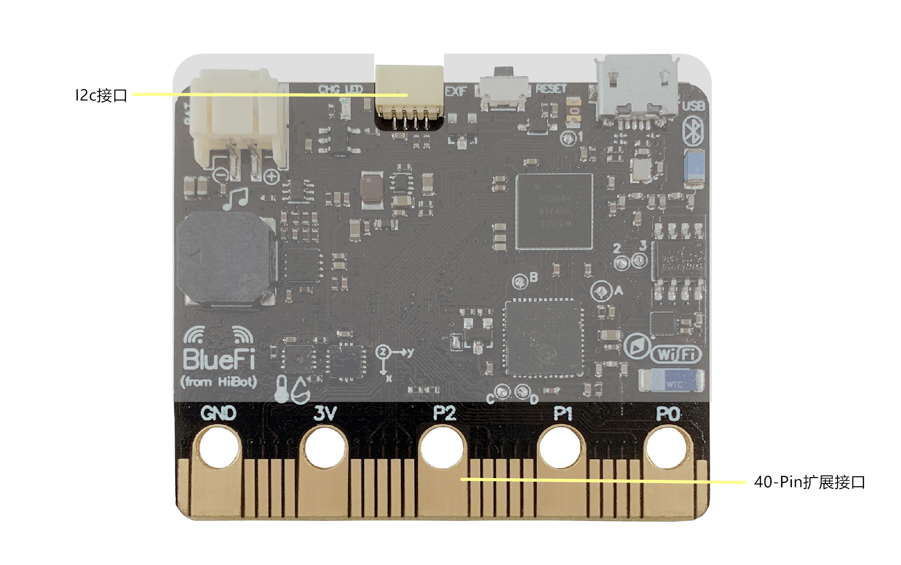
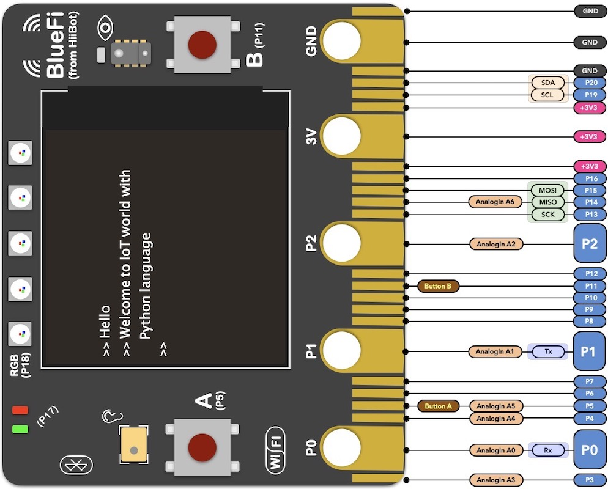
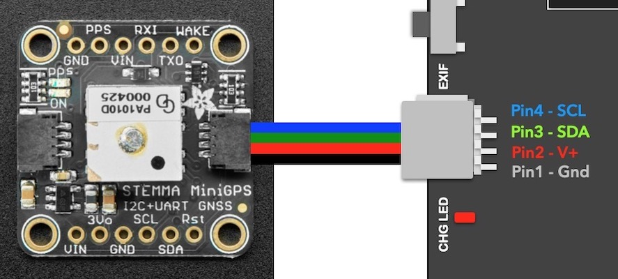

====================
1.7 扩展接口
====================

除了上述小节中介绍的BlueFi上的各种硬件设备之外，BlueFi还提供40-Pin扩展接口(见图1-13)来与外部设备进行电路连接。
与传统的引脚不同的是，40-Pin扩展接口是以导电触片(金手指)的形式与外部电路相连。

图1-13  BlueFi 扩展接口

在40-Pin扩展接口上，总共有5个大的引脚和20个小的引脚。

5个大引脚分别为P0、P1、P2、3V、GND，前三个引脚可以作为触摸输入，后两个引脚可用来为BlueFi供电或通过BlueFi向外部电路供电。
观察40-Pin扩展接口可以发现，在这5个大的引脚的上方有5个小洞，它们的作用是方便我们使用鳄鱼夹或香蕉插头与外部硬件连接。

在BlueFi上除了3V和GND引脚外，其余引脚可编程作为I2C、SPI、PWM等功能使用(详细分类见图1-14)。
在小的引脚上，没有像大引脚一样的小洞可以用来与鳄鱼夹或香蕉插头相连，这时，我们就需要用到扩展板来引出小引脚，
与扩展板相关的内容会在第6章“使用microbit扩展板”中讲到。

图1-14  BlueFi 金手指拓展接口

BlueFi的40-Pin扩展接口完全兼容microbit，因此可以使用microbit丰富的扩展板资源。
使用40-Pin扩展接口可以帮助我们完成更为复杂的编程实例。

BlueFi上的扩展接口除了40-Pin扩展接口外，还有一个Mini Grove接口(见图1-13、图1-15)，它采用4-Pin防呆连接器，
使用I2C接口标准，其上的4个引脚是从40-Pin扩展接口I2C部分引脚上引出的。

图1-15  BlueFi Mini Grove接口

Mini Grove接口以有线连接的形式，可以令BlueFi与其他主机之间按照I2C通讯协议进行数据传输，如使两块BlueFi进行通讯。