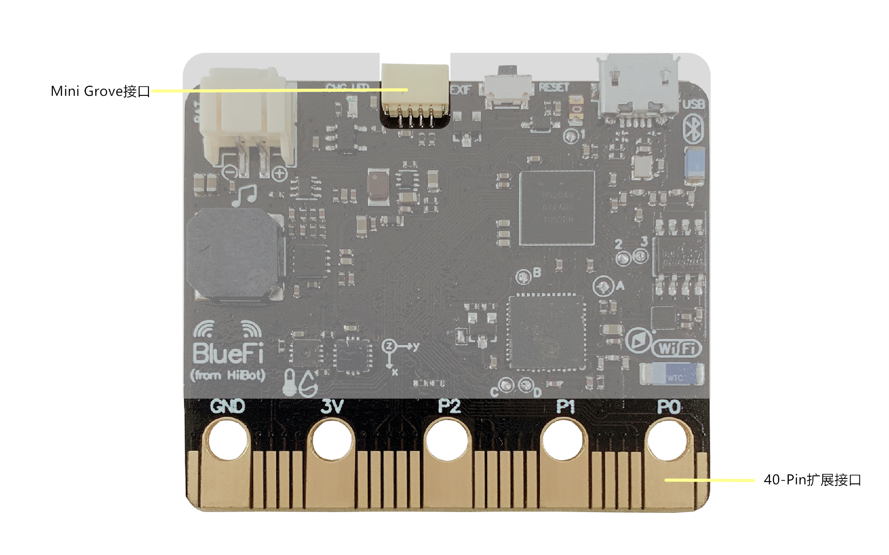

====================
1.7 扩展接口
====================

40-Pin拓展接口上除了电源和GND的19个引脚可编程作为 DI/ DO / PWM/ I2C/ I2S / SPI / UART等功能使用。可完全兼容microbit扩展板。

mini-Grove接口，通过I2C通讯协议实现两块BlueFi之间的信息交流。

图1-8  BlueFi 扩展接口