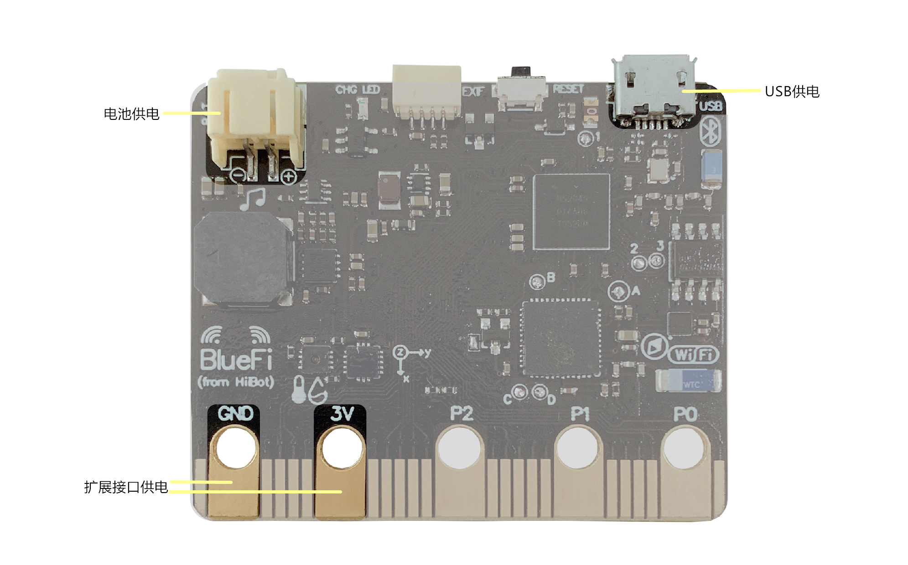

====================
2.1 电源选择
====================

BlueFi上可以通过三种方式来进行供电(见图2-1)，分别是电池供电、USB供电和扩展接口供电。
其中最为常用的是USB供电，因为通过USB供电的同时，还可以进行程序的下载更新。

图2-1  BlueFi 供电接口

使用USB供电时，只需要一根micro-USB数据线来连接BlueFi与主机就可以完成供电操作，无需其他步骤。
使用USB供电线也可为BlueFi供电，但无法进行程序修改。
尽管使用USB供电非常方便，但在某些情况下(远离主机)，我们无法使用数据线将其相连，这时就要用到电池来为BlueFi供电，
电池的电压需在3.7V左右。当然，我们也可以借助鳄鱼夹或其他电线来连接扩展接口上的3V和GND引脚与外部电源的正负极来为BlueFi供电。

用扩展接口供电时，常常使用的是扩展板的形式将3V和GND引脚引出，再外接电源供电。
例如在第6章“使用microbit扩展板”中的小车扩展板就是用到了扩展接口来为BlueFi供电。