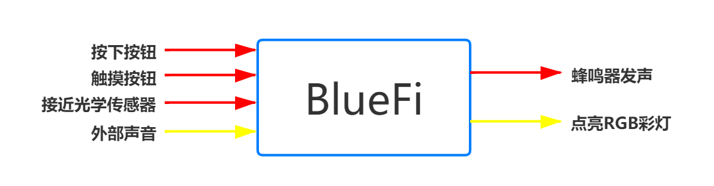

====================
2.3 跳动的音符
====================

在BlueFi出厂时，其内部自带着一个初始程序——跳动的音符(见图2-2)，当我们第一次为BlueFi供电时，该初始程序将会自动执行。
为什么要在BlueFi出厂时为它导入一个初始程序呢？是为了让使用者在初次使用时，可以先对BlueFi正面上几个简单的输入输出硬件的具体功能有一个初步的了解，
以“跳动的音符”为范例，来引导使用者使用BlueFi进行创意的构思与实现，同时也是为了测试BlueFi上的硬件设备是否正常运行。

.. image:: ../_static/images/c2/跳动的音符.png
  :scale: 30%
  :align: center

图2-2  BlueFi 跳动的音符

在接通电源后，LCD屏上会显示一张图片“随节奏跳动的光”，在其右下角还有1个数字，显示的是当前的音量数值，由麦克风获取得到。
在“跳动的音符”中，以按钮A(B)、触摸按键(P0、P1、P2)、光学传感器和麦克风为输入量或输入量的获取设备，
以RGB彩灯、蜂鸣器和LCD屏为输出量。在我们还未了解程序之前，BlueFi对我们来说就相当于是一个黑箱，尽管我们并不知道其中的原理，
但依然可以通过测试得到输入与输出的对应关系，如图2-3所示。

图2-3  输入与输出 对应关系

那么，是什么将输入与输出联系在一起呢？BlueFi内部执行的程序，它规定了输入与输出的对应关系。当然，通过修改该程序就可以改变对应关系，
比如规定按下按钮A令RGB彩灯依次闪烁、触摸P0使LCD屏切换图片等。但是，该怎么样打开“黑箱”呢？在第3章“更新用户程序”中，
会对程序的修改方法做讲解。

除了各种输入与输出外，“跳动的音符”还具有熄屏功能，当长时间没有对BlueFi进行交互时，LCD屏幕的亮度会自动暗淡，直到完全熄灭。
检测到输入时(按钮、触摸等)，才会再次点亮屏幕。这与我们日常使用的手机的自动熄屏功能相同，目的是延长屏幕的使用寿命以及减少功耗。
