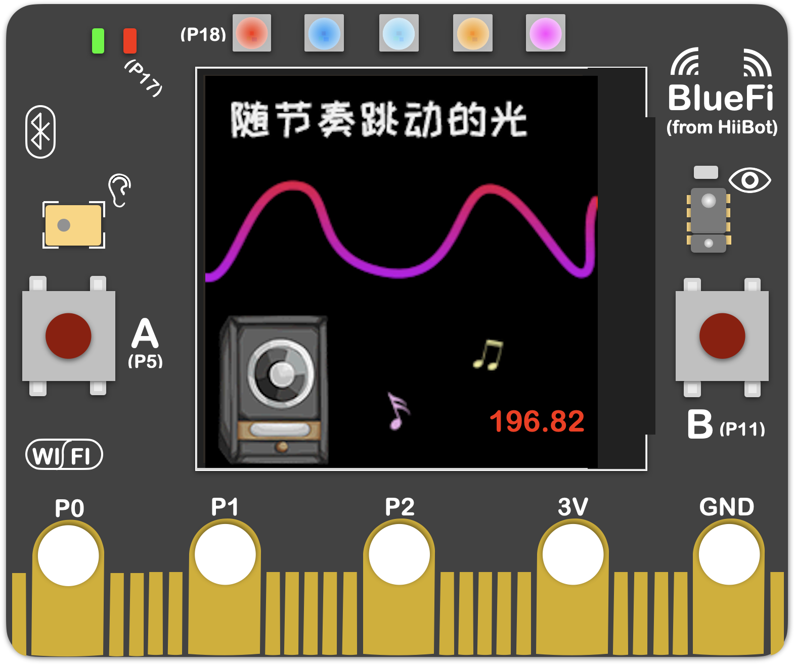

====================
2.3 跳动的音符
====================

在BlueFi出厂时，其内部自带着一个初始程序“跳动的音符”(见图2-2)，无论是使用USB供电还是电池供电，它都会正常运行。
通过“跳动的音符”这一简单示例，作为介绍如何使用BlueFi进行创意编程。

图2-2  BlueFi 跳动的音符

在“跳动的音符”中，以按钮A(B)、触摸按键(P0、P1、P2)、光学传感器和麦克风为输入量，以RGB彩灯、蜂鸣器和LCD屏为输出量，
形象地向我们展示了如何与BlueFi进行交互。

在接通电源后，LCD屏上会显示一张图片“随节奏跳动的光”，在其右下角还有1个数字，显示的是当前的音量数值，由麦克风获取得到。
当我们按下按钮A(B)、触摸按键(P0、P1、P2)或接近光学传感器时，蜂鸣器会发出声音作为反馈。
而麦克风会接收外部的音量并显示在LCD屏上，RGB灯珠的颜色与亮灯个数会随着音量的变化而变化，音量越大，亮灯的个数越多。

“跳动的音符”还具有屏保功能，当长时间没有对BlueFi进行交互时，LCD屏幕会自动暗淡，直到检测到输入量时，才会再次点亮屏幕。