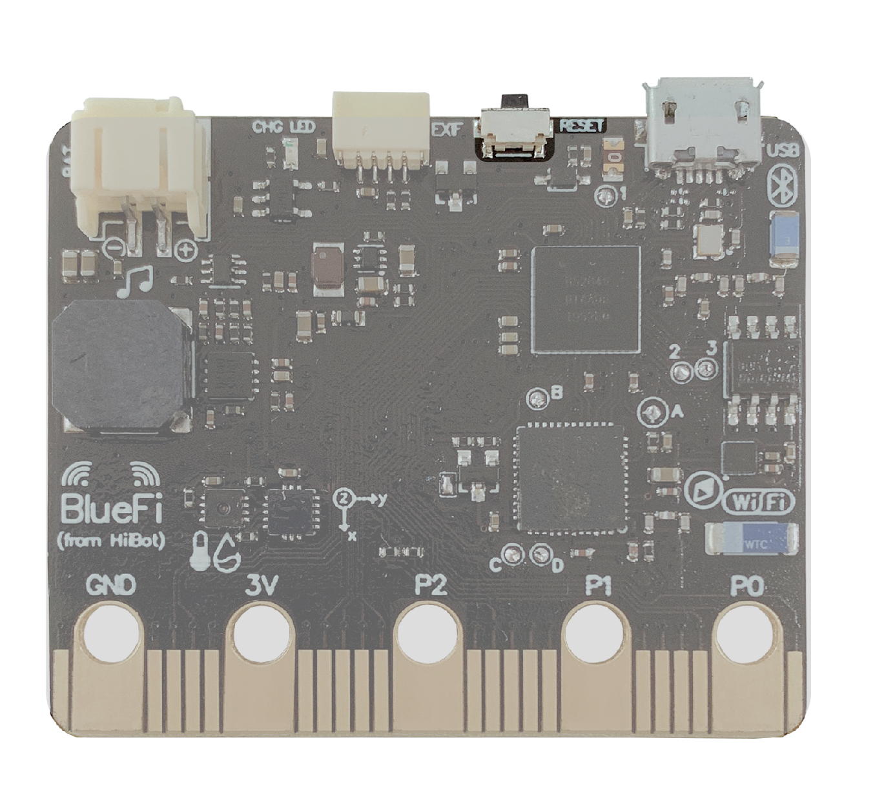
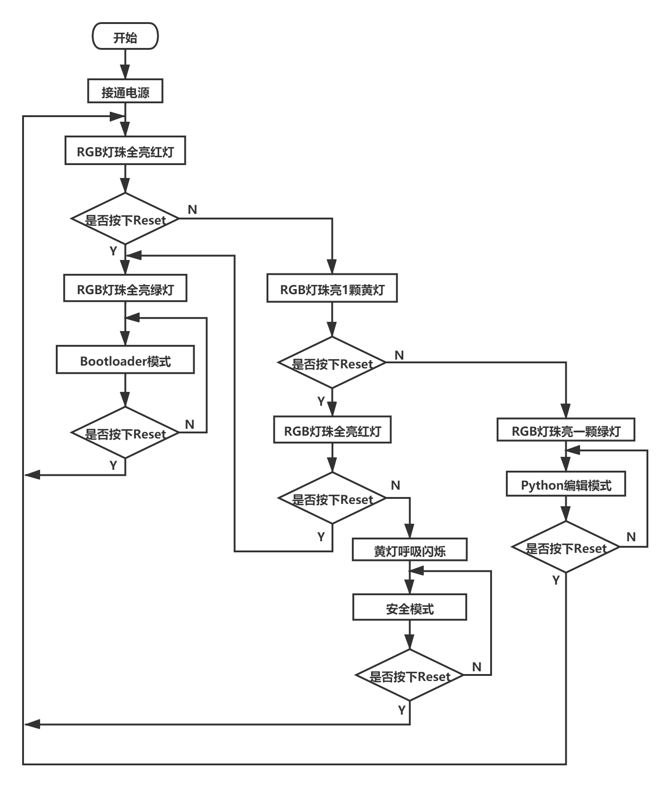

====================
2.5 BlueFi的4种状态
====================

在通电后，我们可以通过Reset按键(见图2-4)和代码编辑器(见第3章)使BlueFi进入4种不同模式以满足不同的需要。

图2-4  BlueFi Reset按键

通过Reset按键可以帮助我们进入3种模式，分别为Python编辑模式、Bootloader模式、安全模式，
下面通过图2-5流程图来帮助理解如何进入上述三种状态。

图2-5  BlueFi 三种状态

Python编辑模式是在平常使用BlueFi时最为常用的模式，只需正常通电即可进入该模式。在该模式下，第一颗RGB灯珠会显示绿色，
它有两种状态，一种是常亮，一种是呼吸闪烁。绿灯常亮代表BlueFi正在执行代码程序；绿灯呼吸闪烁代表BlueFi已执行完成代码程序。

通电后，BlueFi会自动执行已有的程序代码。在Python编辑模式下，我们可以通过使用文本编辑器或代码编辑器(如MU编辑器)进行编程，
编程部分会在第3章“更新用户程序”中详细讲解。

BlueFi的安全模式与电脑的安全模式类似，都是用于系统出现故障，无法正常启动的情况。当BlueFi内的程序导致BlueFi无法正常启动时，
可以通过Reset按键进入安全模式，此时，BlueFi不会执行已有的程序代码，因此，也不会受到错误程序的影响。
这时，就可以正常地修改程序，使它恢复正常。

第三种模式是Bootloader模式，它用于更新BlueFi固件。使用数据线将BlueFi与主机相连时，在主机上会显示一个名为CIRCUITPY的磁盘，
当我们双击Reset按键进入Bootloader模式后，磁盘名称会变为BLUEFIBOOT，
此时就可以通过拖放新版固件文件(必须是UF2格式)到BLUEFIBOOT磁盘，即可升级固件。

最后的第四种模式为REPL模式，要想进入REPL，需要借助代码编辑器(如MU编辑器)，有关REPL的详细内容会在第3章“更新用户程序”中介绍，
在此先对REPL模式进行一个简单的介绍。

REPL，是“Read-Eval-Print Loop”的首字母缩写，代表不断地循环执行“读取-求值-输出”操作，进一步解释就是，
“读取”你输入的一行脚本程序，“求值”是执行该程序语句，并“输出”执行结果，如此循环。其主要用途是一步一步地调试脚本程序，
帮助我们发现程序中存在的Bug。
