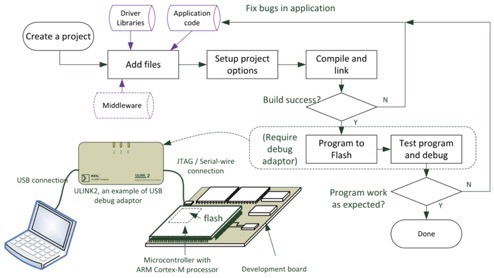
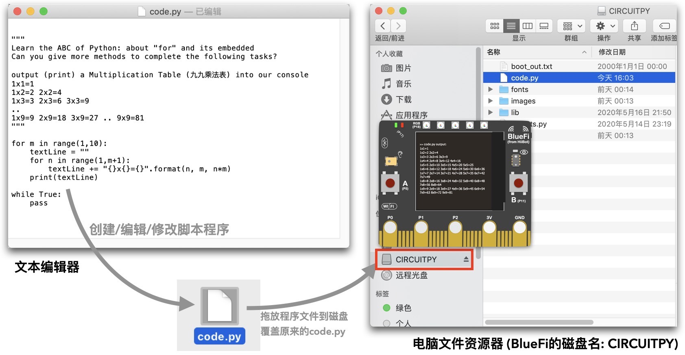

====================
3.1 修改code.py
====================

几乎所有的嵌入式系统或单板机都没有桌面计算机的键盘、鼠标和大屏幕显示器等标准外设，对这些系统编程或开发时都必须借助于桌面计算机。
通常，我们把用于开发嵌入式系统或单板机的桌面计算机称作“宿主计算机”，待开发和编程的嵌入式系统或单板机称作“目标计算机”，
两者通过USB等标准的通讯接口连接。并且，宿主计算机系统必须预先安装必要的编程软件、编译软件和程序下载工具软件。
同时，目标计算机系统也应该具备一个小型的软件系统能够与宿主计算机系统连接，下载用户程序。

图3-1  程序编译过程

BlueFi已经尽可能地简化宿主计算机上所需要的软件环境，仅使用任何桌面计算机系统都具备的文本编辑器就可以对BlueFi编程、下载，
宿主计算机上无需任何特殊的编程软件、编译软件和下载工具软件。使用文本编辑器编辑Python代码，保存为code.py文件，
并将code.py文件拖放至BlueFi磁盘(磁盘名称：CIRCUITPY)即可完成程序的修改(见图3-2)。

图3-2  修改code.py文件