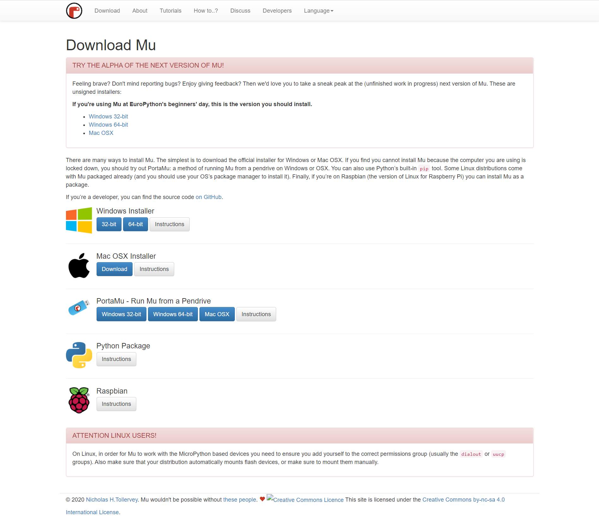
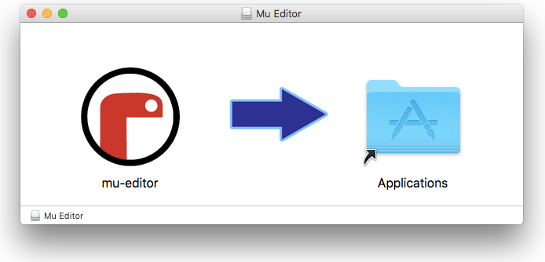

====================
3.2 安装MU编辑器
====================

虽然说在使用BlueFi时，仅使用任何桌面计算机系统都具备的文本编辑器就可以对BlueFi编程、下载，计算机上无需任何特殊的编程软件、
编译软件和下载工具软件，但如果我们能够借助于更合适的工具，Python代码编程的效率也必将提升。
尤其程序员们最喜爱某些编程环境的语法高亮、输入记忆和自动填充、代码块自动缩进等功能都是简化代码编辑工作，
提升编程效率(减少错误，减少调试时间)的利器。

随着Python语言在全球的流行，大多数桌面计算机系统都已经安装各种各样的Python代码编辑器，
如Pycharm、Visual Studio、 Sublime Text等，这些软件都可用于BlueFi的代码编辑、保存文件到BlueFi磁盘。

在此处，推荐使用面向嵌入式系统Python编程的开源软件工具——MU，不仅支持Python3(适合桌面计算机的数值计算和网络等)编程，
还支持硬件编程。本书后续章节的编程内容均采用MU作为代码编辑器。

安装MU软件包
================

用浏览器打开MU编辑器的官网(https://codewith.mu)，点击”Download”进入下载页面，根据自己的宿主计算机系统选择下载合适的MU软件包。
详细安装向导请遵照MU官网的说明。

图3-3  MU下载页面

安装MU编辑器
================

1.安装到Windows电脑

将下载完成的exe文件打开，遵循安装向导完成安装。详细的安装向导请遵照MU官网的说明：
https://codewith.mu/en/howto/1.0/install_windows。

2.安装到MacOS电脑

macOS电脑的MU安装包的文件名为xxx.dmg，具体名称取决于你下载、保存文件时的选择。双击macOS系统的xxx.dmg(App软件包)，
出现一个名称为“mu-editor”可卸载磁盘，打开这个磁盘，你将会看到如图3-4：

图3-4  MU Editor

将”mu-editor”图标拖放至”Application”文件夹即可。熟悉macOS电脑的人都知道，Apple推荐使用自己的App Store安装App。
显然，这样安装的MU编辑器与App Store安装的App不同，macOS会提醒你这个App涉及安全隐私。开源的MU编辑器不涉及电脑的非安全因素，
安装和运行MU时不必担心他会损坏或影响你的电脑安全。

首次运行MU编辑器时，请打开Application文件夹，选中“MU”应用程序，点击鼠标右键，并选择“运行”，当macOS提示你是否继续执行时，
选择信任和继续。第二次及以后再启动MU编辑器应用程序，你就可以直接双击或单击MU图标即可。

针对macOS系统的详细安装向导请遵照MU官网的说明：https://codewith.mu/en/howto/1.0/install_macos