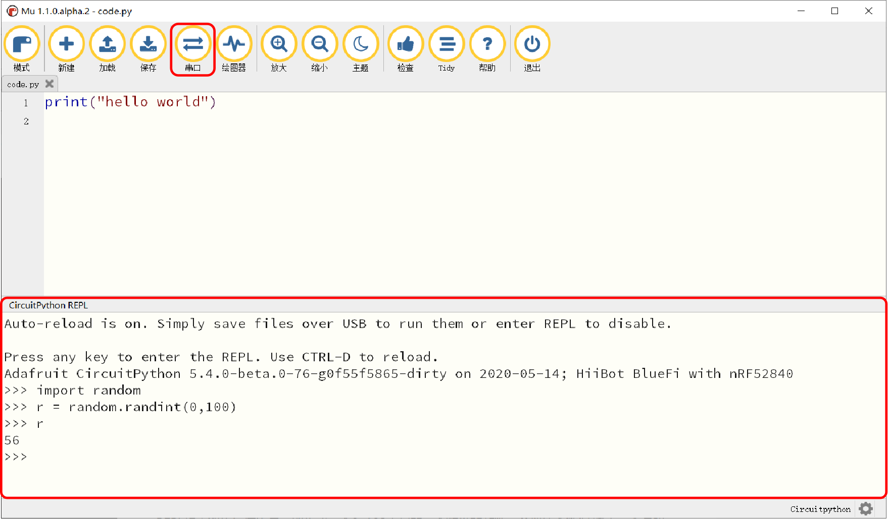
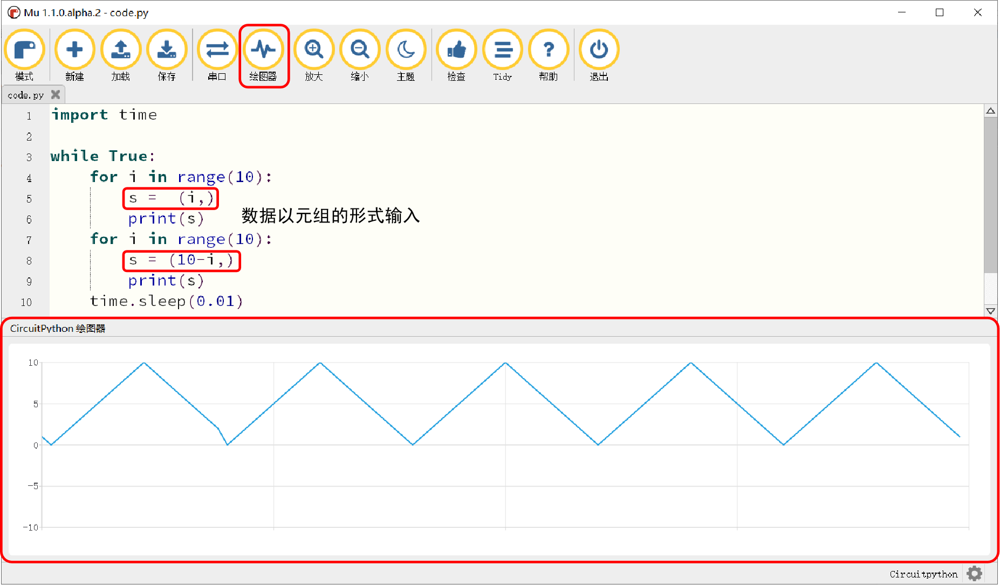

===========================
3.3 连接MU编辑器和BlueFi
===========================

安装好MU编辑器后，为了使用MU编辑器对BlueFi上的程序代码进行修改，我们需要对BlueFi与MU编辑器的连接过程以及如何使用MU编辑器有所了解。
下文将会对BlueFi与MU编辑器的连接过程以及MU编辑器界面做相应介绍。

3.3.1 与MU编辑器的连接过程
==========================

在连接BlueFi与MU编辑器之前，需要先在计算机上打开MU编辑器，当BlueFi通过Micro-USB数据线与宿主计算机成功连接时，
MU编辑器会自动侦测到BlueFi，提示“检测到新的CircuitPython设备”，并提醒你是否切换到“CircuitPython模式”(如图3-5)。

.. image:: ../_static/images/c3/连接BlueFi与主机.jpg
  :scale: 39%
  :align: center

图3-5  连接BlueFi与主机

由上图我们可以看到，MU编辑器(V1.1及以后的版本)支持6种不同的模式，其中4种是硬件编程，MU编辑器会根据侦测到的硬件类型自动切换到对应模式。

BlueFi使用CircuitPython编程语言，这是一种与Python3几乎完全相同的、支持单板机的脚本编程语言，因此，在后面第4章“Python编程语言”中，
以Python3作为编程语言来对Python编程的语法进行讲解。CircuitPython同时支持很多种不同的嵌入式硬件系统，
方便我们使用流行的Python语言开发和设计各种嵌入式计算机系统或单板机。

3.3.2 MU编辑器选项
==================

在后续章节介绍如何使用MU编辑器编辑Python代码之前，需要先对MU编辑器上的几个主要选项进行了解，如图3-6。

.. image:: ../_static/images/c3/MU界面.png
  :scale: 39%
  :align: center

图3-6  MU界面

通过使用上图方框中的几个选项，基本可以满足在编辑Python代码时的需要。

1. 新建、加载、保存
---------------------

在使用代码编辑器编辑程序之前，第一步，我们需要新建或打开程序，分别对应图3-6中的新建与加载选项。当我们点击“新建”时，
会在图3-7所示区域建立一个程序编辑区。

.. image:: ../_static/images/c3/新建.png
  :scale: 39%
  :align: center

图3-7  新建

在上图所示的程序编辑区中，就可以自行编辑Python代码。

点击“加载”，会跳出如图3-8所示的界面，用来打开程序，文件名后缀需为方框中规定的几种，在后续的编程学习中，
最为常用的是以.py为后缀的文件名。

.. image:: ../_static/images/c3/加载.png
  :scale: 39%
  :align: center

图3-8  加载

在完成对程序的编辑后，通过点击“保存”选项，并将文件名后缀命名为正确的格式，即可将程序保存(见图3-9)。

.. image:: ../_static/images/c3/保存.png
  :scale: 39%
  :align: center

图3-9  保存

2. 串口
-----------

点击MU编辑器的“串口” 选项，MU编辑器下方将出现一个特殊的窗口，在习惯上把这个窗口称作“串口控制台(console)”。
在MU编辑器的控制台中，输入“ctrl+C”，BlueFi将立即停止执行code.py或main.py程序，并进入REPL模式(如图3-10所示)，按下回车键，
MU编辑器的控制台将出现“>>”提示符;输入“ctrl+D”,BlueFi将退出REPL模式，并重新从头执行code.py或main.py程序。MU编辑器区
别于Pycharm、Visual Studio和Sublime Text等文本编辑器的关键是MU编辑器天生支持REPL。

MU编辑器的REPL模式通过控制台实现人-机交互(用户输入一个脚本程序语句供REPL读取，然后执行，并输出执行结果。
然后再输入下一个脚本程序语句，重复这一过程)。

图3-10  REPL

如上图所示，在控制台的”>>”提示符后面输入“import random”，即导入Python内建的“random”模块(随机数发生器模块)。
然后输入 “r=random.randint(0, 100)”脚本语句并按回车键表示输入完毕，REPL将立即执行该语句，即生成一个0~100之间的一个随机的整数，
并把这个数据赋于一个名叫“r”的变量。最后输入“r”并按回车键，REPL立即将这个随机数输出到控制台。

当用户需要调试Python程序时，REPL就是调试Python程序最佳工具，它可以对Python程序进行“单步执行”，方便用户找出程序中存在的错误。

REPL模式除了可以对程序进行单步执行外，还具有以下4种功能：help(“modules”)、help(random)、random.(+Tab)、dir(random)。

如果想了解BlueFi支持多少种内建的(built-in)模块，可以在“>>”提示符后面输入“help(“modules”)”，将得到下面的执行结果输出：

.. code-block::  C
  :linenos:

  >>> help('modules')
  __main__          bitbangio         json              struct
  _bleio            board             math              supervisor
  _os               builtins          microcontroller   sys
  _pixelbuf         busio             micropython       terminalio
  _time             collections       neopixel_write    time
  analogio          digitalio         os                touchio
  array             displayio         pulseio           ulab
  audiobusio        errno             random            usb_hid
  audiocore         fontio            re                usb_midi
  audiomixer        framebufferio     rgbmatrix         vectorio
  audiomp3          gamepad           rotaryio
  audiopwmio        gc                rtc
  binascii          io                storage
  Plus any modules on the filesystem

你是否发现前面用过的“random”在其中吗？

如果想了解一个模块所支持的全部API接口，尝试使用“help(module name)”。以Python内建的“random”为例，
首先在REPL模式输入“import random”并按回车键，即导入random模块。然后输入“help(random)”，
BlueFi将会在控制台上输出内建的“random模块”所支持的所有接口。

.. code-block::  C
  :linenos:

  >>> import random
  >>> help(random)
  object <module 'random'> is of type module
    __name__ -- random
    seed -- <function>
    getrandbits -- <function>
    randrange -- <function>
    randint -- <function>
    choice -- <function>
    random -- <function>
    uniform -- <function>

在导入“random”模块之后，使用“help(random)”语句将会给我们列举random模块所支持的全部类(class)、变量和方法(function)。 

下面仍以random模块为例，使用“dir(random)”将以列表(list)格式显示出random模块所支持的类、变量和方法的名称，如下图3-13所示：

.. code-block::  C
  :linenos:

  >>> import random
  >>> dir(random)
  ['__class__', '__name__', 'choice', 'getrandbits', 'randint', 'random', 'randrange', 'seed', 'uniform']

如果你曾经使用过一些支持面向对象编程的编辑软件，在编辑程序时，“输入一个对象名称和点，然后按Tab键，
编辑软件会立即把这个对象的所有接口方法都列举出来”这种辅助式交互可以让程序员不必记住一个对象的全部接口，
用到时输入“ClassName.”并按Tab键，编辑软件会帮你列出所有方法，从中选择要用的接口即可。Python的REPL也具备这一辅助功能，
以random模块为例，导入random模块后，在“>>”提示符后面输入“random.”并按Tab键，REPL会把random模块支持的所有类、
变量和方法全部列出来。

因此，在使用BlueFi学习Python编程时，你不必记住每一个模块的全部接口，当你需要了解一个模块有哪些具体接口(包括类、变量、方法等)时，
在串口控制台按“Ctrl+C”进入REPL模式，输入“import module name”并按回车，
然后输入“module name.”并按Tab键，你将看到这个模块所支持的所有接口。以random模块为例，结果如下图所示：

.. code-block::  C
  :linenos:

  >>> import random
  >>> random.
  choice          getrandbits     randint         random
  randrange       seed            uniform

3. 绘图器
-------------

点击“绘图器”选项，在MU下方会出现一个名为“CircuitPython 绘图器”的界面，如图3-15所示。在这个界面中，
绘图器会自动将从串口传入的数据绘制成曲线图，纵坐标为输入的数值。需要注意的是，在使用绘图器时，
需要以元组的形式将数据输入(print)到串口，绘图器才能读取数据进行绘图，有关元组的定义会在第4章“Python编程语言”中讲到。

图3-11  绘图器

上图中以一个简单的数值递增递减过程为例，示范如何使用绘图器来绘制对应的曲线。在上面的程序中，用到了for-in循环结构和range函数，
这些内容在后续的第4章“Python编程语言”中会进行介绍，现在只需了解上述程序中的“for i in range(10)”的作用是令i的值，从0增加到9，
增加的步长为1，从而使得s的值实现递增递减。