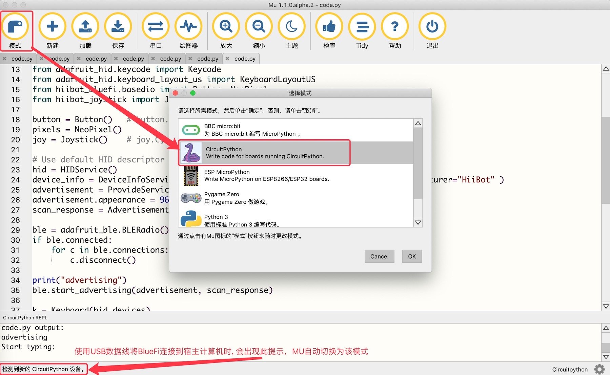
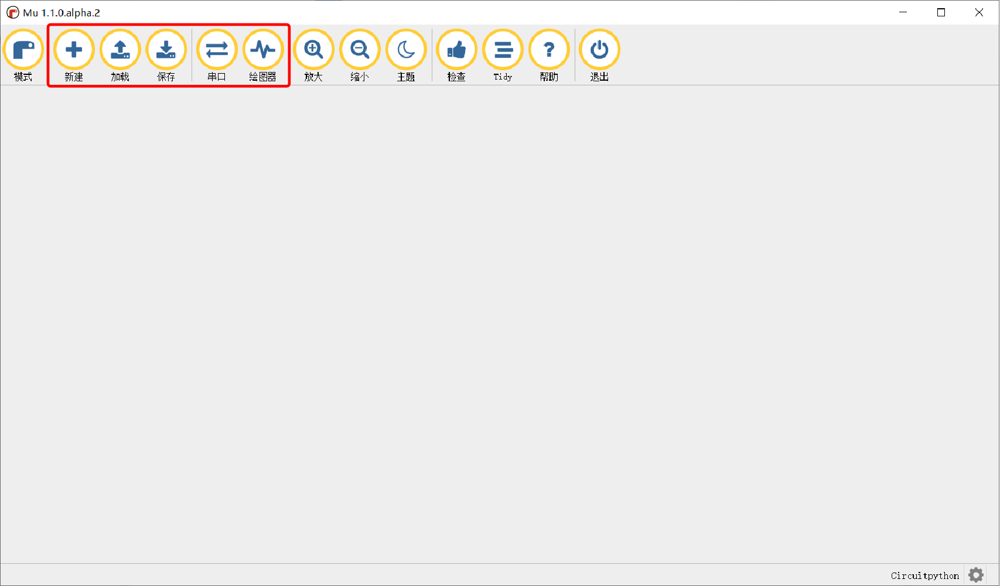
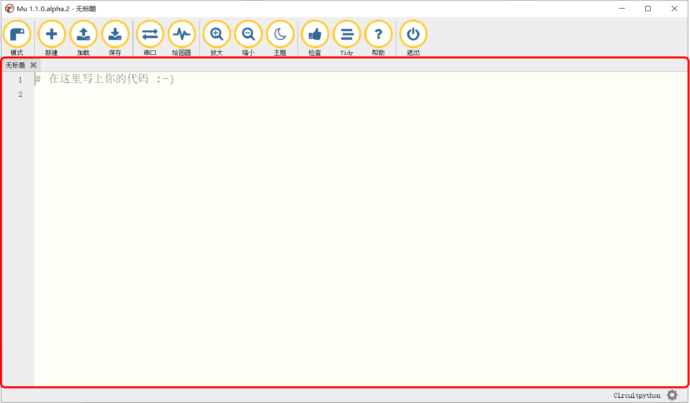
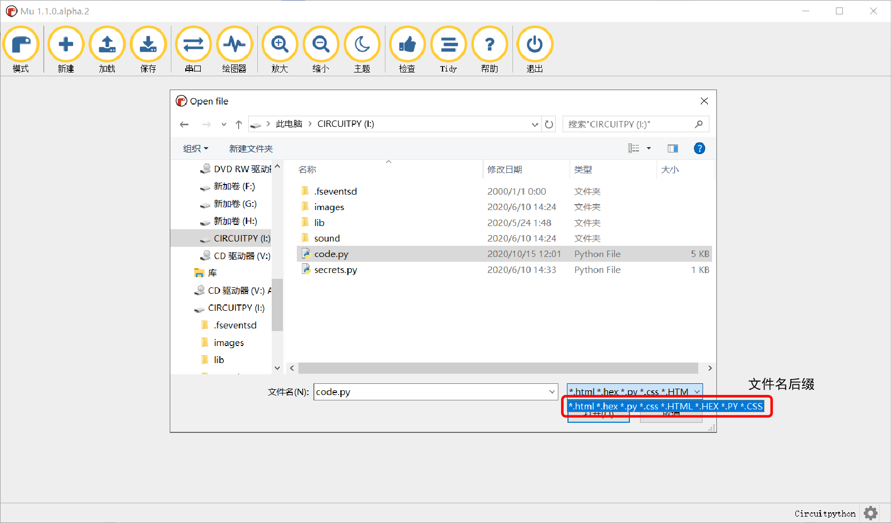
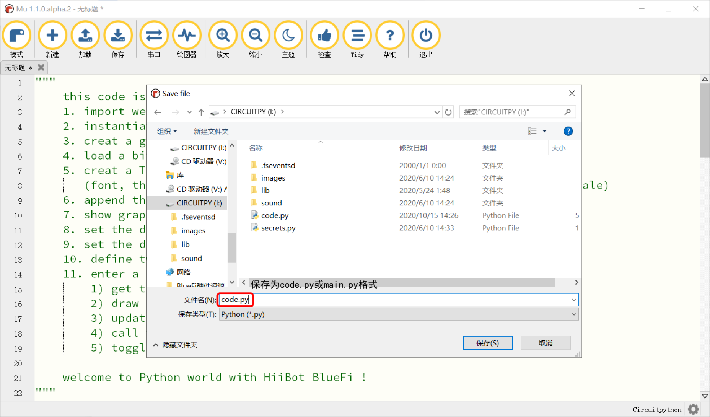
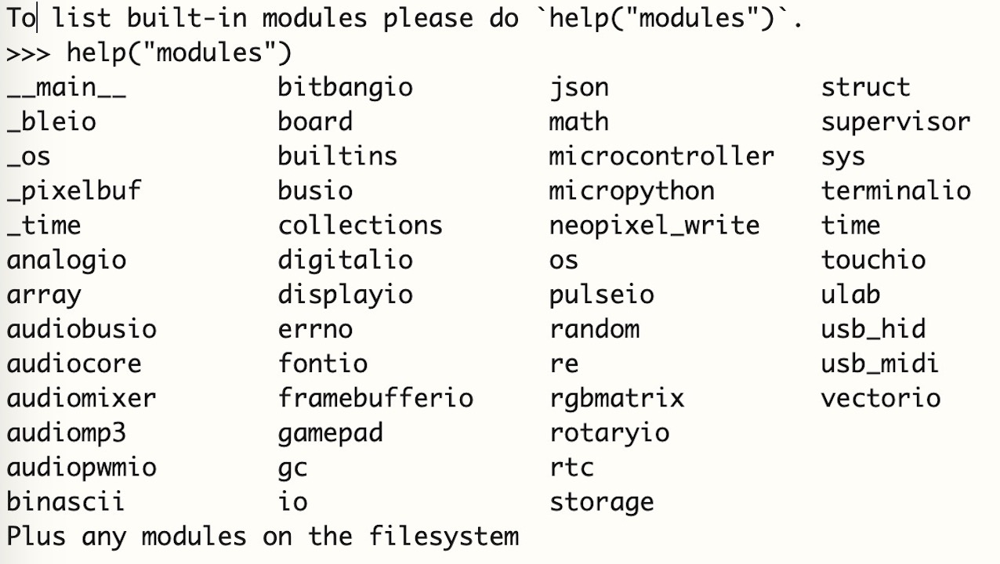
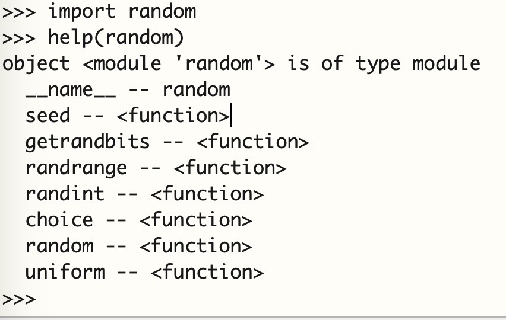
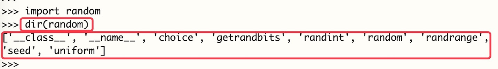
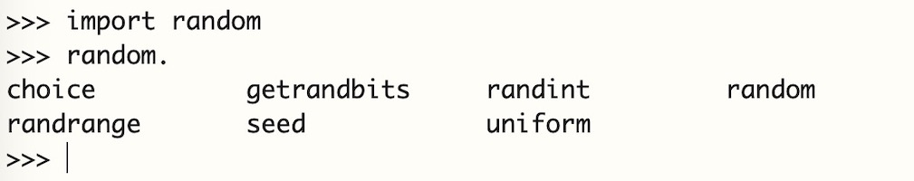

===========================
3.3 连接MU编辑器和BlueFi
===========================

安装好MU编辑器后，为了使用MU编辑器对BlueFi上的程序代码进行修改，需要将BlueFi与MU编辑器相连。

首先打开MU编辑器，当BlueFi通过Micro-USB数据线与宿主计算机成功连接时，MU编辑器会自动侦测BlueFi，
并提示“检测到新的CircuitPython设备”，并提醒你是否切换到“CircuitPython模式”(如图3-5)。

图3-5  连接BlueFi与主机

MU编辑器(V1.1及以后的版本)支持6种不同的模式，其中4种类别的硬件编程，MU编辑器会根据侦测到的硬件类型自动切换到对应模式。

BlueFi使用CircuitPython编程语言，这是一种与Python3几乎完全相同的、支持单板机的脚本编程语言。
CircuitPython由美国知名开源开源硬件供应商——Adafruit发起，并得到全球很多人的维护和支持，同时支持很多种不同的嵌入式硬件系统，
方便我们使用流行的Python语言开发和设计各种嵌入式计算机系统或单板机。

在介绍如何使用MU编辑器编辑Python代码之前，需要先对MU编辑器上的几个主要按键进行了解，如图3-6。

图3-6  MU界面

新建、加载、保存
================

在使用代码编辑器编辑程序之前，第一步，我们需要新建或打开程序，分别对应图3-6中的新建与加载选项。当我们点击“新建”时，
会在图3-7所示区域建立一个程序编辑区。

图3-7  新建

点击“加载”，会跳出如图3-8所示的界面，用来打开程序，文件名后缀需为方框中规定的几种，在后面的编程学习中，
最为常用的是以.py为后缀的文件名。

图3-8  加载

在完成对程序的修改后，点击“保存”选项，即可将程序保存(见图3-9)。注意，如果保存的是要在BlueFi上运行的程序，
请将文件名保存为code.py或main.py，有关“保存”选项的详细内容会在下一小节中讲到。

图3-9  保存

串口
========

点击MU编辑器的“串口” 按钮，MU编辑器下方将出现一个特殊的窗口，习惯上把这个窗口称作“串口控制台(console)”。
在MU编辑器的控制台中，输入“ctrl+C”，BlueFi将立即停止执行code.py或main.py程序，并进入REPL模式，按下回车键，
MU编辑器的控制台将出现“>>”提示符，如图3-10所示。这就是MU编辑器区别于Pycharm、Visual Studio和Sublime Text等文本编辑器的关键，
MU编辑器天生支持REPL。

MU编辑器的REPL使用控制台实现人-机交互(你输入一个脚本程序语句供REPL读取，然后执行，并输出执行结果。
然后你再输入下一个脚本程序语句，重复这一过程(loop))。

.. image:: ../_static/images/c3/串口.png
  :scale: 30%
  :align: center

图3-10  串口

如上图所示，在控制台的”>>”提示符后面输入“import random”，即导入Python内建的”random”模块(随机数发生器模块)；
然后输入 “r=random.randint(0, 100)”脚本语句并按回车键表示输入完毕，REPL将立即执行该语句，即生成一个0~100之间的一个随机的整数，
并把这个数据赋于一个名叫“r”的变量；最后输入“r”并按回车键，REPL立即将这个随机数输出到控制台。

当你需要调试Python程序时，REPL就是“单步执行”Python程序的模式，REPL就是调试Python程序最佳工具。

REPL模式除了可以对程序进行单步执行外，还具有以下4种用途：help(“modules”)、help(random)、random.、dir(random)。

如果你想了解BlueFi支持多少种内建的(built-in)模块，在“>>”提示符后面输入“help(“modules”)”，你将会看到下图3-11的执行结果输出：

图3-11  help(“modules”)

你是否发现前面用过的“random”在其中吗？

如果你想了解一个模块所支持的全部API接口，尝试使用“help(module name)”。以Python内建的“random”为例，
在REPL模式首先输入“import random”并按回车键，即导入random模块；然后输入“help(random)”，
BlueFi将会想控制台输出内建的“random模块”所支持的所有接口都列举出来，如下图3-12所示：

图3-12  help(random)

在导入“random”模块之后，使用“help(random)”语句将会给我们列举random模块所支持的全部类(class)、变量和方法(function)。 
仍以random模块为例，使用“dir(random)”将以列表(list)格式显示出random模块所支持的类、变量和方法名称。如下图3-13所示：

图3-13  dir(random)

如果你曾经使用过一些支持面向对象编程的编辑软件，在编辑程序时，“输入一个对象名称和点，然后按Tab键，
编辑软件会立即把这个对象的所有接口方法都列举出来”这种辅助式交互可以让程序员不必记住一个对象的全部接口，
用到时输入“ClassName.”并按Tab键，编辑软件会帮你列出所有方法，选择即可。Python的REPL也具备这一辅助功能。
以random模块为例，导入random模块后，在“>>”提示符后面输入“random.”并按Tab键，REPL会把random模块支持的所有类、
变量和方法全部列出来。

使用BlueFi学习Python编程时，你不必记住每一个模块的全部接口，当你需要了解一个模块有哪些具体接口(包括类、变量、方法等)时，
在串口控制台 按“Ctrl+C”终止当前正在执行的程序，进入REPL模式，输入“import modulename”并按回车，
然后输入“module name.”并按Tab键，你将看到这个模块所支持的接口。以random模块为例，如下图3-14：

图3-14  random.(Tab)

