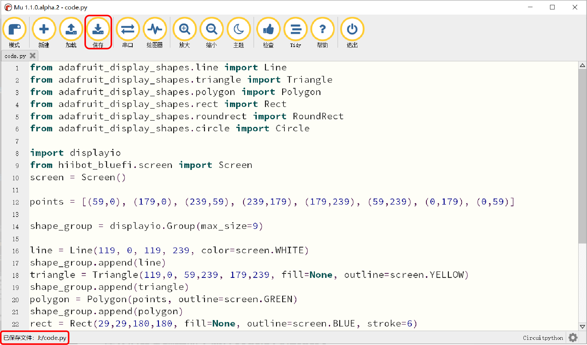

====================
3.4 保存code.py
====================

在连接好BlueFi与MU编辑器后，我们就可以使用MU编辑器对BlueFi上的代码文件进行修改。在BlueFi上运行的用户程序，
需将文件名命名为code.py或main.py格式。在MU编辑器或任意文本编辑器上编写好代码文件后，保存为code.py或main.py，
然后点击“保存”选项(MU编辑器)或将该文件拖放/拷贝-粘贴到BlueFi的CIRCUITPY磁盘即可(见图3-16)。当该文件被修改后，
BlueFi会自动软复位，并执行修改后的code.py或main.py程序。

图3-12  保存code.py

尽管BlueFi内的文件会以一个可移动磁盘的形式出现在主机上，但与平常我们常见的可移动磁盘(U盘、MP3等)不同的是，BlueFi支持热插拔，
可以直接将BlueFi与主机之间的连接断开，无需点击“弹出”选项，热插拔不会对BlueFi内保存的文件造成损失。