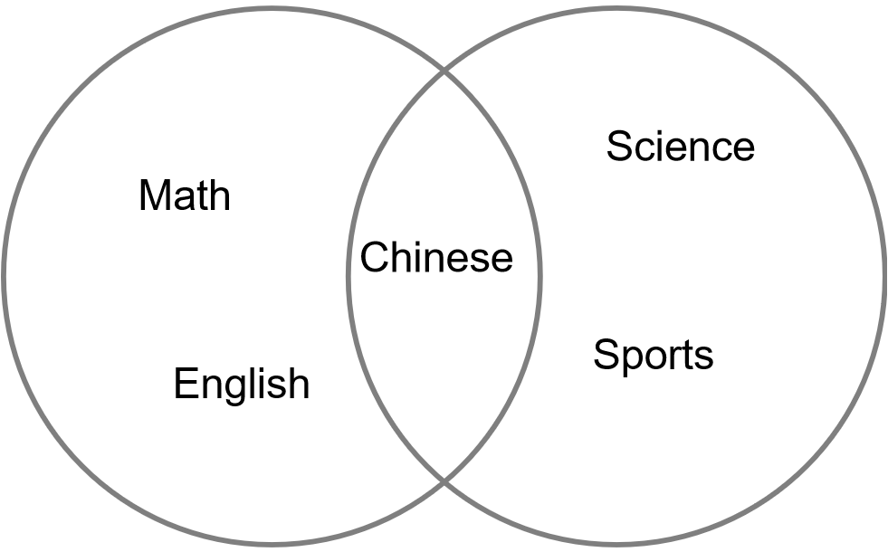
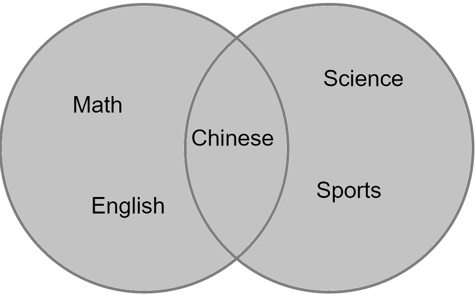
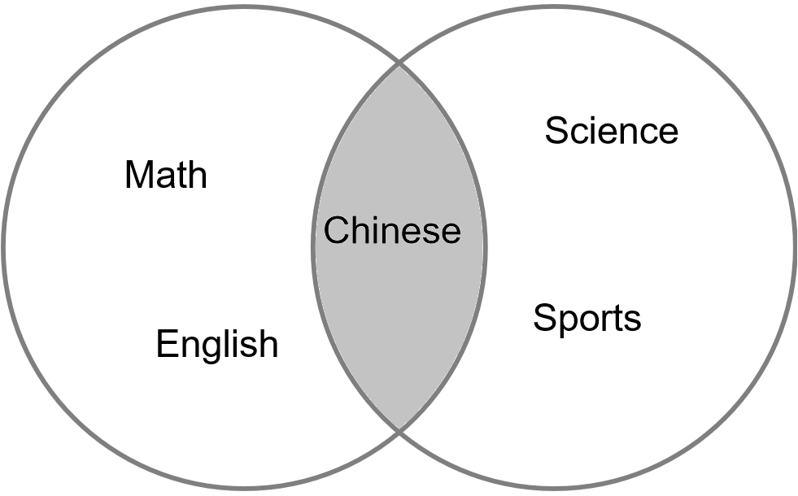
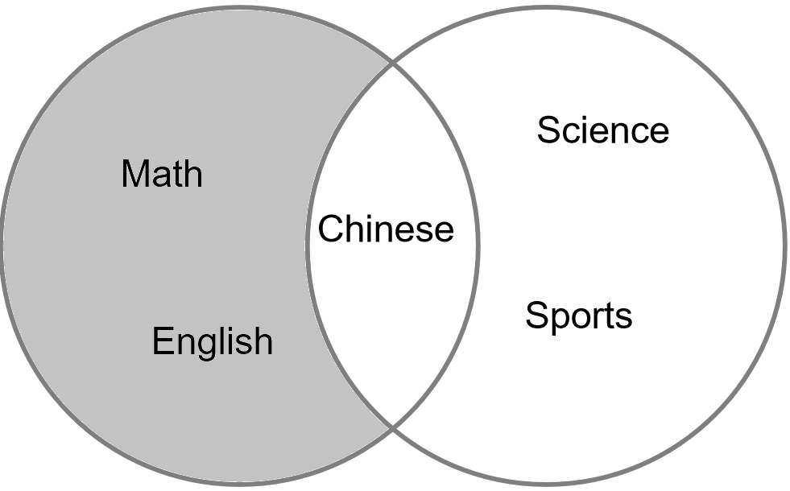
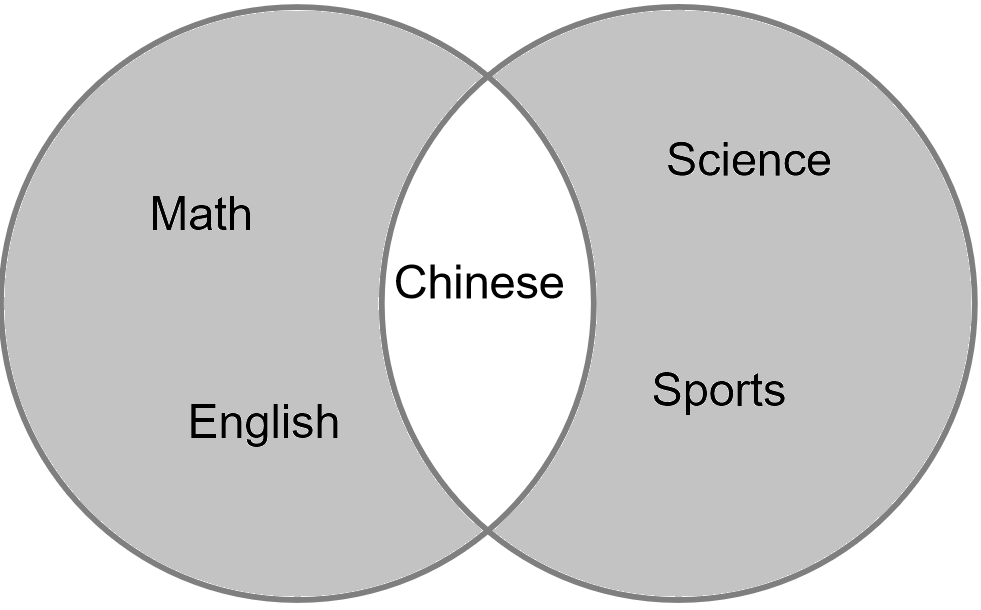
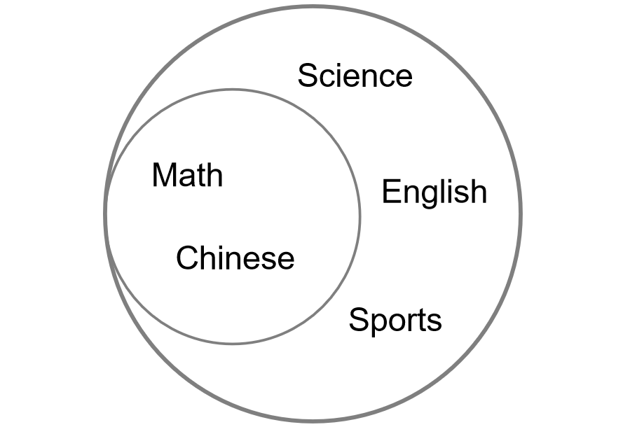

==========================
4.5 集合
==========================

最后一种数据结构为集合(set)，集合也是一种储存数据的数据类型，且格式与列表和元组类似，各项之间以“,”分开。不同之处在于，
集合由一组无序且无重复项的不可变数据组成的，从该定义中可以得出以下三点：
 * 集合内无重复的项。
 * 无法对集合使用索引。
 * 集合内各项只能是数字、字符串、元组等不可变数据类型。

4.5.1 集合的创建
=====================

集合与字典相同，都使用“{ }”来定义，只是字典中的每一项都有两个元素(键和值)，而集合中每一项只有一个元素。集合中的项可以类比于字典中的键，
它们都由不可变的数据类型命名，且不可重复。

.. code-block::  C
  :linenos:

  >>> Scores = {'Chinese', 'Math', 'English','Math'}
  >>> Scores
  {'Chinese', 'English', 'Math'}

从该示例程序中可以看出，即使在定义时定义了两个相同的项，在集合中也只会保留其中的一个。在定义集合时需要注意的是，
如果要定义一个空集合，不能使用“{ }”来定义。因为“{ }”定义的是空的字典，而不是空的集合。

.. code-block::  C
  :linenos:

  #定义的是一个空的字典
  >>> Scores = {}
  >>> Scores
  {}

  #可对它进行字典的修改操作
  >>> Scores['Math'] = 100
  >>> Scores
  {'Math': 100}

那该如何定义一个空的集合呢？使用set函数。

4.5.2 set函数
===================

在Pyhton中，只能使用set函数来创建一个空的集合。

.. code-block::  C
  :linenos:

  >>> Scores = set()
  >>> Scores
  set()

使用set函数可以将字符串、列表、元组甚至字典等数据类型转化为集合，并删除其中的重复项，

.. code-block::  C
  :linenos:

  #字符串->集合
  >>> Scores = set('Chinese')
  >>> Scores
  {'n', 'i', 'C', 's', 'h', 'e'}

  #列表->集合
  >>> Scores = set(['Chinese','Math','English','Math'])
  >>> Scores
  {'Chinese', 'Math', 'English'}

  #字典->集合
  >>> Scores = set([('Chinese',95),('Math',96),('English',91),('Math',96)])
  >>> Scores
  {('Math', 96), ('English', 91), ('Chinese', 95)}

可以看到，生成的集合中没有重复的项，且项的排列是无规律的。

4.5.3 集合的基本操作
=====================

集合的基本操作与其它数据结构类似，但由于集合的无序性，任何有关排列顺序的操作都无法对集合执行，如索引、切片等。

.. code-block::  C
  :linenos:

  >>> Scores = {'Chinese', 'Math', 'English'}

  #得到集合长度
  >>> len(Scores)
  3
  
  #查看'English'是否在集合Scores
  >>> 'English' in Scores
  True

  #删除集合
  >>> del Scores
  >>> Scores
  Traceback (most recent call last):
    File "<stdin>", line 1, in <module>
  NameError: name 'Scores' is not defined

4.5.4 集合的方法
====================

集合中存在的方法与前几个数据结构的方法大同小异，通过它们可以对集合进行添加项、移除项、复制等操作。

1. add
-----------

add方法可以向集合中添加新的项，需要注意的是，添加的项的数据类型只能是不可变的数据类型。

.. code-block::  C
  :linenos:

  >>> Scores = {'Chinese', 'Math', 'English'}

  >>> Scores = {'Chinese', 'Math', 'English'}
  >>> Scores.add('Science')
  >>> Scores
  {'Science', 'Chinese', 'Math', 'English'}

若添加的项为列表，则会引起Python解释器报错：

.. code-block::  C
  :linenos:

  >>> Scores.add(['Science', 'Sports'])
  Traceback (most recent call last):
    File "<stdin>", line 1, in <module>
  TypeError: unhashable type: 'list'

2. pop、remove、discard
-------------------------

对于集合内项的删除，共有三种方法可供选择，分别是pop、remove和discard。三种方法都能删除集合内的项，但其实现方式和返回值都存在差异。

.. code-block::  C
  :linenos:

  #pop
  >>> Scores = {'Chinese', 95, 'Math', 96, 'English', 91}
  >>> Scores.pop()
  96

  #remove
  >>> Scores = {'Chinese',95, 'Math',96, 'English',91}
  >>> Scores.remove('Math')
  >>> Scores
  {96, 'Chinese', 'English', 91, 95}
  >>> Scores.remove('Science')
  Traceback (most recent call last):
    File "<stdin>", line 1, in <module>
  KeyError: 'Science'

  #discard
  >>> Scores = {'Chinese',95, 'Math',96, 'English',91}
  >>> Scores.discard('Math')
  >>> Scores
  {96, 'Chinese', 'English', 91, 95}
  >>> Scores.discard('Science')
  >>> Scores
  {96, 'Chinese', 'English', 91, 95}

观察程序，可以看出三种删除方式的实现效果：
 * pop：随机删除集合中的任意项，返回值为被删除的项。
 * remove：删除指定的项，当集合中不存在指定的项时，会引起Python解释器报错。
 * discard：同样是删除指定的项，但当集合中不存在指定的项时，不会引起Python解释器报错。

remove和discard的区别，就好比与在字典小节中的“字典名[键]”和get方法的区别，一个会引发报错，而另一个不会。

3. 其他方法
----------------

集合的其它方法与别的数据结构类似，例如，copy、update、clear等。当然还有独属于集合的方法，如intersection、symmetric_difference等，
其主要是对两个集合之间进行交集、补集、差集、判断子集等运算。由于用方法的形式不够直观，下面会以数学运算符(&、|、^ ……)的形式来对多个集合之间的数学逻辑运算进行介绍。

4.5.5 集合的运算方法
======================

支持数学运算符来对多个集合内的数据进行处理是集合这一数据结构最大的特点，其运算规律与数学中集合的运算相同。在介绍集合的运算方法之前，
需先建立两个集合，在本例中建立的集合为Course_1和Course_2。

.. code-block::  C
  :linenos:

  >>> Course_1 = {'Chinese','Math','English'}
  >>> Course_2 = {'Chinese','Science','Sports'}

其用韦恩(Venn)图来表示的形式如下图所示：

图4-9 集合

在这两个集合中，共同的项为'Chinese'。

1. 并集
------------

使用“|”可以将两个集合中的项合并为同一个集合，当然，两个集合中的相同项只会保留一个，其返回值与union方法相同。

.. code-block::  C
  :linenos:

  >>> Course_1 | Course_2
  {'Chinese', 'English', 'Math', 'Science', 'Sports'}

  >>> Course_1.union(Course_2)
  {'Chinese', 'English', 'Math', 'Science', 'Sports'}

下图中以灰色部分表示经过集合运算后的结果：

图4-10 并集

2. 交集
---------------

使用“&”将得到两个集合中重叠部分的项，结果与intersection方法相同。

.. code-block::  C
  :linenos:

  >>> Course_1 & Course_2
  {'Chinese'}

  >>> Course_1.intersection(Course_2)
  {'Chinese'}

在韦恩图中，两个图形的交汇处即为交集运算的结果：

图4-11 交集

3. 差集
---------------

“-”是集合中差集的运算符，“a - b”代表从a集合中减去与b集合重叠的部分。“-”同样对应于集合中的difference方法。

.. code-block::  C
  :linenos:

  >>> Course_1 - Course_2
  {'English', 'Math'}

  >>> Course_1.difference(Course_2)
  {'English', 'Math'}

差集结果在韦恩图中的表示如我们预料的一般：

图4-12 差集

4. 对称集
--------------

用“^”来表示对称集操作，“a ^ b”的运算结果为a集合和b集合的并集减去a集合和b集合的交集，结果与symmetric_difference方法相同。

.. code-block::  C
  :linenos:

  >>> Course_1 ^ Course_2
  {'Math', 'Sports', 'English', 'Science'}

  >>> Course_1.symmetric_difference(Course_2)
  {'Math', 'Sports', 'English', 'Science'}

在韦恩图中，两个集合的交集为白色，其余为灰色：

图4-12 对称集

5. 子集
---------------

在集合中还有一种运算方法是判断两个集合之间的包容关系，格式为“>”或“<”，当然，使用“>=”或“<=”也是可以的，“=”代表两个集合内各项都相同的情况。
如果a集合中含有b集合中的所有项，则代表b集合是a集合的一个子集。在集合的方法中，同样有用于判断子集的方法，名字叫做issubset方法。

由于Course_1和Course_2明显不存在子集的关系，因此，重新建立以下两个集合，Course_3和Course_4：

.. code-block::  C
  :linenos:

  >>> Course_3 = {'Math','Chinese'}
  >>> Course_4 = {'Math','Chinese','Science','Sports','English'}

其韦恩图的表示如下所示：

图4-13 子集

用集合的运算方法来对其进行运算，观察其运算结果。

.. code-block::  C
  :linenos:

  >>> Course_3 < Course_4
  True
  >>> Course_3 <= Course_4
  True

  >>> Course_3 >= Course_4
  False
  >>> Course_3 > Course_4
  False

  >>> Course_3.issubset(Course_4)
  True
  >>> Course_4.issubset(Course_3)
  False

从该示例程序中可以看出，集合的子集方法的返回值为布尔类型，只起到判断作用，不会返回一个新的集合。

4.5.6 小结
=================

在本节中，我们知道了集合在定义的结构上与列表、元组相似，对项的定义要求和字典中键的要求相同，以及set函数的使用、集合的基本操作和支持的方法，
还有最为体现集合特色的各种集合的原酸方法——交集、并集、差集等。

至此，我们已经掌握了如何使用各种数值类型和数据结构，但没有各种语句的加入，还是无法组成富有逻辑的程序。
在后面3节中，将介绍如何使用语句来调用这些数据类型，使其与具体的编程应用相结合。
