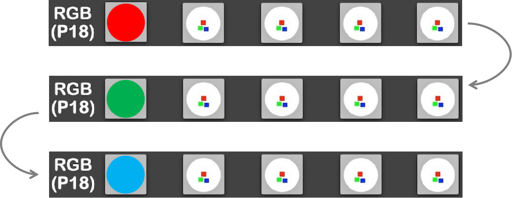

==========================
4.7 循环语句while
==========================

在前面4.2节(列表)中，我们借助BlueFi上的RGB彩灯来帮助理解列表的各种操作。在本节开始介绍while循环语句之前，
请你想一想该怎么用已学的编程知识使得第一颗RGB灯珠的颜色从红色变为绿色，最后变为蓝色？

实现的效果图如下：

图4-14  RGB彩灯颜色切换——单次

根据已学的知识，或许你会这样编程：

.. code-block::  C
  :linenos:

  colors = [(255, 0, 0)]
  pixels.drawPattern(colors)
  time.sleep(1)

  colors = [(0, 255, 0)]
  pixels.drawPattern(colors)
  time.sleep(1)

  colors = [(0, 0, 255)]
  pixels.drawPattern(colors)
  time.sleep(1)

上述的程序的确可以实现要求的颜色变换，但显然，它不会是最好的做法。在该程序中，有着部分形式类似的程序，它们被重复书写着，
该如何对它们进行简化呢？使用while循环语句。

4.7.1 while语句的实现
======================

使用while语句可以将上面程序中的3个语句块变为一个：

.. code-block::  C
  :linenos:

  i = 0
  colors = [[(255, 0, 0)], [(0, 255, 0)], [(0, 0, 255)]]

  while i < 3:
      pixels.drawPattern(colors[i])
      i = i+1
      time.sleep(1)

显然，使用while语句可以避免繁琐的重复编程，提高程序的简洁性与可读性。

while语句的判断条件为“while”和“:”中间的“i < 3”，当判断后的返回值为真时，执行while内部的语句块，一直到判断结果为假时，才跳出while循环。

4.7.2 break
====================

在后面的第5章“使用Python控制BlueFi”中会经常用到“while True”语句，它代表判断条件始终为真，Python将永远执行while内部的语句块。
让我们借助RGB彩灯看看无限循环的效果：

.. code-block::  C
  :linenos:

  i = 0
  colors = [[(255, 0, 0)], [(0, 255, 0)], [(0, 0, 255)]]

  while True:
      if i < 3:
          pixels.drawPattern(colors[i])
          i = i+1
          time.sleep(1)
      else:
          i = 0

其结果如下图所示：

图4-15  RGB彩灯颜色切换——循环

要想退出循环，该怎么做呢？使用beark跳出循环。

将程序修改为：

.. code-block::  C
  :linenos:

  i = 0
  colors = [[(255, 0, 0)], [(0, 255, 0)], [(0, 0, 255)]]

  while True:
      if i < 3:
          pixels.drawPattern(colors[i])
          i = i+1
          time.sleep(1)
      else:
          i = 0
          break

观察BlueFi的RGB彩灯，当灯的颜色变为蓝色后，它不会再变成红色。可以看出，break语句的确跳出了“while True”死循环。

4.7.3 continue
======================

与break语句一样，continue语句同样可以跳出循环，只不过continue语句跳出的只是本次循环中continue语句后的程序，
而不是接下来的所有循环，它将从下一次循环的起始部分重新开始。

我们可以使用continue语句让RGB彩灯显示的颜色依次为红-蓝，跳过显示绿色：

.. code-block::  C
  :linenos:

  i = -1
  colors = [[(255, 0, 0)], [(0, 255, 0)], [(0, 0, 255)]]

  while True:
      if i < 2:
          i = i + 1
          if i == 1:
              continue
          pixels.drawPattern(colors[i])
          time.sleep(1)
      else:
          i = 0
          break

显示效果为：

.. image:: ../_static/images/c4/RGB彩灯颜色切换_红-蓝.png
  :scale: 50%
  :align: center

图4-16  RGB彩灯颜色切换——红-蓝

可以看出，执行到continue语句时，它后面的“pixels.drawPattern(colors[i])”程序不会被执行，因此RGB彩灯也不会显示绿色。

4.7.4 小结
=================

本节主要介绍了第一种循环语句——while，以及两种跳出循环的语句——break和continue，它们各有各的特点，分别用于不同的场景。

下一节将介绍Python中的另一种循环语句——for，与while以条件判断的真假来循环的方式不同的是，
for循环是以遍历的方式来进行循环操作。

