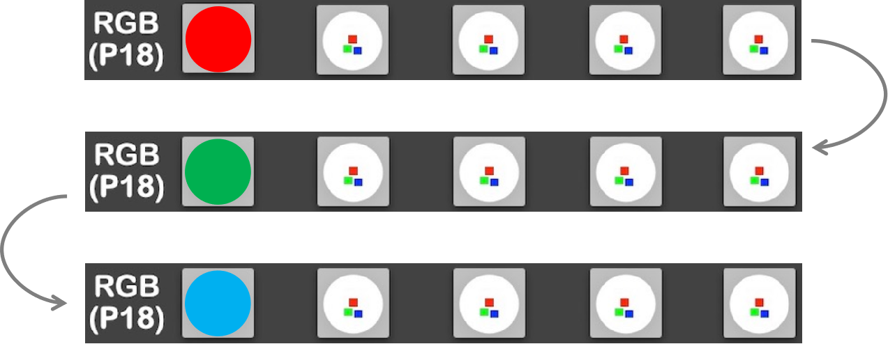
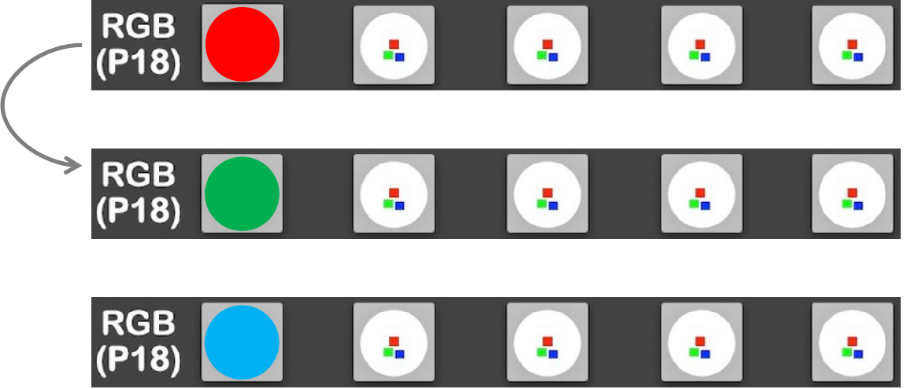
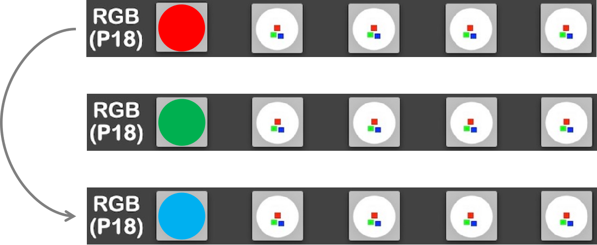

==========================
4.8 循环语句For
==========================

虽然for语句与while语句一样，都属于循环语句，但二者的概念是截然不同的。while语句根据判断条件的返回值来判断是否执行内部程序，
而for语句是以遍历的形式，逐个获取数据容器中的各个项，当容器中的项被获取完后，循环停止。

4.8.1 range函数
=======================

在Python3.0之前的版本中，我们可以使用range函数，这会生成一个整数列表，使用xrange函数，会生成一个可迭代的对象，它们都可被for语句遍历。
而在Python3.x中，废除了原先的range函数，将xrange函数重新命名为range函数。

.. code-block::  C
  :linenos:

  #Python3.0之前的版本
  >>> range(0, 3)
  [0, 1, 2]
  >>> xrange(0, 3)
  xrange(0, 3)
  
  #Python3.x
  >>> range(0, 3)
  range(0, 3)

之后编程中涉及到的range函数，都是Python3.x版本中的定义。

对于range函数，共有两种语法格式：

 * range(stop)
 * range(start, stop(, step))

步长(step)可写可不写，未定义时默认步长为1。

使用list函数可以将range对象变为列表。

.. code-block::  C
  :linenos:

  >>> list(range(3))
  [0, 1, 2]
  >>> list(range(0, 3))
  [0, 1, 2]
  >>> list(range(0, 3, 2))
  [0, 2]

可以看出，使用range(stop)格式，其默认的起始整数为0，且range函数生成的整数不包括stop。

4.8.2 for语句的实现
==========================

与while语句类似，for语句也有独特的语法规则，其格式为：

    for 变量名 in 数据容器

变量名可以任意选取，通常使用i作为变量名，其作用是储存数据容器(列表、元组、字典等)中的项。

根据for语句可以遍历数据容器的特点，下面将分别对for语句在range函数、列表、元组、字典、字符串中的使用做介绍,
其中部分内容将借助RGB彩灯来进行讲解。

1. for i in range()
---------------------

通过4.8.1小节，我们已经知道了如何使用range函数，使用for语句可以依次获取range函数返回值的各个项。

.. code-block::  C
  :linenos:

  import time
  from hiibot_bluefi.basedio import NeoPixel

  pixels = NeoPixel()
  pixels.brightness = 0.01

  colors = [[(255, 0, 0)], [(0, 255, 0)], [(0, 0, 255)]]

  for i in range(3):
      pixels.drawPattern(colors[i])
      time.sleep(1)

i的值依次为0、1、2，其实现的效果如下：

图4-17  RGB彩灯颜色切换——单次

显然，效果与while循环语句实现的效果相同。

2. for i in 列表
---------------------

当遍历的对象为列表时，例如本例中的“colors = [[(255, 0, 0)], [(0, 255, 0)], [(0, 0, 255)]]”，i的取值依次为[(255, 0, 0)]、
[(0, 255, 0)]、[(0, 0, 255)]，此时，i可直接作为drawPattern函数的入口参数。

.. code-block::  C
  :linenos:

  colors = [[(255, 0, 0)], [(0, 255, 0)], [(0, 0, 255)]]

  for i in colors:
      pixels.drawPattern(i)
      time.sleep(1)

RGB灯珠的显示效果与图4-17相同。

3. for i in 元组
----------------------

for语句在遍历元组与列表时是类似的，在程序中，只需将colors列表改为colors元组即可。“[ ]->( )”

.. code-block::  C
  :linenos:

  colors = ([(255, 0, 0)], [(0, 255, 0)], [(0, 0, 255)])

  for i in colors:
      pixels.drawPattern(i)
      time.sleep(1)

显然，i的取值与列表一样，RGB灯珠的闪烁也与图4-17相同。

4. for i in 集合
---------------------

能否像元组一样，将colors列表改为colors集合呢？显然是不行的，集合与列表、元组最大的区别在于集合内项的排列是没有顺序的，也就是说，
无法使用colors[i]这种格式去访问集合中的某一项。因此，集合无法作为drawPattern函数的入口参数。

.. code-block::  C
  :linenos:

  >>> Course = {'Chinese','Math','English'}
  >>> for i in Course:
  ...   print(i)
  ...
  Chinese
  English
  Math

i的取值依次为'Chinese','Math','English'。

5. for i in 字典
--------------------

使用for语句可以获得字典中的键，要想获得与键相对应的值，就需要通过字典自带的操作方法来得到。

.. code-block::  C
  :linenos:

  >>> Scores = {'Chinese': 95, 'Math': 96, 'English': 91}

  >>> for i in Scores:
  ...   print(i,"'s value is", Scores[i])
  ...
  Chinese 's value is 95
  Math 's value is 96
  English 's value is 91

可以看到，i的值为字典中的键。若你想让i的值直接就是字典中的值，可以使用字典中的values方法：

.. code-block::  C
  :linenos:

  >>> for i in Scores.values():
  ...  print(i)
  ...
  95
  96
  91

6. for i in 字符串
---------------------

字符串也是序列数据结构中的一种，它的项就是字符串上的各个字符，使用for语句可以遍历得到。

.. code-block::  C
  :linenos:

  >>> str = 'Chinese'
  >>> for i in str:
  ...   print(i)
  ...
  C
  h
  i
  n
  e
  s
  e

4.8.3 break
=================

在for循环语句中，同样可以使用break语句直接跳出for循环，其使用方法与在while中一样。

.. code-block::  C
  :linenos:

  import time
  from hiibot_bluefi.basedio import NeoPixel

  pixels = NeoPixel()
  pixels.brightness = 0.01

  colors = ([(255, 0, 0)], [(0, 255, 0)], [(0, 0, 255)])

  for i in range(3):
      if i == 2:
          break
      pixels.drawPattern(colors[i])
      time.sleep(1)

该例程序中，第10行和第11行程序的含义是，当i的值为2时，跳出for循环，也就是说RGB灯珠不会变为蓝色。实现的效果如下：

图4-18  RGB彩灯颜色切换——红-绿

可以看出，break语句成功跳出了for循环。

4.8.4 continue
=================

与break语句一样，在for循环中，continue的作用与在while循环中相同，都是跳过continue语句后的程序，从下一次循环的起始部分开始程序。

.. code-block::  C
  :linenos:

  colors = ([(255, 0, 0)], [(0, 255, 0)], [(0, 0, 255)])

  for i in range(3):
      if i == 1:
          continue
      pixels.drawPattern(colors[i])
      time.sleep(1)

该程序中，RGB灯珠将跳过绿色，直接显示蓝色。

图4-19  RGB彩灯颜色切换——红-蓝

4.8.5 小结
===================

经过本节的学习，认识了Python的内置函数range(),
了解了for循环是一种以遍历数据容器的形式来进行循环的语句，以及如何使用for循环来遍历各种数据容器中的项。

到本节为止，我们已经学完了Python中的两大循环结构——while和for，在下一节中，将介绍本书中的最后一种语句——try语句，
它是一种用来处理异常状况的语句。