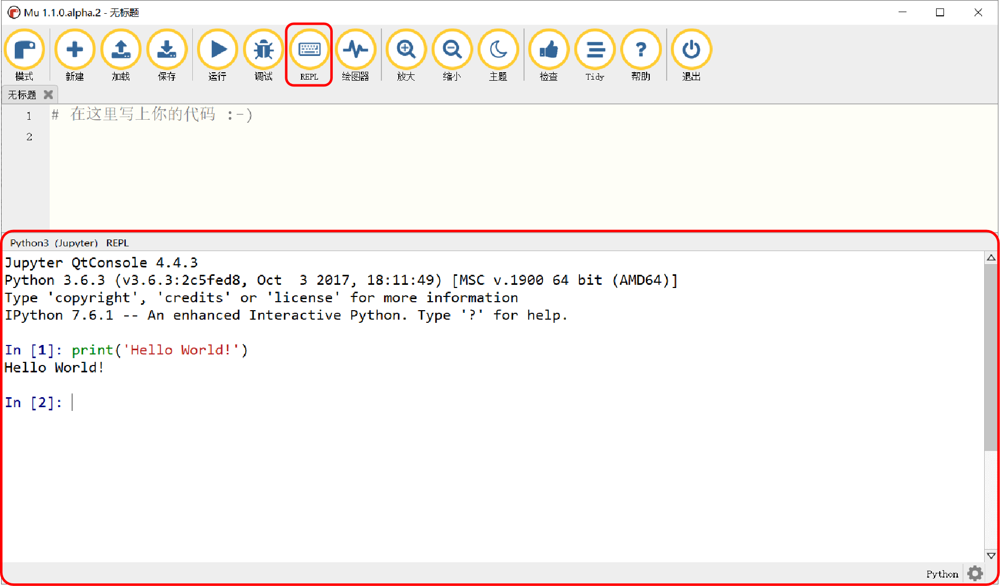

====================
第4章 Python编程语言
====================

本书中的编程部分所用的编程语言为CircuitPython，它由著名开源硬件商——Adafruit发起，得到全球开源社区的支持和维护，
作为支持嵌入式计算机系统Python解释器的后起之秀，CircuitPython具备适合小体积、低功耗、有限资源系统的特征，尤其在开放性和安全性方面，
它的语法结构与Python3.x类似。由于学习Python3.x语法结构时可以借助于Python官方的Python解释器，且有关Python编程的参考资料丰富，
因此，本章将以Python3.x的语法结构来讲解在BlueFi编程过程中所需的Python语言部分的内容。

Python作为一款交互式解释器，以命令行的形式让使用者可以通过逐行输入的方式来获取程序每一步的信息，打开Python软件，
在其对话框中会出现如下类似的语句(Python版本不同，语句略有区别)：

.. code-block::  C
  :linenos:

  Python 3.8.5 (tags/v3.8.5:580fbb0, Jul 20 2020, 15:57:54) [MSC v.1924 64 bit (AMD64)] on win32
  Type "help", "copyright", "credits" or "license" for more information.
  >>>

“>>>”是Python命令行代码的提示符，在后面可输入我们的程序，每行程序输入完成后，按下回车键，Python将执行该行程序并将结果打印在屏幕上。
输入下列程序，看看Python解释器的返回值：

.. code-block::  C
  :linenos:

  >>> print("Hello World!")
  Hello World!
  >>>

如果使用的是MU编辑器上的Python3模式进行学习，请点击上方选项中的“REPL”，同样可以进入命令行窗口。在其中输入print("Hello World!")，
按下回车，看看效果如何。

图4-1  MU编辑器 REPL模式

显然，在MU编辑器的REPL中，使用print语句可以得到相同的输出结果。

.. toctree::
   :maxdepth: 1

   c4-1 data type.rst
   c4-2 List.rst
   c4-3 Tuple.rst
   c4-4 Dict.rst
   c4-5 Set.rst
   c4-6 If.rst
   c4-7 While.rst
   c4-8 For.rst
   c4-9 Try.rst
   c4-10 Function.rst
   c4-11 Class.rst
   c4-12 Module.rst