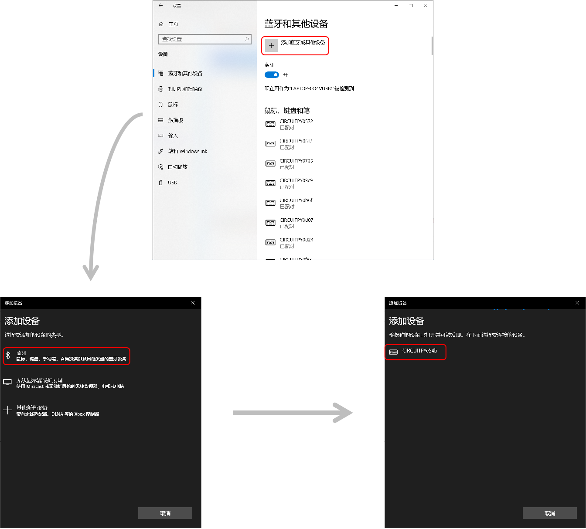

====================
5.14 BlueTooth
====================

蓝牙是一种小范围内的无线连接技术，能在设备间实现方便快捷、灵活安全、低成本、低功耗的数据通信和语音通信，
因此它是实现无线个域网通信的主流技术之一。

为了帮助你更好地理解和应用蓝牙通讯，本节从蓝牙的应用入门开始，后续的教程中将会出现很多次蓝牙的应用编程，
帮助你逐步地掌握蓝牙通讯机器应用。我们首先使用BlueFi创建一个蓝牙键盘，为你计算机添加一个新的键盘。示例代码如下：

.. code-block::  C
  :linenos:

  import time
  import adafruit_ble
  from adafruit_ble.advertising import Advertisement
  from adafruit_ble.advertising.standard import ProvideServicesAdvertisement
  from adafruit_ble.services.standard.hid import HIDService
  from adafruit_ble.services.standard.device_info import DeviceInfoService
  from adafruit_hid.keyboard import Keyboard
  from adafruit_hid.keycode import Keycode
  from adafruit_hid.keyboard_layout_us import KeyboardLayoutUS
  from hiibot_bluefi.basedio import Button
  button = Button()   
  hid = HIDService() 
  device_info = DeviceInfoService(software_revision=adafruit_ble.__version__, manufacturer="HiiBot")
  advertisement = ProvideServicesAdvertisement(hid)
  advertisement.appearance = 961
  scan_response = Advertisement()

  ble = adafruit_ble.BLERadio()
  if ble.connected:
      for c in ble.connections:
          c.disconnect()

  print("advertising")
  ble.start_advertising(advertisement, scan_response)
  k = Keyboard(hid.devices)
  kl = KeyboardLayoutUS(k)
  while True:
      while not ble.connected:
          print("disconnected!")
          time.sleep(1)
          pass
      print("Start typing:")
      while ble.connected:
          c=''
          if button.A:
              c='a'
          if button.B:
              c='b'
          if c!='':
              kl.write(c)
              print(c)
              time.sleep(0.2)
      ble.start_advertising(advertisement)

BlueFi运行本示例程序期间，请先打开你的电脑蓝牙设置窗口，找到当前可连接的蓝牙设备列表，如下图选择对应的蓝牙外设并选择连接，
然后才能正常使用。下图示例仅供参考，不同的电脑显示的信息未必会相同。

图5-3  蓝牙连接过程

当BlueFi在运行程序期间，BlueFi的LCD屏幕会提示当前状态。譬如当你电脑未允许连接BlueFi的蓝牙键盘时，
LCD屏幕上会出现“disconnected!”提示， 而且每秒增加一行，一旦你允许电脑与BlueFi的蓝牙键盘连接时，只要正确地连接上，
BlueFi的LCD屏幕上会出现“Start typing:”提示，当你按下A或B按钮时屏幕也会将显示“a”或“b”的提示。使用过程中，
只要BlueFi与电脑蓝牙断开，也会持续提示“disconnected!”，直到再一次与你的电脑蓝牙连接上。

根据这一执行效果，相信你很容易理解本示例程序。由于本节课是体验蓝牙键盘之目的，不必理会程序的细节。
下面我们只是简要地解释程序的关键部分代码。

    * 程序的前10行，全部都是导入本示例程序所需要的模块或类。
    * 第11和12行，分别实例化Button和HIDService。
    * 第13～15行，程序是将BlueFi配置为HID键盘，后续程序启动蓝牙广播发布自己的属性配置时所需的信息。
    * 第16行，定义蓝牙scan的应答回调处理函数。
    * 第18行，实例化一个低能耗蓝牙(BLE)通讯通道，并在第19～21行的循环体内检查该通道是否存在已连接的，如果存在就断开。
    * 第23行，在LCD屏幕上提示”启动蓝牙广播”，第24行立即启动蓝牙广播，等待蓝牙中心设备(此示例的中心设备是电脑)发现自己。
    * 第25和26行，分别指定键盘的类型和键盘编码类型。
    * 然后进入无穷循环。
    * 在无穷循环的程序块内，第28～31行是监测是否已经与中心设备连接，如果未连接则让LCD屏幕显示“disconnected!”提示，并循环等待连接。作为键盘，如果不与主设备/电脑连接，的确没有其他事务能做的。
    * 在无穷循环的程序块内，第32行让LCD屏提示“Start typing:”表示BlueFi已经与主设备/电脑连接上，可以按A或B按钮。
    * 在无穷循环的程序块内，第33～42行程序就是判断是否有A或B按钮被按下，如果有就发送给主设备，并在LCD屏上显示按下的按钮，如此重复，直到BlueFi的蓝牙通道与主设备/电脑断开。
    * 在无穷循环的程序块内，如果正在已经与主设备/电脑连接的BlueFi再次与电脑断开，第43行又发起蓝牙广播，等待主设备发现自己并尝试连接，退回到无穷循环程序块的第28～31行执行程序，等待与主设备/电脑再次连接上。

在你初次使用BlueFi蓝牙键盘与电脑连接，以及向电脑发送键码的过程中，相信你能够亲身体验蓝牙这种近距离无线通讯的便捷性和用法。
