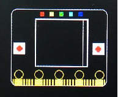

====================
5.7 LCD显示器
====================

在第1章中我们已经介绍过BlueFi上的LCD屏幕的各种用途，可以显示文字和图形。同时也是我们的控制台，无论任何时候，只要脚本程序遇到错误停止执行时，
详细的错误提示信息都会显示在这个屏幕上，方便我们快速排查问题所在，这一功能在执行Python等脚本程序的计算机相同中尤为重要。

控制台只接受“print()”方法输出的信息和相同的提示信息等，如果用户编程需要使用LCD屏幕显示自己订制的信息，
那就需要进一步了解CD屏幕的用法。本节将对LCD屏的各种用法一一说明。

5.7.1 显示文字
=================

除了我们之前常用的print函数打印文字到LCD屏上之外，我们还可以借助BlueFi库函数中的screen模块来自定义文字，
我们可以让LCD屏显示我们所需的文字，文字的大小、颜色、位置等都是可修改的。示例程序如下：

.. code-block::  C
  :linenos:

  import time
  from hiibot_bluefi.basedio import Button
  from hiibot_bluefi.soundio import SoundIn
  from hiibot_bluefi.screen import Screen
  button = Button()
  mic = SoundIn()
  screen = Screen()
  show_data = screen.simple_text_display(title="BlueFi LCD", title_scale=2, text_scale=2)
  while True:
      show_data[2].text = "A:{}".format(button.A)
      show_data[3].text = "B:{}".format(button.B)
      show_data[5].text = "SoundIn:{:.1f}".format(mic.sound_level)
      show_data.show()
      time.sleep(0.1)

本示例程序中，我们将显示的文字在放大2倍后才显示。

下面来分析本示例程序：

    * 第1行，导入一个Python内建的模块“time”。
    * 第2行，从“/CIRCUITPY/lib/hiibot_bluefi/basedio.py”模块中导入一个名叫“Button”的类。
    * 第3行，从“/CIRCUITPY/lib/hiibot_bluefi/soundio.py”模块中导入一个名叫“SoundIn”的类。
    * 第4行，从“/CIRCUITPY/lib/hiibot_bluefi/screen.py”模块中导入一个名叫“Screen”的类。
    * 第5行，将导入的“Button”类实例化为一个实体对象，名叫“button”。
    * 第6行，将导入的“SoundIn”类实例化为一个实体对象，名叫“mic”。
    * 第7行，将导入的“Screen”类实例化为一个实体对象，名叫“screen”。
    * 第8行，定义一个名叫“show_data”的Screen类的多行文本显示子类，设置文本显示的标题为“BlueFi LCD”，标题字体放大2倍，文本字体放大2倍。
    * 第9行，一个无穷循环的程序块。
    * 第10行，(无穷循环程序块的第1行)，设置多行文本显示子类的第2行的文本内容为A按钮状态。
    * 第11行，(无穷循环程序块的第2行)，设置多行文本显示子类的第3行的文本内容为B按钮状态。
    * 第12行，(无穷循环程序块的第3行)，设置多行文本显示子类的第5行的文本内容为麦克风感知到的声音数值。
    * 第13行，(无穷循环程序块的第4行)，更新多行文本显示。
    * 第14行，(无穷循环程序块的第5行)，执行time的sleep方法，参数为0.1秒。

第8行是本示例程序的重点，我们使用Screen类的一个名叫simple_text_display子类，即实现多行简单文本显示的一组方法，
使用这个子类允许你定义多行简单文本显示的所用的字体、标题、标题字的缩放倍数(默认为标准字体的2倍)、标题颜色，
以及多行文本的字体缩放倍数(默认为标准字体)、颜色等。定义simple_text_display子类的接口原型：

.. code-block::  C
  :linenos:

  def simple_text_display(
      title=None,                   # title
      title_color=(255, 255, 255),  # title_color
      title_scale=1,                # title_scale
      text_scale=1,                 # text_scale
      font=None,                    # used font
      colors=None,                  # list of text_color
  ):

在本示例程序的“while True:”程序块内，前三行程序分别是指定三行文本的显示内容，show_data[i].text 表示第i行文本的内容。
而第4行程序是显示文本必要的代码，调用show_data.show()函数将更新多行文本显示到屏幕上。

5.7.2 调整屏幕亮度
===================

BlueFi的Screen类中包含有几个很重要的属性：width(BlueFi屏幕宽度)、height(BlueFi屏幕高度)、
rotation(BlueFi屏幕旋转)和brightness(BlueFi屏幕亮度)。前两个属性是固定值，由BlueFi所用屏幕的物理参数确定，
旋转屏幕是根据自己的需要来决定，如果你想直到当前的旋转角度，只需要将screen.rotation值打印出来就知道了。
屏幕亮度属性——brightness非常重要，如果你的BlueFi已经运行了很长时间，期间未关闭过屏幕显示，你可以用手指去触摸显示屏能明显感觉到温度。
LCD显示屏的是一种被动显示器，屏幕本身不会发光，必须借助于外接光源才能看到屏幕上的字。因此，绝大多数LCD 屏幕都会带着一个背光板，
一种面积跟LCD屏幕完全相同的平面光源，光源被置于LCD屏幕后面。LCD屏背光板是功耗较大的电子元件，而且寿命也比较短，
尤其是随着使用时间的增加，背光板的亮度将逐渐降低。为了节能，大部分时间我们不需要看LCD显示屏的内容时，
我们应该关闭LCD屏幕后面的背光板。

.. code-block::  C
  :linenos:

  import time
  from hiibot_bluefi.basedio import Button, NeoPixel
  from hiibot_bluefi.soundio import SoundIn
  from hiibot_bluefi.screen import Screen
  button = Button()
  mic = SoundIn()
  screen = Screen()
  delayCnt=500

  def screenSave():
      global delayCnt
      time.sleep(0.01)
      if delayCnt<=0:
          screen.brightness = 0 # close backlight
      else:
          delayCnt -= 1
          if delayCnt<50:
              screen.brightness = 0.2
          elif delayCnt<100:
              screen.brightness = 0.5

  pixels = NeoPixel()
  pixels.clearPixels()
  show_data = screen.simple_text_display(title="BlueFi Text Lines", title_scale=1, text_scale=2)
  while True:
      screenSave()
      show_data[2].text = "A:{}".format(button.A)
      show_data[3].text = "B:{}".format(button.B)
      sl = mic.sound_level
      show_data[5].text = "SoundIn:{:.1f}".format(sl)
      show_data.show()
      if button.A or button.B or sl>500:
          delayCnt = 500
          screen.brightness = 1.0

在运行本示例程序期间如果你的周围环境无噪音(相对比较安静)，也不触碰A和B按钮，大约6秒之后，BlueFi的LCD屏幕自动关闭，
实际上是背光板的光源被关闭，我们就看不到LCD屏幕上的文字。如果你吹一下口哨或拍拍巴掌等制造较大的声音，你会发现LCD屏自动亮起，
按下A或B按钮也会看到相同的情况。

这个程序看起来很长(34行代码!)，不过很好理解，我们只是在前一个示例的基础上增加一个自动进入/退出屏保的功能。
主要修改是增加一个名叫“screenSave”的无参数无返回值的函数，在无穷循环程序块内调用该函数实现自动进入屏保的业务。
并在程序的最后增加3行语句实现，按下按钮A或B、或麦克风感知到很大的声音时，自动退出屏保打开显示屏。
第31行程序语句中采用三个条件的或逻辑，满足任何一个条件时，重置变量delayCnt为500，并设置屏幕背光板亮度为最大(1.0)。
在screenSave函数中不断地将变量delayCnt自减1，降到100以下时让屏幕亮度保持为50%；降至50以下时亮度保持20%；降至0时亮度也设为0，
即进入屏保。保持BlueFi处于屏保状态一段时间，你再用手指触摸LCD屏幕，感知他的温度，判断屏保的节能效果。

5.7.3 绘制几何图形
======================

下面我们将继续探索LCD屏幕显示的功能，掌握如何在BlueFi的彩色LCD屏幕上绘制基本几何图形，包括直线、三角形、任意多边形、矩形、
圆角矩形和圆，并掌握边框线径、填充与透明等处理。利用这些绘制基本几何图形的方法，我们能够创意出各种各样的几何图案。

1. 绘制基本图形
----------------

下面的示例程序就是将BlueFi上支持的所有基本几何图形都绘制在LCD屏上。示例程序如下：

.. code-block::  C
  :linenos:

  from adafruit_display_shapes.line import Line
  from adafruit_display_shapes.triangle import Triangle
  from adafruit_display_shapes.polygon import Polygon
  from adafruit_display_shapes.rect import Rect
  from adafruit_display_shapes.roundrect import RoundRect
  from adafruit_display_shapes.circle import Circle

  import displayio
  from hiibot_bluefi.screen import Screen
  screen = Screen()

  points = [(59,0), (179,0), (239,59), (239,179), (179,239), (59,239), (0,179), (0,59)]

  shape_group = displayio.Group(max_size=9)

  line = Line(119, 0, 119, 239, color=screen.WHITE)
  shape_group.append(line)
  triangle = Triangle(119,0, 59,239, 179,239, fill=None, outline=screen.YELLOW)
  shape_group.append(triangle)
  polygon = Polygon(points, outline=screen.GREEN)
  shape_group.append(polygon)
  rect = Rect(29,29,180,180, fill=None, outline=screen.BLUE, stroke=6)
  shape_group.append(rect)
  rrect = RoundRect(39,39,160,160,40, fill=None, outline=screen.BLUE, stroke=4)
  shape_group.append(rrect)
  circle = Circle(119,119,75,fill=None, outline=screen.BLUE)
  shape_group.append(circle)

  screen.show(shape_group)

  while True:
      pass

在这个示例中，我们将adafruit_display_shapes绘图接口的子类全部展示出来。目的是帮助你掌握绘制这些基本几何图形的接口的使用方法。

下面是程序分析：

    * 第1行，从“/CIRCUITPY/lib/adafruit_display_shapes/line.py”模块中导入Line类
    * 第2行，从“/CIRCUITPY/lib/adafruit_display_shapes/triangle.py”模块中导入Triangle类
    * 第3行，从“/CIRCUITPY/lib/adafruit_display_shapes/polygon.py”模块中导入Polygon类
    * 第4行，从“/CIRCUITPY/lib/adafruit_display_shapes/rect.py”模块中导入Rect类
    * 第5行，从“/CIRCUITPY/lib/adafruit_display_shapes/roundrect.py”模块中导入RoundRect类
    * 第6行，从“/CIRCUITPY/lib/adafruit_display_shapes/circle.py”模块中导入Circle类
    * 第8行，导入displayio模块
    * 第9行，从“/CIRCUITPY/lib/hiibot_bluefi/screen.py”模块中导入Screen类
    * 第10行，将导入的“Screen”类实例化为一个实体对象，名叫“screen”
    * 第12行，声明一个列表型变量points，并用8个元组型坐标赋给这个列表
    * 第14行，声明一个displayio类显示元素群Group型变量shape_group，并指定其包含的最大元素个数为9
    * 第16行，定义一个名叫line的Line类图形，并指定其两端点坐标和颜色
    * 第17行，将line添加到shape_group元素群中
    * 第18行，定义一个名叫triangle的Triangle类图形，并指定其顶点坐标和颜色
    * 第19行，将triangle添加到shape_group元素群中
    * 第20行，定义一个名叫polygon的Polygon类图形，使用顶点列表points指定其顶点坐标, 并指定其颜色
    * 第21行，将polygon添加到shape_group元素群中
    * 第22行，定义一个名叫rect的Rect类图形，并指定左上角顶点坐标、宽度和高度，以及颜色
    * 第23行，将rect添加到shape_group元素群中
    * 第24行，定义一个名叫rrect的RoundRect类图形，并指定左上角顶点坐标、宽度、高度和圆角半径，以及颜色
    * 第25行，将rrect添加到shape_group元素群中
    * 第26行，定义一个名叫circle的Circle类图形，并指定圆心坐标和圆角半径，以及颜色
    * 第27行，将circle添加到shape_group元素群中
    * 第29行，将shape_group元素群显示到screen上
    * 第31行，定义一个无穷循环程序块
    * 第32行，(无穷循环程序块的第1行)，空操作

2. 绘制BlueFi轮廓图形
-----------------------

下一个示例将非常有趣，使用前一个示例中所掌握的绘制基本图形的方法绘制一个BlueFi彩色轮廓图在BlueFi的LCD屏幕上，虽然程序代码很长，
但是算法和程序思路异常简单。示例代码如下：

.. code-block::  C
  :linenos:

  from adafruit_display_shapes.line import Line
  from adafruit_display_shapes.triangle import Triangle
  from adafruit_display_shapes.polygon import Polygon
  from adafruit_display_shapes.rect import Rect
  from adafruit_display_shapes.roundrect import RoundRect
  from adafruit_display_shapes.circle import Circle

  import displayio
  from hiibot_bluefi.screen import Screen
  screen = Screen()

  shape_group = displayio.Group(max_size=41)

  rrect = RoundRect(19,39,200,160,12, fill=None, outline=screen.WHITE, stroke=1)
  shape_group.append(rrect)

  rect1 = Rect(69,59,100,100, fill=None, outline=screen.WHITE, stroke=1)
  shape_group.append(rect1)
  rect2 = Rect(24,109,24,24, fill=screen.WHITE, outline=screen.WHITE, stroke=1)
  shape_group.append(rect2)
  rect3 = Rect(189,109,24,24, fill=screen.WHITE, outline=screen.WHITE, stroke=1)
  shape_group.append(rect3)
  rect4 = Rect(79,45,8,8, fill=screen.RED, outline=screen.RED, stroke=1)
  shape_group.append(rect4)
  rect5 = Rect(99,45,8,8, fill=screen.YELLOW, outline=screen.YELLOW, stroke=1)
  shape_group.append(rect5)
  rect6 = Rect(119,45,8,8, fill=screen.GREEN, outline=screen.GREEN, stroke=1)
  shape_group.append(rect6)
  rect7 = Rect(139,45,8,8, fill=screen.CYAN, outline=screen.CYAN, stroke=1)
  shape_group.append(rect7)
  rect8 = Rect(159,45,8,8, fill=screen.BLUE, outline=screen.BLUE, stroke=1)
  shape_group.append(rect8)
  rect9 = Rect(69,59,110,100, fill=None, outline=screen.WHITE, stroke=2)
  shape_group.append(rect9)

  circle1 = Circle(36,121,6, fill=screen.RED, outline=screen.RED)
  shape_group.append(circle1)
  circle2 = Circle(200,121,6, fill=screen.RED, outline=screen.RED)
  shape_group.append(circle2)

  circle3 = Circle(35,175,9, fill=None, outline=screen.GOLD)
  shape_group.append(circle3)
  circle4 = Circle(77,175,9, fill=None, outline=screen.GOLD)
  shape_group.append(circle4)
  circle5 = Circle(119,175,9, fill=None, outline=screen.GOLD)
  shape_group.append(circle5)
  circle6 = Circle(161,175,9, fill=None, outline=screen.GOLD)
  shape_group.append(circle6)
  circle7 = Circle(203,175,9, fill=None, outline=screen.GOLD)
  shape_group.append(circle7)

  rect10 = Rect(27,185,16,14, fill=screen.GOLD, outline=screen.GOLD, stroke=1)
  shape_group.append(rect10)
  rect11 = Rect(69,185,16,14, fill=screen.GOLD, outline=screen.GOLD, stroke=1)
  shape_group.append(rect11)
  rect12 = Rect(111,185,16,14, fill=screen.GOLD, outline=screen.GOLD, stroke=1)
  shape_group.append(rect12)
  rect13 = Rect(153,185,16,14, fill=screen.GOLD, outline=screen.GOLD, stroke=1)
  shape_group.append(rect13)
  rect14 = Rect(195,185,16,14, fill=screen.GOLD, outline=screen.GOLD, stroke=1)
  shape_group.append(rect14)

  rect15 = Rect(23,185,2,10, fill=screen.GOLD, outline=screen.GOLD, stroke=1)
  shape_group.append(rect15)

  rect16 = Rect(45,185,3,14, fill=screen.GOLD, outline=screen.GOLD, stroke=1)
  shape_group.append(rect16)
  rect17 = Rect(51,185,3,14, fill=screen.GOLD, outline=screen.GOLD, stroke=1)
  shape_group.append(rect17)
  rect18 = Rect(56,185,3,14, fill=screen.GOLD, outline=screen.GOLD, stroke=1)
  shape_group.append(rect18)
  rect19 = Rect(62,185,3,14, fill=screen.GOLD, outline=screen.GOLD, stroke=1)
  shape_group.append(rect19)

  rect20 = Rect(87,185,3,14, fill=screen.GOLD, outline=screen.GOLD, stroke=1)
  shape_group.append(rect20)
  rect21 = Rect(93,185,3,14, fill=screen.GOLD, outline=screen.GOLD, stroke=1)
  shape_group.append(rect21)
  rect22 = Rect(99,185,3,14, fill=screen.GOLD, outline=screen.GOLD, stroke=1)
  shape_group.append(rect22)
  rect23 = Rect(105,185,3,14, fill=screen.GOLD, outline=screen.GOLD, stroke=1)
  shape_group.append(rect23)

  rect24 = Rect(129,185,3,14, fill=screen.GOLD, outline=screen.GOLD, stroke=1)
  shape_group.append(rect24)
  rect25 = Rect(135,185,3,14, fill=screen.GOLD, outline=screen.GOLD, stroke=1)
  shape_group.append(rect25)
  rect26 = Rect(141,185,3,14, fill=screen.GOLD, outline=screen.GOLD, stroke=1)
  shape_group.append(rect26)
  rect27 = Rect(147,185,3,14, fill=screen.GOLD, outline=screen.GOLD, stroke=1)
  shape_group.append(rect27)

  rect28 = Rect(171,185,3,14, fill=screen.GOLD, outline=screen.GOLD, stroke=1)
  shape_group.append(rect28)
  rect29 = Rect(177,185,3,14, fill=screen.GOLD, outline=screen.GOLD, stroke=1)
  shape_group.append(rect29)
  rect30 = Rect(183,185,3,14, fill=screen.GOLD, outline=screen.GOLD, stroke=1)
  shape_group.append(rect30)
  rect31 = Rect(189,185,3,14, fill=screen.GOLD, outline=screen.GOLD, stroke=1)
  shape_group.append(rect31)

  rect32 = Rect(213,185,2,10, fill=screen.GOLD, outline=screen.GOLD, stroke=1)
  shape_group.append(rect32)

  screen.show(shape_group)

  while True:
      pass

程序的具体细节不必赘述，几乎都是前一个示例的代码，所有多出来的代码只是修改了绘制几何图形的位置、颜色、尺寸等参数。
本示例在BlueFi上的执行结果如下图：

图5-2  BlueFi轮廓图

使用本节所get的技能，你一定能设计出更有趣的图案。
