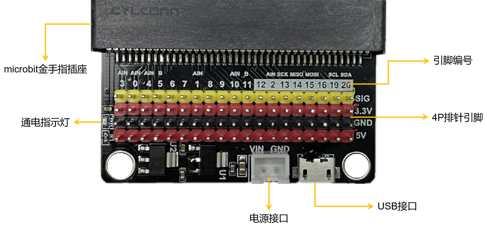

======================
6.1 认识microbit扩展板 
======================

经过前面章节的学习，我们已经初步了解了40-Pin金手指的各种功能及其结构。对于大的引脚(P0、P1、P2、3V、GND)，
我们可以使用鳄鱼夹和香蕉插头来连接电路，但小的引脚就无法用这些方式连接，只能使用焊接导线的方式来与外部电路连接，显然是很不方便的。

因此，我们通常借助microbit金手指的扩展板来将金手指上的引脚引出，这样我们就可以借助杜邦线来完成电路的连接。在本节中，
我们将介绍一种最为简单的扩展板，它只是将金手指的引脚引出为排针：

图6-1 microbit金手指扩展接口

6.1.1 触摸输入
======================

在本书的“触摸输入”那一节中，我们使用到了金手指的3个大引脚——P0、P1、P2，借助BlueFi可以准确地检测到它们的触摸信号。在本小节中，
将借助这一点对扩展板是否成功引出引脚做测试，除了BlueFi和扩展板之外，你还需要准备一根公对母的杜邦线，将杜邦线的母头插在扩展板的0、1或2号引脚上。
下面是示例程序，程序的内容与“触摸输入”章节的程序一致：

.. code-block::  C
  :linenos:

  import time
  from hiibot_bluefi.basedio import TouchPad
  touch = TouchPad()
  while True:
      if touch.P0:
      print("P0 be touched *")
      if touch.P1:
      print("P1 be touched ***")
      if touch.P2:
      print("P2 be touched *****")
      time.sleep(0.1)

在插入母头时请注意要将其插在SIG(扩展板不同，标识也不同)那一排上。正确地插入BlueFi并将程序保存到CIRCUITPY磁盘中，等待程序运行完成后，
用手去触碰杜邦线的公头，观察BlueFi的LCD屏幕上是否打印出上述示例程序中print函数后的内容。如果没有，
请检查杜邦线的母头是否插在SIG的0、1或2号引脚上；如果检查之后屏幕上还是没有打印内容，有可能是杜邦线或扩展板存在问题，
请更换后再进行试验。

根据试验的结果，我们可以看出，扩展板的确能将microbit金手指上的引脚引出并实现电平信号的传输。这一小节只是对于扩展板的一次测试，
下面将使用两块BlueFi及其扩展板，实现两块BlueFi之间的信息传输。

6.1.2 信息通讯
=====================

准备好两份BlueFi和扩展板以及两根母对母的杜邦线，然后将下两小节中的两段示例程序分别保存到两块BlueFi中，就可以实现简单的信息通讯。

1. 发送方
---------------------

下面是发送方的程序：

.. code-block::  C
  :linenos:

  import time
  import board
  from digitalio import DigitalInOut, Direction
  from hiibot_bluefi.basedio import Button

  button = Button()
  sig_send = DigitalInOut(board.P3)
  sig_send.direction = Direction.OUTPUT
  sig_send.value = 0

  while True:
      button.Update()
      if button.A:
          sig_send.value = 1
      else:
          sig_send.value = 0

程序的思路很简单，就是当检测到按钮A被按下时，P3引脚输出高电平，否则，P3引脚输出低电平。

在该示例程序中，我们导入了两个新的模块——“board”和“digitalio”，“board”模块的作用是调用金手指上的各种引脚，
例如程序中的“board.P3”就代表调用的是P3引脚；在“digitalio”模块中则涉及到了引脚上数字量的各种输入输出接口函数。

下面对示例程序中有关改变引脚参数的代码做讲解：

    * 第7行，对“digitalio”模块内的“DigitalInOut”类进行实例化操作，实例化对象为sig_send，调用引脚为board.P3。
    * 第8行，设置P3引脚为输出引脚。
    * 第9行，设置P3引脚的初始值为0(低电平)。
    * 在无穷循环的程序块中，通过改变value方法的值，就可以改变输出的电平高低，1为高电平，0为低电平。

2. 接收方
-------------

在接收方的程序中，我们要对发送方发送的电平信号进行检测并做出相应反应：

.. code-block::  C
  :linenos:

  import time
  import board
  from digitalio import DigitalInOut, Direction, Pull
  from hiibot_bluefi.basedio import LED

  led = LED()
  sig_receive = DigitalInOut(board.P8)
  sig_receive.direction = Direction.INPUT
  sig_receive.pull = Pull.DOWN

  while True:
      if sig_receive.value:
          led.white = 1
      else:
          led.white = 0

在该示例程序中，我们使用BlueFi上的白色LED灯作为指示信号，当收到的电平为高电平时，LED点亮，否则，LED熄灭。

在程序前四行的导入模块中，与上一小节相比，除了多导入了LED模块之外，还导入了Pull模块，
它的作用是将输入引脚的电平在没有信号输入的时候保持在高电平或低电平，使它始终有一个确定的状态。

下面是对程序中有关引脚的代码解释：

    * 第7行，对“DigitalInOut”类进行实例化操作，实例化对象为sig_receive，调用引脚为P8。
    * 第8行，设置P8引脚为输入引脚。
    * 第9行，设置P8引脚的默认状态为下拉，无输入状态下P8引脚上的电平为低电平。
    * 在无穷循环的程序块中，检测P8引脚上收到的电平信号，此时，不能在程序中修改value方法的值。

对于输入引脚，我们只能用Pull设置其默认状态，无法通过value方法修改引脚的电平。

3. 通讯测试
----------------

将发送方和接收方的程序分别保存到两块BlueFi并插入两块扩展板上，然后将一根母对母的杜邦线一头插在发送方的P3引脚，另一头插在接收方的P8引脚。
此时，通上电源后你会发现接收方的LED灯不受发送方的按钮A控制，这是为什么？两块BlueFi之间的基准电压不同。

如果你有万用表，可以用它检测一下两块扩展板上的地信号之间的电压差，你会发现它并不等于0。
因此，我们还需要一根杜邦线来将两块扩展板的地引脚连在一起，这样才能传输正确的电平信号。
连接好两根杜邦线后，按下发送方的按钮A，你是否看见接收方的LED灯被点亮？

在本节中，只是简单地介绍了扩展板引出引脚的功能，在后面的几个小节中，将介绍一些具有特殊功能的扩展板。
