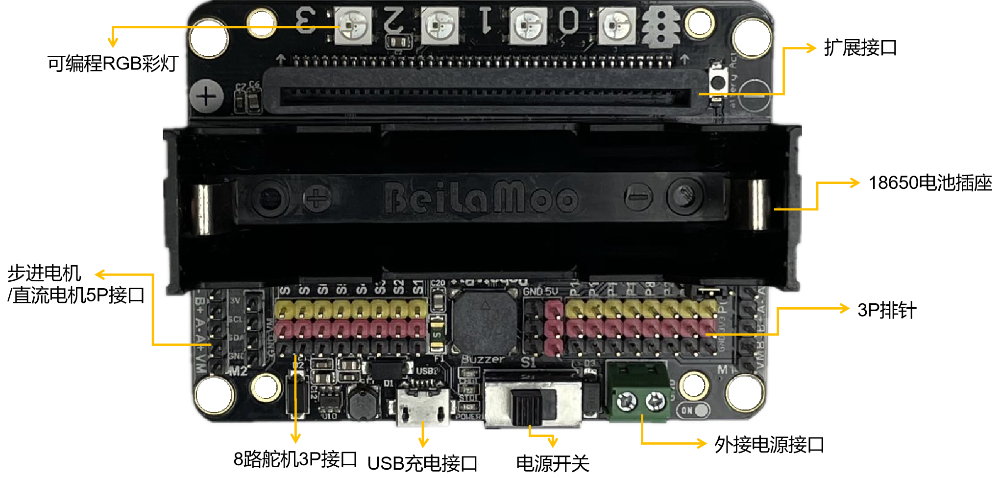
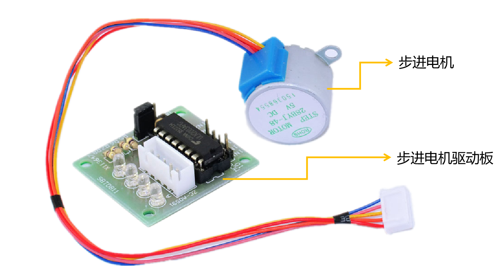
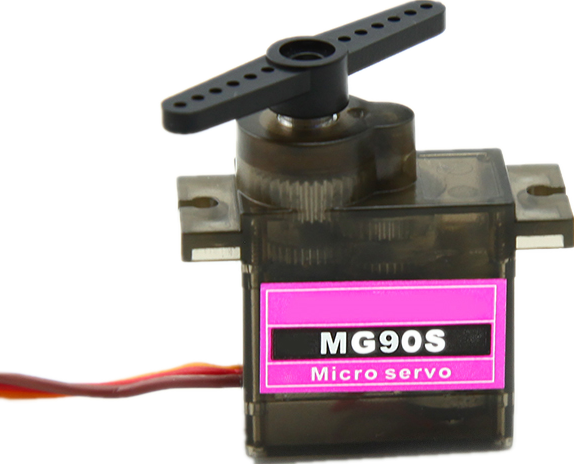
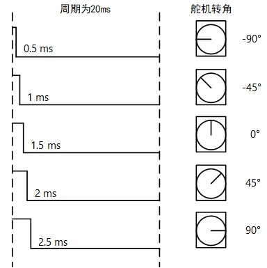

======================
6.2 机器人扩展板 
======================

机器人扩展板，顾名思义，就是用来驱动机器人的扩展板。而控制机器人运动的部件是各种电机(步进电机、舵机等)，因此，
机器人扩展板实际上驱动的是各种电机。

机器人扩展板与上一节中的扩展板最大的不同之处在于机器人扩展板上提供各种电机的驱动模块和接口，下面以RobotBit(V2.2)扩展板为例，
对该扩展板上的步进电机接口和舵机接口的使用做相应介绍。下图是RobotBit(V2.2)扩展板的实物图：

图6-2 RobotBit

6.2.1 驱动步进电机
=======================

由于RobotBit扩展板允许的最大电压为5V，因此，在选择步进电机时，步进电机的额定工作电压应在5V。在本小节中，我们使用的是28BYJ-48步进电机，
它的正常工作电压为5V，满足我们的要求。

图6-3 28BYJ-48步进电机

在上图中除了步进电机之外，还有一个部件叫步进电机驱动板，它常常与步进电机配套使用，用来驱动步进电机。如果只使用BlueFi上IO引脚的输出电平来驱动步进电机，
会因为电压和电流过小而无法驱动电机，因此，需要一个驱动板提高输出功率来辅助驱动步进电机。由于在RobotBit扩展板上自带有驱动电路，
我们无需再外接驱动板，只需将步进电机的5P接口与扩展板上的相应接口相连即可。通常步进电机五根线中的红线为电源正极输入端，
在连接时请注意连接方向不要接反。

由于步进电机的型号是28BYJ-48，它的步距角为5.625°/64，是四相步进电机，可使用单双相轮流通电进行控制。输入脉冲信号的次序如下表所示：

图6-4 步进电机的脉冲次序

如果是借助“RobotBit”类中的方法驱动步进电机，只需按照下面的步骤，就可以轻松驱动步进电机。
在BlueFi的“lib”文件夹中带有专门控制RobotBit扩展板的模块——hiibot_robotbit.py(mpy)，如果没有，请自行在BlueFi开源库中下载。
将其在MU编辑器中打开，我们可以找到“RobotBit”类，在“RobotBit”类中存放着各种驱动电机的方法。
在下面的示例程序中，我们将使用“RobotBit”类中有关步进电机的方法来驱动步进电机：

.. code-block::  C
  :linenos:

  import time
  from hiibot_robotbit import RobotBit

  robotbit = RobotBit()
  robotbit.StepperDegree(2,90)

  time.sleep(3)

  robotbit.StepperTurn(2,1)

将BlueFi和步进电机插在扩展板上，并外接5V电源，连接好后，打开电源开关，
将上述程序保存到BlueFi的磁盘中，观察步进电机的转动情况。你会发现步进电机先是转了90°，然后停止3s，最后又转动了1周(360°)。

除去程序开始部分的导入模块和实例化程序，控制步进电机转动的程序其实只有两行——第5行和第9行。
在第5行程序中调用了“RobotBit”类中的“StepperDegree(index,degree)”方法来控制步进电机的转角，该方法共有两个入口参数——index(步进电机序号)和degree(转角)。
index数值的选择取决于你连接的是RobotBit扩展板上的哪个步进电机驱动引脚(M1、M2)，在该示例程序中使用的是M2引脚，因此index的值为2。
而“degree”则代表我们设定的旋转角度，可正(顺时针旋转)可负(逆时针旋转)。

在第9行中调用了“StepperTurn(index,rounds)”方法，该方法的第一个入口参数依然为index，而第二个参数“rounds”代表步进电机旋转的周数，
在本例中是旋转1周。“StepperTurn(index,rounds)”方法其实就是把“StepperDegree(index,degree)”方法中的“degree”修改为了“rounds×360”，
本质上还是在设定电机的转动角度，我们可以从下面“StepperTurn”方法的定义中直接看出这一点。

.. code-block::  C
  :linenos:

  def StepperTurn(self, index, rounds):
      self.StepperDegree(index, rounds*360)

6.2.2 驱动舵机
========================

舵机也叫伺服电机，最早用于船舶上实现船舶的转向功能，由于其可编程控制的特性，
因此经常被使用在机械臂、智能小车、航模等需要转向部件的机构上。

图6-5 MG90S舵机

上图中所示的是市场上常见的小型舵机，它的转角范围为-90°～90°，正常工作下的电压输入范围为4.8～7.2V。事实上，我们也可以使用BlueFi输出的3.3V的电压来控制舵机转动，无需外接5V电源或驱动板，
但此时舵机的力矩会低于正常工作下的力矩。

目前，控制舵机的方法共有两种——PWM信号和串行总线。pwm是国际航模通用的一种标准的信号控制形式，只需改变PWM的占空比，即可控制舵机转到固定角度；
而串行总线是用数据传输的方式与舵机通信，通过指令包的发送和接收获取舵机当前位置和需要抵达的位置，因此可以获取各种详细的数据——位置、扭矩、温度、速度、负载等。

由于在BlueFi自带的库函数中有输出PWM波的模块(pulseio)，因此在本小节中只对用PWM信号控制舵机转角做介绍，有关串行总线控制的内容读者可以自行学习。

控制舵机的PWM信号的周期通常为20ms，其中脉宽从0.5ms～2.5ms，相应的舵机转角为-90°～90°，二者的对应关系可以参照下图：

图6-6 舵机转角与占空比的对应关系

调用BlueFi中的“pulseio”模块输出PWM信号：

.. code-block::  C
  :linenos:

  import board
  import pulseio

  def setpwm(pw):
      return int(pw/20*65535)

  motor_pwm = pulseio.PWMOut(board.P8,frequency = 50,duty_cycle = setpwm(1.5))

  while True:
      pass

在上述示例程序中，我们令BlueFi的P8引脚输出了一个频率为50Hz(周期为20ms)、占空比为1.5/20的PWM信号。将BlueFi和舵机插入RobotBit扩展板上的对应位置处，
本例中将舵机插在了扩展板的P8引脚处，舵机上三根线的对应关系为：橙色-信号线、红色-电源正极、棕褐色-电源负极，在与扩展板连接时请注意线的对应关系。

连接好后点击MU编辑器的保存按钮执行该示例程序，观察舵机是否转到了0°的位置，然后再修改第7行程序中的setpwm(pw)的pw数值(0.5～2.5)，再观察舵机的转角情况。
在该示例程序中主要调用的就是第7行程序中的PWMOut方法，它一共有3个入口参数，分别设置引脚编号(board.Px)、PWM信号频率(frequency)和占空比(duty_cycle)，
其中占空比的数值范围为0～65535，在本例中用setpwm函数对其赋值，只需输入脉宽(0～2.5)即可返回相应的占空比。

除了用BlueFi的“pulseio”模块输出PWM信号之外，我们还能直接使用RobotBit扩展板的模块——hiibot_robotbit.py(mpy)内已经封装好的接口函数输出PWM信号。

.. code-block::  C
  :linenos:

  import time
  from hiibot_robotbit import RobotBit

  robotbit = RobotBit()
  robotbit.Servo(1,180)

RobotBit扩展板上驱动舵机的方法名为“Servo(index,degree)”，它有两个入口参数，含义与驱动步进电机的“StepperDegree”方法相同，
第一个参数“index”为所接舵机引脚的编号(1～8)，本例中接的是1号引脚；第二个参数“degree”为舵机的转角，范围为0°～180°，在本例中控制舵机转到180°的位置。

将BlueFi和舵机正确地插在扩展板上，并外接5V电源，连接好后，打开电源开关，并保存上述程序，观察舵机的转动情况。
与之前用BlueFi的引脚直接输出PWM信号相比，用RobotBit扩展板自带的“Servo”方法需要外接5V的电源，
因此此时舵机上的转矩比之前的3.3V电压驱动时的转矩要大，可以带动更重的负载。
在实际使用舵机驱动机械臂或智能小车时，一般使用“Servo”方法来驱动舵机。

在本节中，我们初步了解了电机可以作为智能小车、机器人、航模等需要转向控制的执行元件，并且也知道了如何使用RobotBit扩展板驱动各种电机。
如果你对电机在实际项目中的应用感兴趣，在第7章“创意项目”的部分章节中就有使用电机实现转向控制的内容，读者可以自行跳转阅读。

