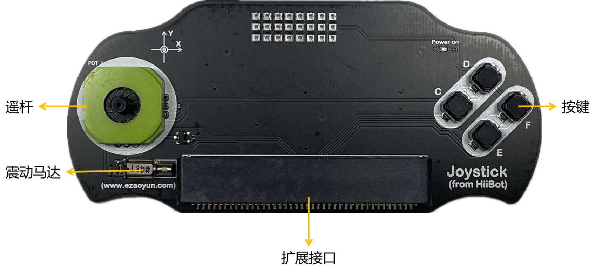

======================
6.2 手柄扩展板 
======================

除了上一章提到的排针式的扩展板之外，我们最常用到的其实是各种具有特定使用场景的扩展板。这种特定的扩展板本身往往具备着一个相应的模块，
模块内提供各种接口函数方便我们直接使用扩展板上的电子元件。

在本节中，将介绍第一种特定的扩展板——手柄扩展板。一提到手柄，相信接触过主机游戏的人都会想到游戏主机上的PS4手柄和Xbox手柄，如下图所示：

图6-1 PS4手柄(左)和Xbox手柄(右)

这是市场上较为流行的两种游戏手柄，从外表上看，它们都有两个摇杆和各种按键，为什么要有两个摇杆呢？在玩3D游戏时，除了需要移动游戏角色之外，
我们还需要移动角色的视角，这时就需要两个摇杆来分别满足上述要求。除了外表上我们能看见的器件之外，在手柄的内部往往还安装有震动马达。
震动马达在游戏中的应用场景非常多，如击打、赛车碰撞等都需要震动马达来提供相应的反馈，目的是渲染游戏气氛，增强玩家的代入感。

6.2.1 BlueFi手柄
==================

那么，是否有一款扩展板可以实现上面的这些功能呢？手柄扩展板。尽管他的外表没有市场上流行的手柄那么好看，但它可以与microbit金手指连接的特点，
支持我们使用BlueFi来对该手柄扩展板进行编程控制，你会用它来做什么呢？

图6-2 BlueFi手柄

在下面的几个小节中，会调用该手柄扩展板模块内的接口函数来实现一些简单的小项目。

6.2.2 按键点灯
==================

在手柄上，总共有4个按键，分别是C、D、E、F按键，它们的使用方式与BlueFi上的按钮A(B)类似，
只不过是需要通过“hiibot_joystick”模块中的“Joystick”类内的接口函数来调用它。

下面的程序将演示如何使用手柄上的按键来控制RGB彩灯的闪烁：

.. code-block::  C
  :linenos:

  import time
  from hiibot_joystick import Joystick
  from hiibot_bluefi.basedio import NeoPixel

  joy_button = Joystick()
  pixels = NeoPixel()
  pixels.brightness = 0.3
  colors = []

  while True:
      joy_button.Update()
      if joy_button.C_wasPressed:
          colors = [ (255,0,0), (0,0,0), (0,0,0), (0,0,0)]
      
      if joy_button.D_wasPressed:
          colors = [ (0,0,0), (0,255,0), (0,0,0), (0,0,0)]
            
      if joy_button.E_wasPressed:
          colors = [ (0,0,0), (0,0,0), (0,0,255), (0,0,0)]
            
      if joy_button.F_wasPressed:
          colors = [ (0,0,0), (0,0,0), (0,0,0), (255,255,255)]
            
      pixels.drawPattern(colors)
      time.sleep(0.2) 

将BlueFi与手柄扩展板相连，注意，在连接时请将BlueFi显示屏的那一面朝外，确认连接正常后再接通电源。你可以试着按下手柄上的4个按键，
并观察RGB彩灯的点灯情况是否与程序中的colors列表中的数值对应。

在此，不对程序中的各行程序一一说明，下面主要介绍一下“hiibot_joystick”模块。

在REPL中输入下面的程序，可以看到“hiibot_joystick”模块内的所有接口：

.. code-block::  C
  :linenos:

  >>> from hiibot_joystick import Joystick
  >>> joy = Joystick
  >>> joy = Joystick()
  >>> dir(joy)
  ['__class__', '__dict__', '__init__', '__module__', '__qualname__', 'C', '_p0', '_x', '_y', '_C', '_db_C', '_D', '_db_D', 
  '_E', '_db_E', '_F', '_db_F', '_vibration', 'Update', 'C_wasPressed', 'C_wasReleased', 'C_pressedFor', 'D', 'D_wasPressed', 
  'D_wasReleased', 'D_pressedFor', 'E', 'E_wasPressed', 'E_wasReleased', 'E_pressedFor', 'F', 'F_wasPressed', 'F_wasReleased', 
  'F_pressedFor', 'Vibration', '__mapxy', 'X', 'Y']

如果你想了解这些接口是怎么写的，请打开电脑上的“CIRCUITPY磁盘->lib文件夹”，在lib文件夹下你可以找到“hiibot_joystick.py”或“hiibot_joystick.mpy”文件，
如果是“hiibot_joystick.py”，请将其用MU编辑器打开，你就可以看到其内部的各种变量、函数，如上例程序中的“F_wasPressed”函数；
如果是“hiibot_joystick.mpy”，你需要到 https://python4bluefi.readthedocs.io/zh_CN/latest/ 网页内的“BlueFi开源库”中下载“hiibot_joystick.py”，
然后再在MU编辑器中打开查看。

6.2.3 打靶游戏
==================

通过上一小节中的程序，可能你无法体会到手柄扩展板的特别之处，下面，我们将使用手柄上的摇杆和震动马达来实现一个“打靶”小游戏。

.. code-block::  C
  :linenos:

  import time
  import displayio
  import random
  from hiibot_joystick import Joystick
  from adafruit_display_shapes.circle import Circle
  from adafruit_display_shapes.line import Line
  from hiibot_bluefi.screen import Screen

  screen = Screen()
  joy_button = Joystick()
  group = displayio.Group(max_size=4)

  bullet = Circle(0,0,10,fill=(0,0,0), outline=screen.RED)
  group.append(bullet)

  line_1 = Line(119, 0, 119, 40, color=screen.WHITE)
  group.append(line_1)

  line_2 = Line(10, 0, 50, 0, color=screen.WHITE)
  group.append(line_2)

  target = Circle(120,120,10,fill=(0,0,255), outline=screen.BLUE)
  group.append(target)

  screen.show(group)

  def bullet_init():
      bullet.x =  joy_button.X + 110
      bullet.y =  joy_button.Y + 110
      line_1.x = bullet.x + 10
      line_1.y = bullet.y - 10
      line_2.x = bullet.x - 10
      line_2.y = bullet.y + 10

  def decoration():
      line_1.x = bullet.x + 10
      line_1.y = bullet.y - 10
      line_2.x = bullet.x - 10
      line_2.y = bullet.y + 10

  def bullet_coord_x_y():
      if 3 < abs(bullet.x - (joy_button.X + 110)):
          bullet.x = joy_button.X + 110
      if 3 < abs(bullet.y - (joy_button.Y + 110)):
          bullet.y = joy_button.Y + 110
      decoration()

  def target_hit():
      if abs(bullet.x - target.x) < 8 and abs(bullet.y - target.y) < 8:
          return True

  bullet_init()

  while True:
      bullet_coord_x_y()
    
      if target_hit():
          joy_button.Vibration = 1
          time.sleep(0.05)
          target.x = random.randint(30,210)
          target.y = random.randint(30,210)
          joy_button.Vibration = 0

将程序保存到BlueFi上，程序加载完成后，在LCD屏上你可以看到两个小点，接下来请推动摇杆，你会发现那个空心的小点朝着手柄的推动方向移动。
然后将空心小点与实心小点重合，有没有感受到手柄的震动？恭喜你，你已经完成了一次“射击”。

这个程序的实现思路是在屏幕上画出两个目标点，其中一个可以被手柄的遥感控制，当两个点重合时，震动马达震动并在屏幕上随机生成一个新的目标点，
周而复始。是不是很简单？下面让我们来看一下程序的主要实现代码：

    * 程序的前7行是导入程序必要的各种模块或类。
    * 第9～10行，类的实例化操作。
    * 第13～25行，画两个目标图形，并显示在LCD屏上。
    * 第27～33行，定义bullet_init函数，函数目的为初始化空心点及其上两条线段的x、y坐标，使其一开始的位置位于屏幕的正中心。
    * 第35～39行，定义decoration函数，目的是修改空心点上两条线段的坐标值，使它们始终跟随空心点移动。
    * 第41～46行，定义bullet_coord_x_y函数，设定摇杆的死区数值为3，即只有当摇杆摆动的范围大于3，程序才会认为这是一次有效的移动，并控制空心点移动。
    * 第48～54行，定义target_hit函数，目的是判断两点是否重合，通过修改if语句中的判断范围(在本例中两个都是8)，我们可以得到更加精确或宽松的重合条件。
    * 第52行，调用bullet_init()，初始化空心点。
    * 第54～62行，无限循环语句块，其实现的内容为空心点随摇杆移动，当两点重合时，震动0.05s并随机生成新的实心点。

在程序中的bullet_coord_x_y函数内，我们遇到了设置摇杆死区的问题，为什么要设置摇杆死区？摇杆死区的范围如何界定呢？

手柄的摇杆会因为使用次数过多、内部积灰等原因产生摇杆漂移。漂移就是在你没有控制摇杆输出指令，甚至你的手根本没有碰到摇杆的时候，
在主机上却出现了摇杆控制动作的现象。我们可以用下面的程序来观察手柄摇杆的漂移现象：

.. code-block::  C
  :linenos:

  import time
  from hiibot_joystick import Joystick

  joy_button = Joystick()

  while True:
      print("X:{}".format(joy_button.X))
      print("Y:{}".format(joy_button.Y))
      time.sleep(1)

在程序中的第7行和第8行，分别读取摇杆的X和Y数值，将其平放在桌面上，观察LCD屏上显示的数值，你会发现，X和Y的数值并不是不变的，
它们的数值存在上下的波动，波动的差值通常是1，这就是摇杆的漂移现象。如果我们不设置死区，可以将bullet_coord_x_y函数中的3改为0，
把程序保存之后观察空心点，即使我们不推动摇杆，它还是会在上下左右之间抖动，这显然是需要避免的。

现在你知道为什么要设置摇杆死区和如何选择摇杆死区的范围吗？

这个打靶游戏非常简单，简单也意味着我们可以在它上面添加更多的功能。我们可以添加一个计数器放在屏幕的角落，用来记录击中的靶的个数；
以按键的方式来代替重合，也就是说，当两个点重合时，需要按下某一按键，才能完成一次打靶，这将更接近现实中的打靶过程——瞄准、射击；……
任何有趣的想法都可以将它添加到程序中，动手去实现它吧！
