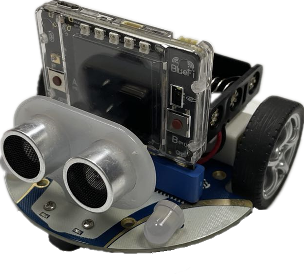

=========================
6.3 酷比特小车(Cutebot) 
=========================

在日常生活中，你一定见过或玩过遥控小车，它主要由两个部分组成——手柄和小车。在上一节中，
我们已经知道了使用BlueFi的金手指可以外接手柄扩展板来模拟一个手柄，那么小车是否也可以作为一个BlueFi的外接模块来使用呢？
在本节中，我将为你介绍酷比特小车(Cutebot)，它支持microbit金手指连接，当然，他肯定也是支持编程控制的。

6.3.1 酷比特小车的组成
========================

下面让我们先来看一下酷比特小车上具有的各个接口及元件：

.. image:: ../_static/images/c6/Cutebot小车.png
  :scale: 36%
  :align: center

图6-3 酷比特小车(Cutebot)

可以看到，通过使用酷比特小车上丰富的接口和传感器资源，我们已经可以编程实现很多智能小车的功能，如循迹、避障、遥控等，
配合使用BlueFi丰富的传感器你将能实现更多种交互。

图6-3 酷比特小车(Cutebot) + BlueFi

6.3.1 让Cutebot动起来
=========================

使用麦昆小车前，需要先准备3节1.5V的7号电池，且确保电池电量饱满，并将电池正确地放入电池盒。
电池安装正确之后，我们首先让酷比特小车动起来。实现的效果：小车前进一段距离；然后开启右转灯并开始右转，然后关闭右转灯并停止右转；
然后再后退 一段距离；再开启左转灯左转，最后关闭左转灯并停止左转；如此循环。

示例程序代码如下：

.. code-block::  C
  :linenos:

  import time
  from hiibot_cutebot import Cutebot

  car = Cutebot()
  carspeed = 50

  while True:
      car.motor(carspeed, carspeed)
      time.sleep(1.5)
      car.stop()
        
      car.headLamp(0,(0,0,255))   # turn on right head lamp
      car.motor(carspeed//2, -carspeed//2)
      time.sleep(1.5)
      car.headLamp(0,(0,0,0))   # turn off right head lamp
      car.stop()
        
      car.motor(-carspeed, -carspeed)
      time.sleep(1.5)
      car.stop()
        
      car.headLamp(1,(0,0,255))    # turn on left head lamp
      car.motor(-carspeed//2, carspeed//2)
      time.sleep(1.5)
      car.headLamp(1,(0,0,0))    # turn off left head lamp
      car.stop()

请将上述示例代码保存到BlueFi的/CIRCUITPY/code.py文件，并将BlueFi插入到酷比特小车上，然后打开酷比特小车的电源开关，
请观察酷比特小车的动作是否达到我们的预期效果。

上述示例程序非常容易理解。前两行语句是导入Python模块，第4行程序是将MaQueen类实例化为“car”，第5行设置一个变量carspeed,用来存放小车的转速。
在无穷循环程序块中，我们使用“car.motor(左轮速度和方向, 右轮速度和方向)”接口控制小车前进、后退、左转和右转，
该接口的两个参数分别代表左轮速度和方向、右轮速度和方向，负数表示反转，正数表示正转，数值绝对值的大小代表速度，速度取值0～255。
要想停下小车，可以调用Cutebot类中的stop方法，即程序中的“car.stop()”。

在该程序中还涉及到了两盏RGB前灯的调用程序，使用“car.headLamp(选择左车灯或右车灯，(R,G,B))”接口可以调用酷比特小车的两盏前灯，
该接口中的第一个参数为左车灯或右车灯的选择，“0”代表选择右灯，“1”代表选择左灯。而第二个参数则是设置该车灯的RGB数值，
数值的传入格式为列表或元组。

6.3.2 循迹小车
======================

6.3.3 AGV避障
=====================

6.3.4 遥控小车
====================

