=========================
6.4 酷比特小车(Cutebot) 
=========================

在日常生活中，你一定见过或玩过遥控小车，它主要由两个部分组成——手柄和小车。在上一节中，
我们已经知道了使用BlueFi的金手指可以外接手柄扩展板来模拟一个手柄，那么小车是否也可以作为一个BlueFi的外接模块来使用呢？
在本节中，我将为你介绍酷比特小车(Cutebot)，它支持microbit金手指连接，因此，我们可以通过对BlueFi的金手指引脚编程从而控制酷比特小车。

6.4.1 酷比特小车的组成
========================

下面让我们先来看一下酷比特小车上具有的各个外置接口及电子元件：

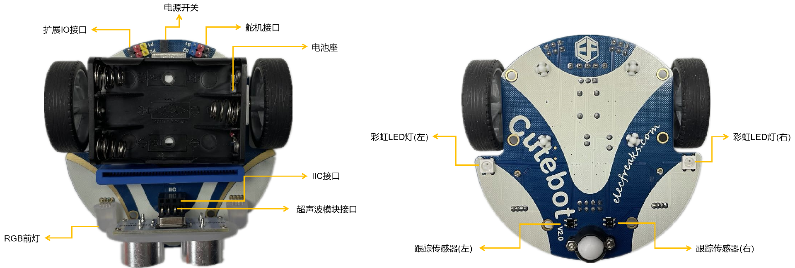

图6-9 酷比特小车(Cutebot)

可以看到，通过使用酷比特小车上丰富的接口和传感器资源，我们已经可以编程实现很多智能小车的功能，如循迹、避障、遥控等，
如果配合使用BlueFi丰富的传感器，你将能实现更多种交互。

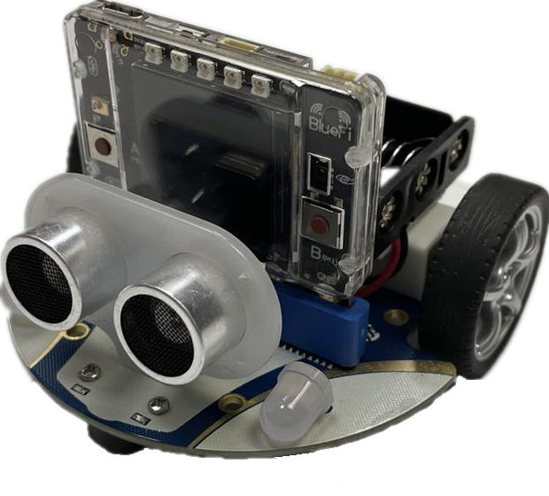

图6-10 酷比特小车(Cutebot) + BlueFi

6.4.2 让Cutebot动起来
=========================

使用酷比特小车前，需要先准备3节1.5V的7号电池，且确保电池电量饱满，并将电池正确地放入电池盒。
电池安装正确之后，我们首先让酷比特小车动起来。实现的效果：小车前进一段距离；然后开启右转灯并开始右转，然后关闭右转灯并停止右转；
然后再后退 一段距离；再开启左转灯左转，最后关闭左转灯并停止左转；如此循环。

示例程序代码如下：

.. code-block::  C
  :linenos:

  import time
  from hiibot_cutebot import Cutebot

  car = Cutebot()
  carspeed = 50

  while True:
      car.motor(carspeed, carspeed)
      time.sleep(1.5)
      car.stop()
        
      car.headLamp(0,(0,0,255))   # turn on right head lamp
      car.motor(carspeed//2, -carspeed//2)
      time.sleep(1.5)
      car.headLamp(0,(0,0,0))   # turn off right head lamp
      car.stop()
        
      car.motor(-carspeed, -carspeed)
      time.sleep(1.5)
      car.stop()
        
      car.headLamp(1,(0,0,255))    # turn on left head lamp
      car.motor(-carspeed//2, carspeed//2)
      time.sleep(1.5)
      car.headLamp(1,(0,0,0))    # turn off left head lamp
      car.stop()

请将上述示例代码保存到BlueFi的/CIRCUITPY/code.py文件，并将BlueFi插入到酷比特小车上，然后打开酷比特小车的电源开关，
请观察酷比特小车的动作是否达到我们的预期效果。

上述示例程序非常容易理解。前两行语句是导入Python模块，第4行程序是将MaQueen类实例化为“car”，第5行设置一个变量carspeed,用来存放小车的转速。
在无穷循环程序块中，我们使用“car.motor(左轮速度和方向, 右轮速度和方向)”接口控制小车前进、后退、左转和右转，
该接口的两个参数分别代表左轮速度和方向、右轮速度和方向，负数表示反转，正数表示正转，数值绝对值的大小代表速度，速度取值0～255。
要想停下小车，可以调用Cutebot类中的stop方法，即程序中的“car.stop()”。

在该程序中还涉及到了两盏RGB前灯的调用程序，使用“car.headLamp(选择左车灯或右车灯，(R,G,B))”接口可以调用酷比特小车的两盏前灯，
该接口中的第一个参数为左车灯或右车灯的选择，“0”代表选择右灯，“1”代表选择左灯。而第二个参数则是设置该车灯的RGB数值，
数值的传入格式为列表或元组。

6.4.3 电子围栏
======================

前一个示例没有任何逻辑，只是简单的顺序执行固定动作，下面我们来实现一个稍微复杂一点的动作效果：地上画个圆作为电子围栏的边界，
酷比特小车就在围栏内随意行驶。准备工作：在白色地面或纸上贴上宽度大于1公分以上的黑色胶带或不干胶，确保黑色胶带围成一个封闭的图案，
并将酷比特小车放在图案内。图案可以参考下图所示：

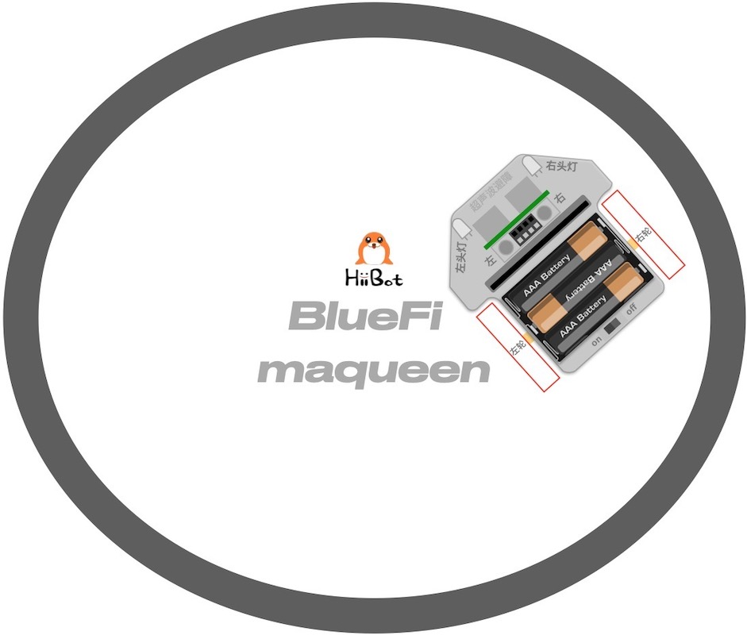

图6-11 电子围栏

执行下面的示例代码，你会看到酷比特小车在电子围栏内随意地行驶，但始终不会跑出围栏。

.. code-block::  C
  :linenos:

  import time
  from hiibot_cutebot import Cutebot
  from hiibot_bluefi.basedio import Button, NeoPixel

  button = Button()
  pixels = NeoPixel()
  car = Cutebot()

  carrun = False

  car.pixels.brightness = 0.1
  car.pixels.fill((0,0,0)) # two pixels on the bottom set to RED
  car.pixels.show()
  colors = [(255,0,0), (255,255,0), (0,255,0), (0,0,255)]

  st = time.monotonic()

  def roundColors():
      global st
      if (time.monotonic() - st) < (1 if carrun==True else 5):
          return
      st = time.monotonic()
      t=colors[0]
      for ci in range(3):
          colors[ci] = colors[ci+1]
          car.pixels.fill(colors[ci])
      colors[3] = t
      car.pixels.fill(colors[3])
      car.pixels.show()

  while True:
      
      roundColors()
      
      button.Update()
      if button.A_wasPressed:
          carrun = True
          print("running")
      if button.B_wasPressed:
          car.stop()
          print("stop")
          carrun = False

      ls = car.leftTrackSensor
      rs = car.rightTrackSensor
      if carrun:
          if ls == 0 and rs == 0 :
              car.stop()
              car.move(1,-20)  # backward
              time.sleep(0.2)
              car.stop()
              car.leftHeadLED = 1
              car.move(2, 30)  # turn left
              time.sleep(0.2)
              car.leftHeadLED = 0
              car.stop()
          elif ls == 0 :
              car.stop()
              car.headLamp(0,(0,0,255))
              car.move(3, 30)  # turn right
              time.sleep(0.2)
              car.headLamp(0,(0,0,0))
              car.stop()
          elif rs == 0 :
              car.stop()
              car.headLamp(1,(0,0,255))
              car.move(2, 30)  # turn left
              time.sleep(0.2)
              car.headLamp(1,(0,0,0))
              car.stop()
          else:
              car.move(0, 30)  # forward
              time.sleep(0.02)
      pass

将示例程序保存到BlueFi的/CIRCUITPY/code.py文件中，并将BlueFi插入到酷比特小车，将酷比特小车的电源开关拨到 “on”档位，
等待我们的程序正式开始运行后，按下BlueFi的A按钮，并将整个小车放在黑色胶带围成的封闭图案内，你将看到酷比特小车始终在围栏内行驶。
当你想要让酷比特小车停下时，请按下BlueFi的B按钮即可，或者直接关闭电源。

为什么酷比特小车不会越过黑色胶带围成的“围栏边界”呢？我们使用酷比特小车底部的一对循迹传感器来侦测小车是否到达 “围栏边界”，
如果遇到边界则根据这对传感器的状态来调整行驶方向：如果两个传感器都侦测到黑色边界，则先后退一段距离再左转；
如果只有左侧传感器侦测到黑色边界则右转；如果右侧传感器侦测到黑色边界则左转；如果传感器都未侦测到黑色边界则继续前进。
其中小车4个方向(前后左右)上的运动我们在程序中用Cutebot类中的move方法来实现它，其格式为“car.move(方向，转速)”，
主要的参数为该方法中的第一个参数，它代表小车的运动方向，对应关系为“0-前进，1-后退，2-左转，3-右转”。

这是本示例程序的无穷循环程序块中的关键逻辑，或者说这就是实现“电子围栏”效果的关键逻辑。
本示例中增加2个按钮做交互实现开始行驶和停止行驶的功能，也属于无穷循环程序块的一部分逻辑。

为了达到更好的视觉效果，本示例程序还使用了酷比特小车底盘的2颗彩灯来区别行驶、停车状态。其主要实现程序为第18～29行，
我们先来看“roundColors”函数中的第20～21行，“time.monotonic() - st”中“time.monotonic()”代表当前系统的运行时间，
而st代表上一次切换彩灯颜色时的系统运行时间，二者的差值就代表了距离上一次切换彩灯颜色过了多长时间。“1 if carrun==True else 5”
是一个判断语句，判断条件为小车是否在运动；若小车在运动，返回1，若不在运动，返回5，这里的1和5代表的就是切换彩灯颜色的最短时长。
小车运动时，彩灯颜色的切换时间为1s，停止时，切换时间为5s。若第20行判断语句判断结果为真，即未达到切换时间，
执行return语句结束“roundColors”函数；若判断结果为假，即已达到切换时间，执行之后第22～29行中的重写st值、切换彩灯颜色语句。

如果你想了解酷比特小车有多少个接口，可以像6.2节一样，REPL中使用dir函数或找到“hiibot_cutebot.py”文件将其打开来查看。

6.4.4 循迹小车
=====================

AGV(Automatic Guided Vehicle，无人搬运车)小车已经是很多现代车间里最重要的物料“搬运工”！
沿着预先规划好的路线能够无人且自动驾驶的货车能够将仓库的物料自动地运送到指定工位，并从指定工位将产品自动运送会成品仓库。
这些曾经依靠人力或依靠司机开着货车来完成的工作，现在逐步被AGV代替。

AGV如何实现“沿着规定路线行驶到指定停靠点”呢？有很多种方法可以实现AGV的功能，本小节给出一种循迹的方法。
使用循迹传感器反馈的状态信号控制酷比特小车运动来模拟AGV。

我们仍以地面贴黑色胶带或不干胶来“指定路线”，编程控制酷比特小车沿着该路线行驶(允许弯曲的路线)，到达路线末端后自动调头并原路返回。
为了更好地理解循迹的程序逻辑，我们先分析下图的三种情况：

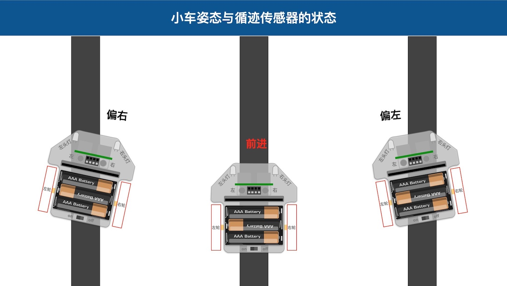

图6-12 小车姿态与循迹传感器状态

根据上图所示，如果小车向右偏离路线我们应该如何纠偏呢？向左偏离时又如何纠偏呢？如下图，当我们达到道路末端时，循迹传感器的状态是怎样？
如何让酷比特小车绕自身中心调头呢？

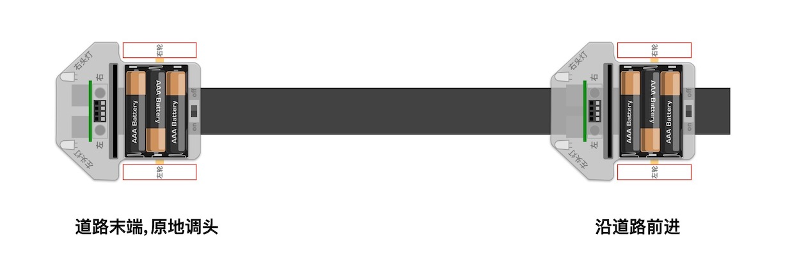

图6-13 到达道路末端

当我们简单地分析这几种特殊情况之后，有助于掌握下面的示例程序中的关键逻辑和代码。本示例的准备工作非常简单，
请使用前示例所用的黑色胶带围成的封闭边界作为本次循迹的“指定路线”。

.. code-block::  C
  :linenos:

  import time
  import random
  from hiibot_bluefi.basedio import Button, NeoPixel
  from hiibot_cutebot import Cutebot

  car = Cutebot()
  button = Button()
  pixels = NeoPixel()

  #  stop car one second
  car.stop()
  carspeed = 30
  time.sleep(1)
  carrun = True

  car.pixels.brightness = 0.1
  car.pixels.fill((0,0,0)) # two pixels on the bottom set to RED
  car.pixels.show()
  colors = [(255,0,0), (255,255,0), (0,255,0), (0,0,255)]

  st = time.monotonic()

  def roundColors():
      global st
      if (time.monotonic() - st) < (1 if carrun==True else 5):
          return
      st = time.monotonic()
      t=colors[0]
      for ci in range(3):
          colors[ci] = colors[ci+1]
          car.pixels.fill(colors[ci])
      colors[3] = t
      car.pixels.fill(colors[3])
      car.pixels.show()

  def searchBackLine():
      global car
      for steps in range(360):
          rdir = random.randint(0, 2)
          if rdir==0:
              car.move(2, carspeed)
          else:
              car.move(3, carspeed)
          time.sleep(0.005)
          if not car.rightTrackSensor or not car.leftTrackSensor:
              # backlin be searched by any sensor
              car.stop()
              return True
      car.stop()
      return False

  def ssButton():
      global carrun
      button.Update()
      if carrun and button.B_wasPressed:
          print("stop")
          carrun = False
          return 2  # stop
      if not carrun and button.A_wasPressed:
          print("start")
          carrun = True
          return 1  # start
      return 0      # hold the current status

  while True:
      ssButton()
      if searchBackLine() and carrun:
          print("start to track this backline")
          while True:
              ssButton()
              if not carrun:
                  car.stop()
                  time.sleep(0.1)
                  continue
              # two sensors is above backline, go on
              if not car.rightTrackSensor and not car.leftTrackSensor:
                  car.motor(carspeed, carspeed)
              # left sensor is above backline, but right sensor missed backline, thus turn left
              elif not car.leftTrackSensor:
                  car.motor(carspeed//3, carspeed)
              # right sensor is above backline, but left sensor missed backline, thus turn right
              elif not car.rightTrackSensor:
                  car.motor(carspeed, carspeed//3)
              # two sensors missed backline, thus stop car and search backline
              else:
                  car.stop()
                  print("black line is missing, need to search the black line")
                  break
              time.sleep(0.01)
              roundColors()
      else:
          print("failed to search backline")
          while True:
              pass

程序代码看起来很长！为了帮助你理解程序语句的作用，请分析下面的流程图，并对照程序代码、执行程序时小车的行为。

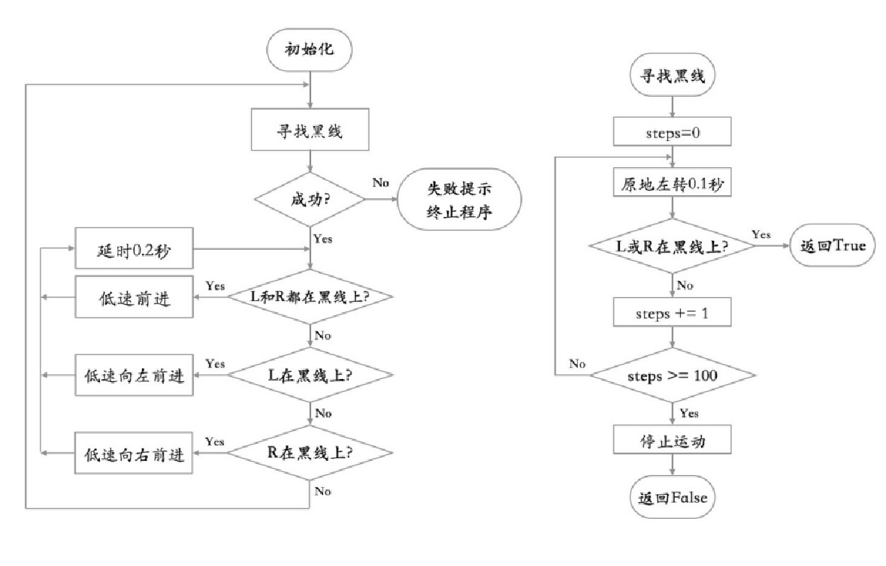

图6-14 循迹小车程序流程图

左边的流程图讲解的是整个示例程序，而右边的流程图介绍的是寻找黑线的过程，即程序中的searchBackLine函数。

虽然示例程序看起来很长，我们增加的彩光效果和按钮控制开启/停车等逻辑占用将近一半的代码，真正的循迹控制逻辑只是在嵌套循环的内循环体中。
此外，本示例程序中包含一个容错处理，被定义成子程序searchBackLine。该子程序可以实现：
当酷比特小车的两个循迹传感器都未检测到“指定路线”的黑色道路时，
小车将自动开始绕自身中心旋转，找到黑色道路后再继续沿路行驶。

你也可以试一试如下图所示的“指定路线”，你能预测自己的酷比特小车会如何行驶？

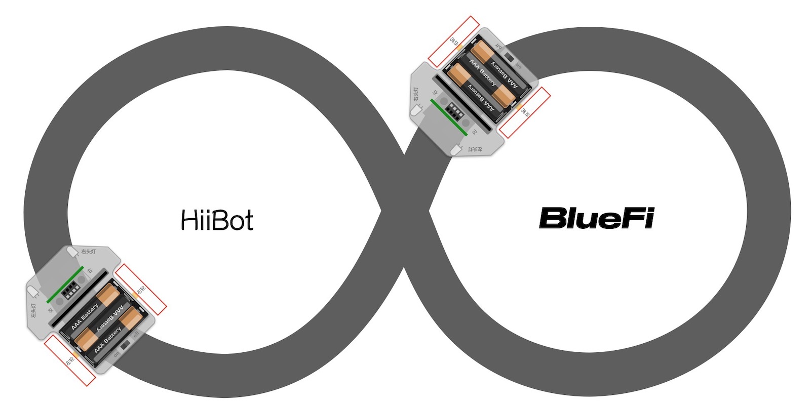

图6-15 ∞型循迹路线

事实上，企业车间的仓库分为原料仓库、半成品仓库、成品仓库等多种，生产工位较多，如何实现多点物料搬运？需要我们去探索，
下面的几张图是多点物料搬运问题的抽象图例，你可以使用黑色胶带或不干胶绘制这些图中的“指定路线”，
编程实现沿着这些“指定路线”自动搬运物料的小车。

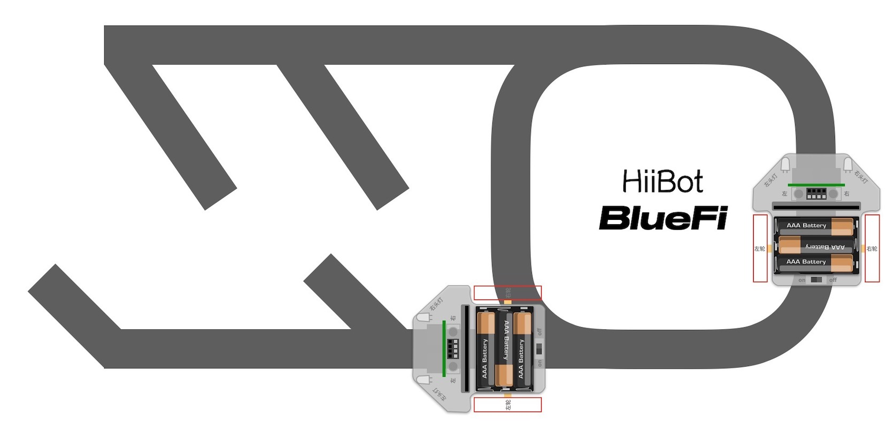

图6-16 物料搬运路线一

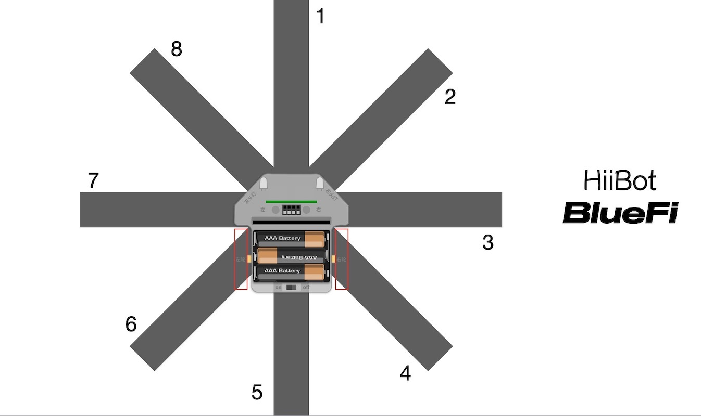

图6-17 物料搬运路线二

6.4.5 避障小车
=====================

如果小车在行驶过程中遇到障碍物怎么办？譬如有人正好站在行驶路线上，此时小车绝对不能直接撞上去。问题是，小车如何知道前方有人？
酷比特小车带有一个超声波传感器，能够检测2公分到4米距离内的障碍物。下面我们修改前一个示例实现这一功能：
当酷比特小车的行驶方向有障碍物时，让酷比特小车自动停下来，直到障碍物被移除。

.. code-block::  C
  :linenos:

  import time
  import random
  from hiibot_bluefi.basedio import Button, NeoPixel
  from hiibot_cutebot import Cutebot

  car = Cutebot()
  button = Button()
  pixels = NeoPixel()

  #  stop car one second
  car.stop()
  carspeed = 30
  time.sleep(1)
  carrun = True

  car.pixels.brightness = 0.1
  car.pixels.fill((0,0,0)) # two pixels on the bottom set to RED
  car.pixels.show()
  colors = [(255,0,0), (255,255,0), (0,255,0), (0,0,255)]

  st = time.monotonic()

  def roundColors():
      global st
      if (time.monotonic() - st) < (1 if carrun==True else 5):
          return
      st = time.monotonic()
      t=colors[0]
      for ci in range(3):
          colors[ci] = colors[ci+1]
          car.pixels.fill(colors[ci])
      colors[3] = t
      car.pixels.fill(colors[3])
      car.pixels.show()

  def searchBackLine():
      global car
      for steps in range(360):
          rdir = random.randint(0, 2)
          if rdir==0:
              car.move(2, carspeed)
          else:
              car.move(3, carspeed)
          time.sleep(0.005)
          if not car.rightTrackSensor or not car.leftTrackSensor:
              # backlin be searched by any sensor
              car.stop()
              return True
      car.stop()
      return False

  def ssButton():
      global carrun
      button.Update()
      if carrun and button.B_wasPressed:
          print("stop")
          carrun = False
          return 2  # stop
      if not carrun and button.A_wasPressed:
          print("start")
          carrun = True
          return 1  # start
      return 0      # hold the current status

  while True:
      ssButton()
      if searchBackLine() and carrun:
          print("start to track this backline")
          while True:
              ssButton()
              dist_cm = car.distance
              if not carrun or dist_cm < 15:
                  car.stop()
                  time.sleep(0.1)
                  continue
              # two sensors is above backline, go on
              if not car.rightTrackSensor and not car.leftTrackSensor:
                  car.motor(carspeed, carspeed)
              # left sensor is above backline, but right sensor missed backline, thus turn left
              elif not car.leftTrackSensor:
                  car.motor(carspeed//3, carspeed)
              # right sensor is above backline, but left sensor missed backline, thus turn right
              elif not car.rightTrackSensor:
                  car.motor(carspeed, carspeed//3)
              # two sensors missed backline, thus stop car and search backline
              else:
                  car.stop()
                  print("black line is missing, need to search the black line")
                  break
              time.sleep(0.01)
              roundColors()
      else:
          print("failed to search backline")
          while True:
              pass

如果你细心地对比以下上面的代码与前一个示例的代码，你会发现为了让正在行驶AGV不会直接撞上自己前方突然出现的障碍物，
我们只是修改修改了第71行和第72行程序，第71行语句是将酷比特小车的超声波测距传感器的“酷比特与前方障碍物之间距离赋予变量“dist_cm”，
然后把第72行原来的“判断是否按下停车按钮”的单逻辑修改为“或”逻辑：“按下停车按钮”或“与障碍物之间距离小于15(cm)”，
如果这个“或”逻辑的结果为“True”，让酷比特停车，并跳过无穷循环的后续程序块。

并将整个小车放在黑色胶带上方，等待我们的程序正式开始运行后，用你的手掌放在酷比特行驶路线前方来模拟障碍物，观察酷比特的反应。

6.4.6 遥控小车
====================

经过前几个小节的程序，我们基本上已经了解了酷比特小车的各种用法，接下来，让我们回到开头所说的遥控小车吧，这将用到上一节中所介绍的手柄扩展板。

在编写遥控小车程序之前，我们需要知道在手柄和小车之间，该建立哪种通讯方式。常见的设备之间的通讯方式有蓝牙通讯、红外线通讯、基础无线电通讯等。
蓝牙通讯和红外线通讯都是基于无线电通讯的原理，但二者的传输距离、穿透性、传输速度等特点各不相同。在本小节中，仅介绍最基础的无线电通讯方式，
如果你忘了无线电通讯的知识点，可以重新回顾一下“Radio通讯”章节中的内容。

1. 手柄(发送方)
------------------

首先是手柄的程序：

.. code-block::  C
  :linenos:

  import time
  from hiibot_bluefi.basedio import Button
  from adafruit_ble_radio import Radio
  from hiibot_bluefi.screen import Screen
  from hiibot_joystick import Joystick

  screen = Screen()
  joy = Joystick()
  button = Button()
  rfc = Radio(channel=8)

  radio_flag = 0 
  show_data = screen.simple_text_display(title="BlueFi Car", title_scale=2, text_scale=2,title_color=(0, 0, 255))
  show_data[1].text = "Radio:  Unconnected"
  show_data[2].text = "Car Status: "
  show_data.show()

  def start_or_end():
      global radio_flag
      button.Update()
      if button.A_wasPressed:
          rfc.send('start')
          show_data[1].text = "Radio:  Connected"
          radio_flag = 1
      if button.B_wasPressed:
          rfc.send('end')
          radio_flag = 0
          show_data[1].text = "Radio:  Unconnected"

  def joy_button():
      global joy_flag
      joy.Update()
      if radio_flag == 1:
          if not joy.D:
              show_data[4].text = "       forward"
              rfc.send('forward')
          elif not joy.C:
              show_data[4].text = "        left"
              rfc.send('left')
          elif not joy.E:
              show_data[4].text = "        back"
              rfc.send('back')
          elif not joy.F:
              show_data[4].text = "       right"
              rfc.send('right')
          else:
              show_data[4].text = ""
              rfc.send('stop')

  while True:
      start_or_end()
      joy_button()

虽然看起来这一段程序比较长，但其本质上是在发送每一个按键对应的信息。“D”是前进，“C”是左转，“A按钮”是建立无线电连接……
下面以流程图的形式帮助大家理解该示例程序：

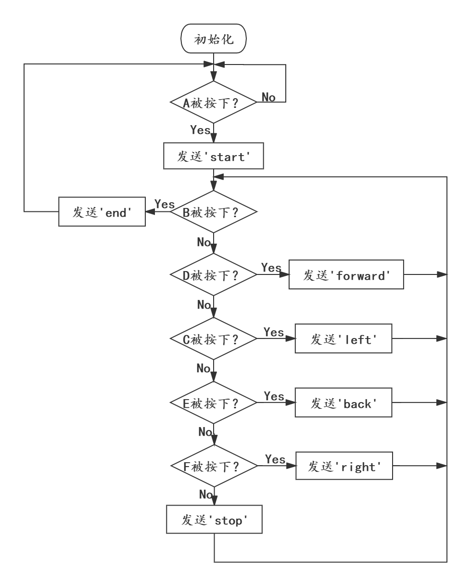

图6-18 遥控手柄程序流程图

可以看出，joy_button函数是手柄控制程序中的主要部分，用来发送控制小车运动的信号。将程序保存到BlueFi后，把BlueFi插入手柄扩展板中，
在BlueFi的屏幕上会显示各种信息：Radio通讯是否建立(Connected)，也就是手柄能否控制小车的运动；小车当前的运动状态——前进(forward)、左转(left)……

现在你已经知道了如何使用手柄来发送控制信号，你可以先试着按下A键，之后再按下手柄上的四个按键，对照着流程图观察LCD屏上显示的信息。
如果我们同时按下2个按键会发生什么？

2. 小车(接收方)
---------------------

下面是小车作为接收方的程序：

.. code-block::  C
  :linenos:

  import time
  from adafruit_ble_radio import Radio
  from hiibot_cutebot import Cutebot

  rfc = Radio(channel=8)
  car = Cutebot()
  carspeed = 60

  start_signal = False
  backward_flag = False

  car.pixels.fill((0,0,0))
  car.pixels.show()
  colors = [(255,0,0), (255,255,0), (0,255,0), (0,0,255)]
  st = time.monotonic()

  def forward():
      global carspeed,backward_flag
      backward_flag = False
      car.motor(carspeed, carspeed)

  def back():
      global backward_flag
      backward_flag = True
      car.motor(-carspeed, -carspeed)

  def forward_left():
      car.motor((carspeed+10)//4, (carspeed)//2)

  def forward_right():
      car.motor((carspeed)//2, (carspeed+10)//4)

  def backward_left():
      car.motor(-(carspeed+10)//4, -(carspeed)//2)

  def backward_right():
      car.motor(-(carspeed)//2, -(carspeed+10)//4)

  motor_direction = {
      'b_forward':forward,
      'b_back':back,
      'b_forward_left':forward_left,
      'b_forward_right':forward_right,
      'b_backward_right':backward_right,
      'b_backward_left':backward_left,
  }

  def roundColors():
      global st
      if (time.monotonic() - st) < 0.5:
          return
      st = time.monotonic()
      t=colors[0]
      for ci in range(3):
          colors[ci] = colors[ci+1]
          car.pixels.fill(colors[ci])
      colors[3] = t
      car.pixels.fill(colors[3])
      car.pixels.show()

  def move_receive():
      global rmsg_bytes,start_signal

      if rmsg_bytes == b'forward':
          return 'b_forward'

      if rmsg_bytes == b'back':
          return 'b_back'

      if rmsg_bytes == b'left' and backward_flag == True:
          return 'b_backward_left'
      elif rmsg_bytes == b'left':
          return 'b_forward_left'

      if rmsg_bytes == b'right' and backward_flag == True:
          return 'b_backward_right'
      elif rmsg_bytes == b'right':
          return 'b_forward_right'

      if rmsg_bytes == b'stop':
          car.stop()

  while True:
      rmsg = rfc.receive_full()
      if start_signal:
          roundColors()
      else:
          car.pixels.fill((0,0,0))
          car.pixels.show()
      if rmsg:
          rmsg_bytes = rmsg[0]
          if start_signal:
              if move_receive() in motor_direction:
                  motor_direction[move_receive()]()
          if rmsg_bytes == b'start':
              start_signal = True
          if rmsg_bytes == b'end':
              start_signal = False

本示例程序的代码较长，你可以借助手柄的操控以及下面的流程图并对照着程序理解其含义：

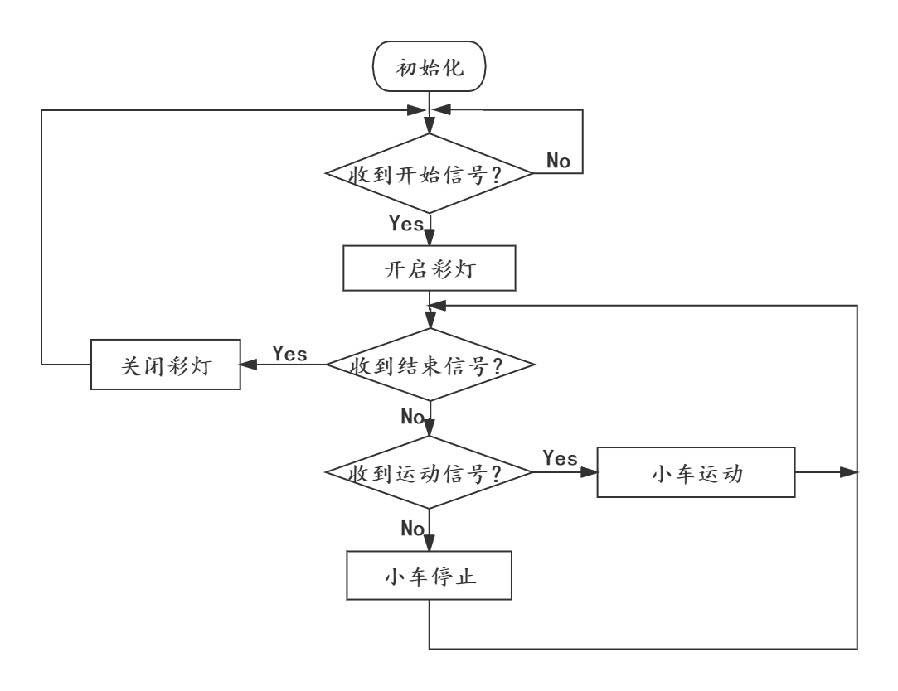

图6-19 遥控小车程序流程图

只要你学过“Radio通讯”那一节，你肯定能理解该小车程序中有关无线电信息接收的部分程序，也就是流程图中的“收到开始信号”、“收到运动信号”……
开始信号和结束信号在程序中很容易就能找到，但运动信号有哪些呢？

在本示例程序中用motor_direction字典保存了小车的各种运动信号，字典中的键名对应move_receive函数的各种返回值，而值对应返回值的运动函数。
字典的作用是将接收到的运动信号与相应的运动函数联系在一起。例如返回值'b_forward'对应forward函数、返回值'b_forward_left'对应forward_left函数……

将程序保存到BlueFi中，并将BlueFi插入到酷比特小车。把手柄和酷比特小车(需要两块BlueFi)都接上电源，在程序运行完成后，
按下插在手柄扩展板上的BlueFi的A键，此时，如果酷比特小车底盘的两颗彩灯开始发光，说明手柄和小车之间的无线电通讯已经建立，
你可以使用手柄上的四个按键来控制酷比特小车的运动。如果想断开手柄和小车之间的联系，可以断开电源或按下手柄扩展板上BlueFi的B键。
此时，酷比特小车不受手柄按键控制，小车底盘彩灯关闭。

我们只是用了BlueFi上的无线电功能就可以实现遥控小车的控制程序，而在BlueFi上还有各种传感器模块：光学传感器、加速度计、地磁计等，
借助这些传感器，我们还能实现更多有趣的交互程序，你会用哪些模块来丰富小车的功能呢？

