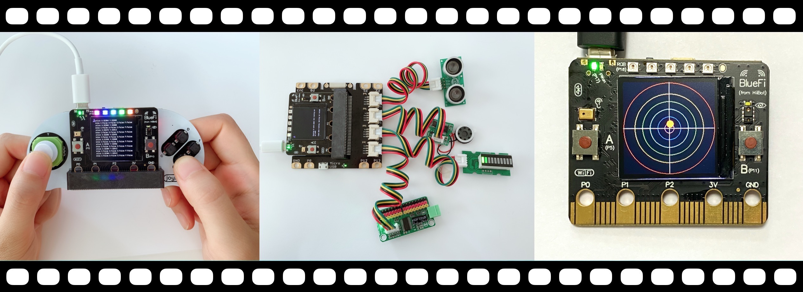
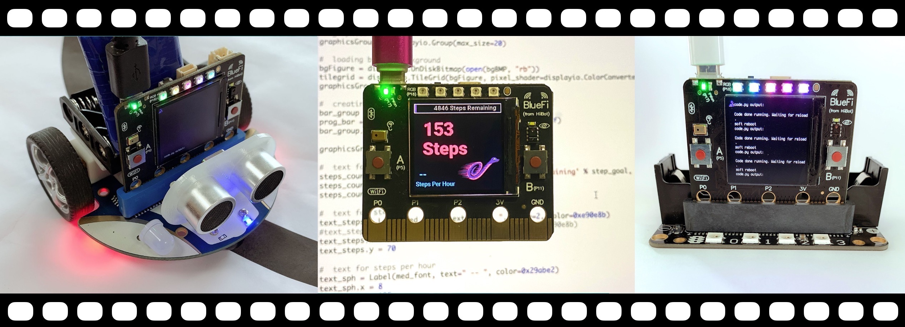
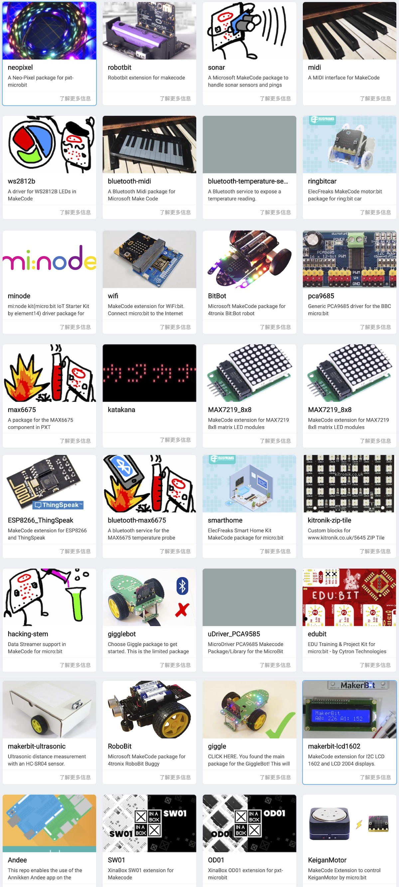

============================
第6章 使用microbit扩展板
============================

microbit单板机以其简单易用为特色，支持图形化语言的在线编程环境——makecode(源自Microsoft的PXT开源项目)，Python脚本语言(MU编辑器)等。
全球很多开源社区都有丰富的microbit周边资源，包括各种扩展板、小车底盘、机器人功能板等硬件资源。
全新设计的BlueFi在计算性能和网络连通性等方面远超micrbit，但仍保留microbit硬件接口，
目的是借助于丰富的microbit周边快速搭建高性能的AI边缘计算应用原型。

由于microbit的40-Pin金手指拓展接口上定义了19个可编程I/O引脚，每一个引脚都可以定义为DI/DO/PWM等模式，部分引脚具有模拟输入功能，
部分引脚还可以用作I2C/SPI/UART通讯接口，使用microbit专用的40-Pin拓展插槽连接器，利用这些引脚可以实现遥控手柄、彩灯条/阵列、
传感器、按钮、喇叭等I/O扩展板。据不完全统计，全球microbit周边多达300+种。

在本章中将对其中的部分扩展板进行介绍，使用遥控手柄控制小车、使用MQTT远程控制机械臂运动...

.. toctree::
   :maxdepth: 1

   c6-1.rst
   c6-2.rst
   c6-3.rst
   c6-4.rst
   c6-5.rst
