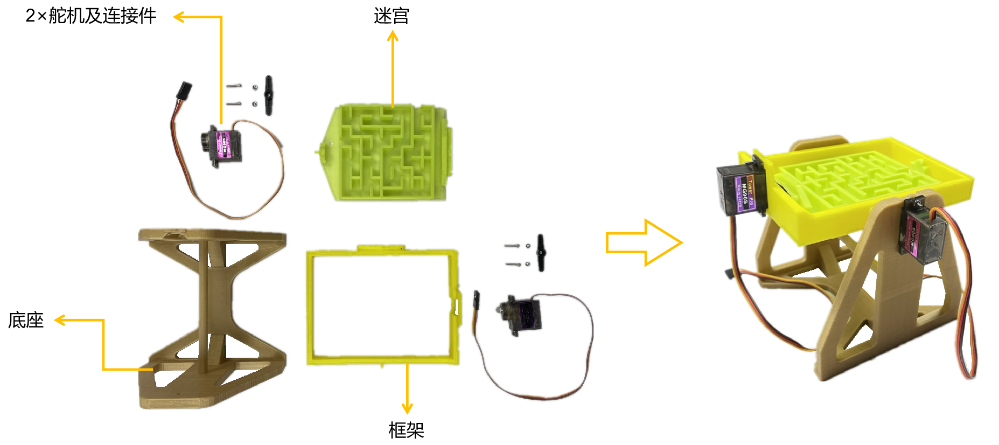
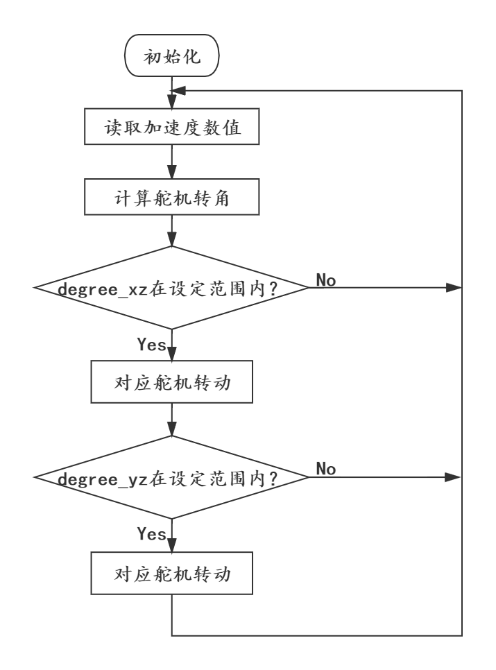
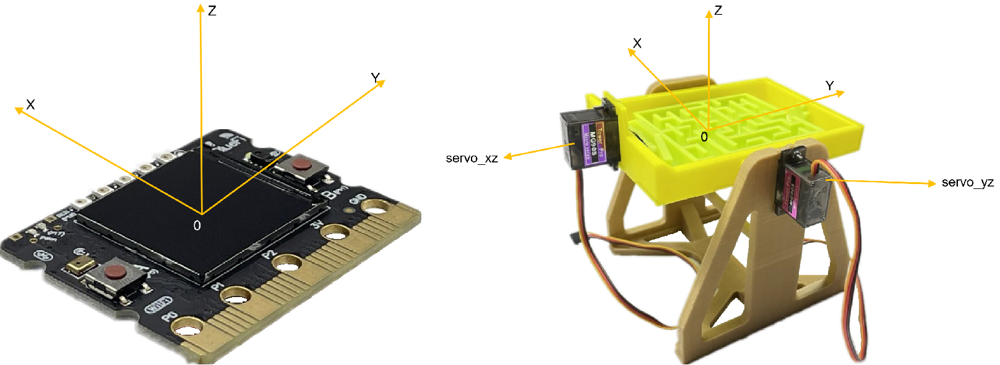
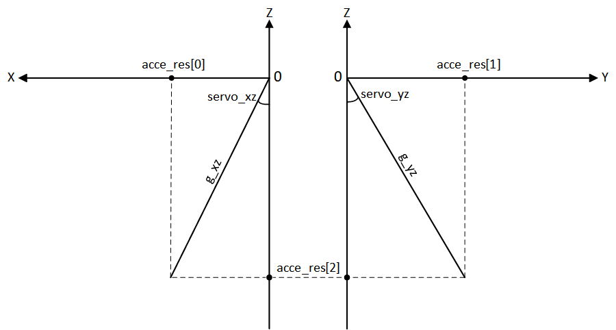

======================
7.1 遥控迷宫
======================

随着5G时代的到来，让远程实时手术成为可能，即使医生与患者相隔万里，也不会对手术的实施造成阻碍。所谓远程手术也就是说，
医生根据现场传来的实时影像进行手术操作，其一举一动都可转化为数字信息传递至远程患者处，控制当地的医疗机器人做出相应动作，
这对影像的实时性要求非常高。这种远程操作的形式可以避免医生的长途奔波，并且为病人能及时得到救治提供更大的可能性。

类似的遥控机器人还有很多，在许多人类无法靠近而又需要人类的经验和智慧去主导操作进行的危险场合，这类能够准确跟随人类动作的机器人也能派上大用场。

在本次的项目中，我们依靠BlueFi所完成的项目与上述的遥控机器人有着异曲同工之妙。我们将遥控一个迷宫，使它的倾角可以随着BlueFi倾角的改变而改变，
从而帮助迷宫内的小球走出迷宫。

7.1.1 搭建迷宫
=========================

在介绍BlueFi上的控制程序之前，我们需要先将模型搭建好。模型整体由4个部分组成：底座、框架、迷宫、2个舵机及连接件，其实物模型如下图所示：

图7-1 遥控迷宫实物图

这个项目的模型结构并不复杂，相信大家能一眼看出其中的原理，由两个舵机来分别驱动迷宫的两个转动自由度，使得迷宫可以自由地改变自身的倾角。
当然，这得在BlueFi控制程序的帮助下实现。

7.1.2 遥控迷宫编程
==========================

从实物中可以看出，我们主要是对两个舵机的转角进行编程控制，因此，需要用到在第6章中的介绍过的RobotBit扩展板来驱动舵机，
下面是该项目的完整程序：

.. code-block::  C
  :linenos:

  import time
  import math
  from hiibot_robotbit import RobotBit
  from hiibot_bluefi.sensors import Sensors

  sensors = Sensors()
  maze = RobotBit()

  pi = 3.1415926
  degree_x = 0
  degree_y = 0
  acce_compare = [0,0,0]
  acce_res = [0,0,0]

  maze.Servo(8,90)
  maze.Servo(1,90)

  def filter_acce():
      filter_flag = 1
      while filter_flag:
          for n in range(0,3):
              acce = sensors.acceleration
              acce_compare[n] = acce[n]
              time.sleep(0.01)
              acce = sensors.acceleration
              if abs(acce_compare[n] - acce[n]) > 0.05:
                  acce_compare[n] = acce[n]
                  filter_flag = 0
      return acce_compare[0],acce_compare[1],acce_compare[2]

  def servo_degree():
      servo_xz =0
      servo_yz =0
      acce_res[0] , acce_res[1] , acce_res[2] = filter_acce()
      g_xz = math.sqrt(acce_res[0]**2 + acce_res[2]**2)
      g_yz = math.sqrt(acce_res[1]**2 + acce_res[2]**2)
      servo_xz = math.asin(acce_res[0] / g_xz) / pi * 180
      servo_yz = math.asin(acce_res[1] / g_yz) / pi * 180
      return servo_xz , servo_yz

  while True:
      degree_xz , degree_yz = servo_degree()
      if -30< degree_xz <30:
          maze.Servo(1,-degree_xz + 90)
      if -30< degree_yz <30:
          maze.Servo(8,degree_yz + 90)
      time.sleep(0.01)

将上述程序保存到BlueFi的磁盘中，连接好各个部件，通上电源并倾斜手中的BlueFi，观察迷宫的倾斜状况，迷宫的姿态是否成功受到BlueFi的控制？
为帮助大家更好的理解程序流程，下面是该项目程序的流程图，你可以对照着流程图理解上述程序中各段代码的含义：

图7-2 遥控迷宫流程图

从程序中可以看出，本项目的实现思路是利用BlueFi的加速度计获取3个轴上的加速度数值来感知BlueFi当前的姿态，
并将姿态数值经过公式转换为两个舵机上的转角，从而实现对迷宫姿态的控制。

有关程序开始部分的导入模块和初始化变量的内容，在此不再赘述。下面，将对程序中的两个函数——filter_acce()、servo_degree()作详细介绍，
这两个函数是本项目中最为重要的部分。

1. filter_acce()
---------------------

由于加速度计在读取3个轴上的数值时，即使保持BlueFi的姿态不变，其数值还是会存在波动，因此，就像处理摇杆的漂移一样，
需要设计一个“死区”函数来降低数值波动导致的舵机转角波动，即对加速度数值进行滤波操作。

在filter_acce()中，通过设定一个标志位“filter_flag”来判断当前的加速度变化是否属于波动的范围内，
若“acce_compare[n]”(上一时刻的加速度数值)与“acce[n]”(当前时刻的加速度数值)之间的差值大于0.05(最大波动范围)，
则认为当前的加速度变化是人为造成的，修改“acce_compare[n]”的值并退出“while filter_flag:”无穷循环，返回“acce_compare[n]”的数值。
若二者的差值小于0.05，则保持当前的加速度数值不变，忽略波动。(最大波动范围是通过观察BlueFi静止时数值的波动得出的。)

通过filter_acce()，我们可以得到较为稳定的加速度数值用于后续的舵机转角计算。

2. servo_degree()
----------------------

在servo_degree()中，主要是在计算两个舵机的转角值。由于servo_degree()中涉及到了三维坐标系下直线与坐标轴夹角的计算，
为了帮助大家理解计算公式的推导过程，下图是迷宫与BlueFi相对应的空间直角坐标系，
坐标系上的X、Y、Z三个轴分别代表BlueFi在X、Y、Z三个方向上的加速度值，箭头方向即为加速度的正方向。

图7-3 加速度坐标轴

在上图中标出了该函数的返回值——servo_xz和servo_yz与舵机的对应关系，这两个值也分别对应第41～47行无穷循环中的变量degree_xz和degree_yz。

在BlueFi加速度计的帮助下，我们可以轻松获得BlueFi当前姿态下3个方向(X、Y、Z)上的加速度数值，其总的合成加速度始终等于重力加速度(约等于9.8)。
由于servo_xz是BlueFi绕Y轴的转角，servo_yz是BlueFi绕X轴的转角，它们的值可以分别用重力加速度在xz平面和yz平面上的投影与Z轴的夹角表示，
如下图所示：

图7-3 servo_xz和servo_yz

你可以对照着程序中的第35～37行的代码，将其中的各个变量与上图中的参数一一对应。g_xz和g_yz分别对应着重力加速度g在XZ平面和YZ平面的投影；
acce_res列表从0到2分别代表经过滤波之后的X、Y、Z方向上的加速度值；servo_xz和servo_yz即为求得的舵机转角。

计算的思路是先根据已知的加速度数值(acce_res[n])求解得到g_xz和g_yz，再使用反三角函数math.asin()求解得到servo_xz和servo_yz。

7.1.3 小结
=====================

在本次的“遥控迷宫”项目中，我们运用了BlueFi上的加速度计来获取BlueFi的姿态并通过RobotBit扩展板控制两个舵机的转角，
从而使得迷宫的姿态与BlueFi的姿态保持一致，实现对迷宫姿态的遥控。在项目的实现过程中涉及到了使用RobotBit扩展板驱动舵机、
消除加速度数值抖动和求解BlueFi转角这三部分内容，尤其是后两部分内容，需要理解它们的编程思路。

“遥控迷宫”只是对实际的遥控机器人的一种简化模型，虽然它也能够实现简单的遥控操作，但其遥控距离受到连接线的限制且控制方式有限，
该如何对它进行改进呢？改进的方向可以是：摆脱连接线的限制，改用无线控制；增加迷宫的运动自由度；……

你会对它进行什么样的改进呢？
