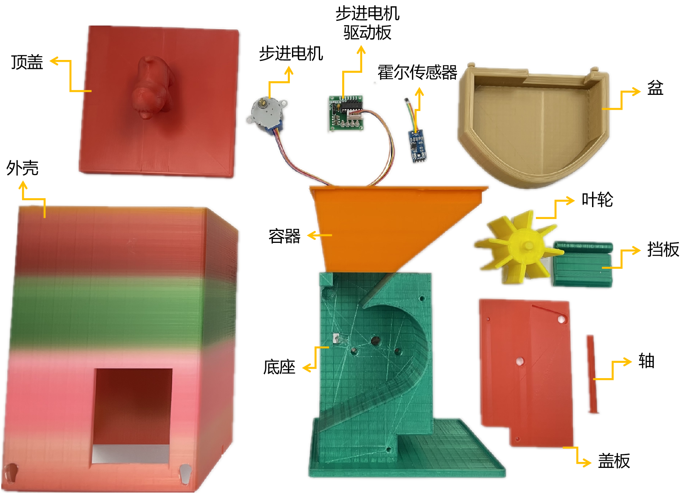
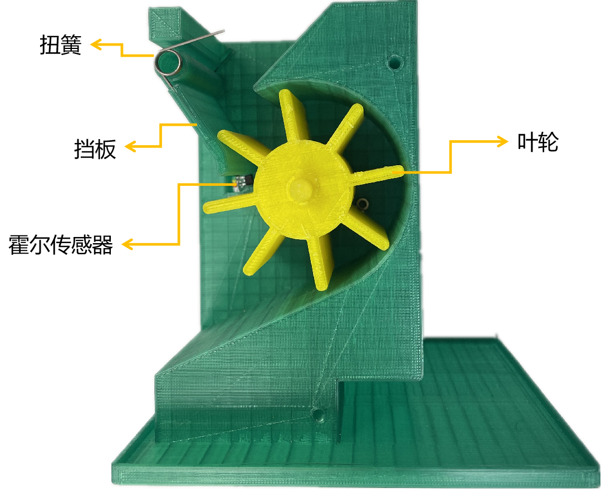
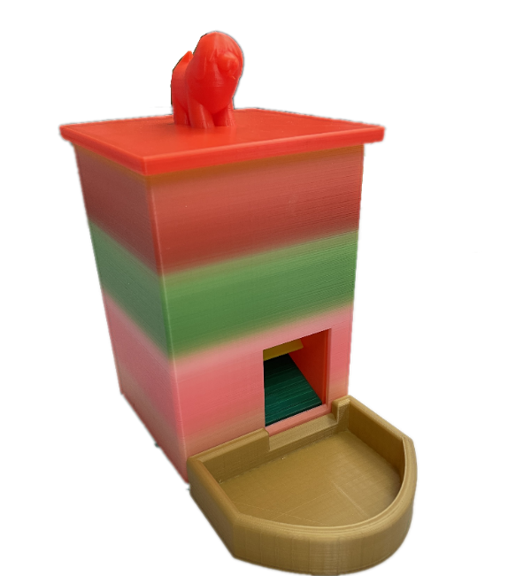
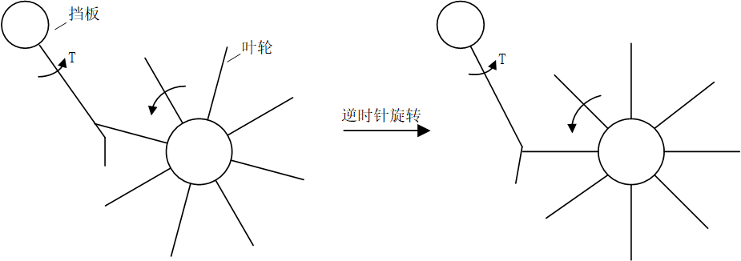
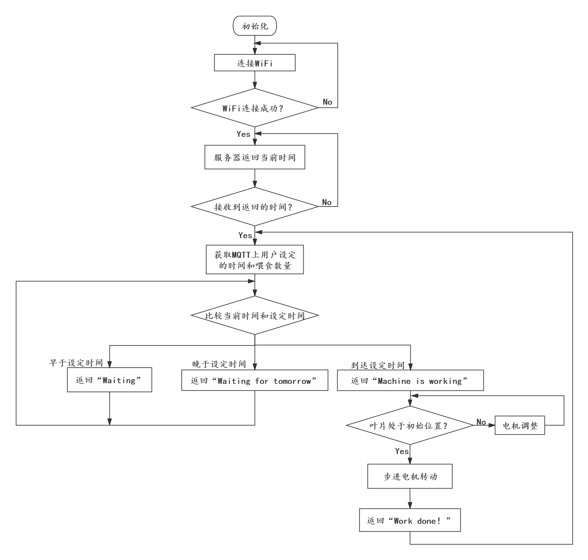
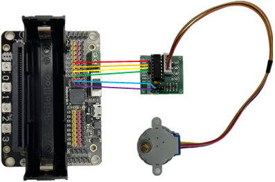
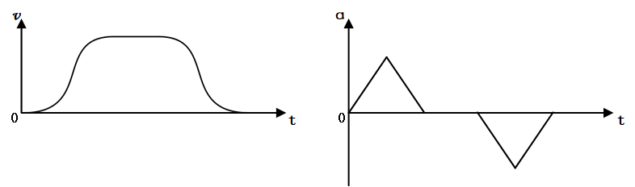
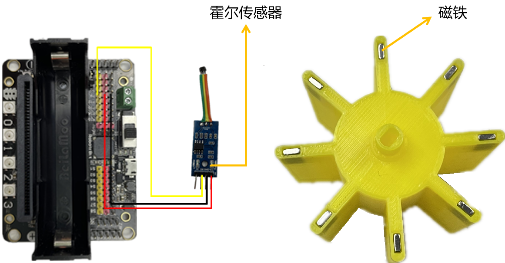

==============================
7.2 宠物喂食器
==============================

先进科技产品的应用提高了人们的生活品质，在家庭生活中，智能化的产品能够替代人完成一些必需的家务，譬如扫地机器人、自动洗碗机和智能窗帘，它们将人从繁琐、
无聊的家务劳动中解放出来，给予人更多的时间享受生活。

对于喂养宠物的家庭来说，每天定时投放猫粮狗粮是一个麻烦的问题。一旦主人出差、旅游或其他情况在一段时间内不在家，宠物就需要邻居或是其他人帮助喂养。
因此，许多家庭会选择购买一个能够自动给宠物投放食物的装置。在本次项目中，通过对模型搭建和程序编写两个方面的讲解来帮助大家制作宠物喂食器。

7.2.1 模型搭建
====================

尽管模型所需的部件较多，但实际上与喂食功能相关的主要是叶轮、挡板、步进电机及其驱动板和霍尔传感器。宠物喂食器所需的全部部件如下的拆解图所示：

图7-5 拆解图

下图是部分零件的装配图，通过下图你可以直观地认识到宠物喂食器的工作过程。叶轮的转动由步进电机控制，步进电机及其驱动板被安装在该装配图所示模型的背面。

图7-6 部分零件装配图

宠物喂食器整体的展示效果如下图所示：

图7-7 宠物喂食器

握住顶盖处的“小狗”把手可以将顶盖提起，然后把狗粮(或其它宠物食品，下文以狗粮代替各种宠物食品)倒入容器中，通过控制步进电机的转角可以控制叶轮旋转，叶轮的旋转将带动狗粮落入盆中，从而实现喂食功能。
上述就是自动喂食大致的操作过程，而在实际的设计阶段，我们发现宠物喂食器会经常性地出现卡粮(狗粮无法正常落下)的情况，为了避免卡粮的频繁发生，
我们对叶轮结构做了各种改进，最终选择了图7-6所示的“叶轮+挡板”结构，其结构简图如下所示：

图7-8 叶轮结构简图

这里以“叶轮推动挡板”这一结构来解决卡粮问题。挡板始终绕着一根固定轴转动，并在挡板的转轴上安装了扭簧，使得挡板始终受到逆时针的扭矩T。
叶轮在步进电机的驱动下转动，从初始位置逆时针转动推动挡板作顺时针的转动，当叶片位于水平位置时，挡板到达左端极限位置，而后受扭簧的扭矩作用逆时针回转。
这一过程能有效地分离两部分的狗粮，在避免了“卡粮”的同时，也保证了未分离的狗粮不会泄露。

7.2.2 要求分析
==================

在编写程序之前，我们需要了解程序所要满足的要求有哪些。
根据调查，不到6个月的宠物狗一天喂食三次较为合适，而成年的宠物狗一天喂养两次较为合适，这就对喂食装置提出了第一个要求——定时喂食。
由于宠物自身并不会克制自己进食的欲望，因此我们需要对投放的食物量加以控制，根据宠物的年龄和体重科学喂食，这也是对喂食装置的第二个要求——定量喂食。

1. 定时功能
--------------

定时功能无非就是比较当前时间与设定时间是否相等，它实现步骤可以分为三步：第一步，获取当前时间；第二步，设定定时时间；第三步，
比较当前时间和定时时间是否相等，并返回比较结果。

在前面的“WiFi”章节中，我们已经了解了如何联网获取实时时间，而借助“MQTT”章节的内容告诉我们可以通过MQTT来设定定时时间。
在得到以上两个时间参数后，便可以对它们的“时”和“分”分别进行比较，根据比较结果作出相应的反应。

2. 定量功能
--------------

根据前面“模型搭建”小节中叶轮的结构和喂食过程的介绍可以得出，定量功能的实现与步进电机的转角密切相关。步进电机的转角越大，则狗粮的量就越大。
因此，定量功能的实现主要就是对步进电机转角大小的控制。

由于转动角度的最小值为两个相邻叶片之间的夹角，因此，定量的精度与叶轮叶片的个数有直接的联系，叶片个数越多，可定量的最小值就越小，
喂食的量就越准确，但可储存狗粮的空间(相邻叶片之间的凹槽)也就越小。经过综合的考虑，本项目选择的叶片个数为8。

7.2.3 程序编写
================

根据上一小节中对定时和定量的要求，我们得到如下的程序：

.. code-block::  C
  :linenos:

  import time
  import rtc
  import board
  from hiibot_bluefi.wifi import WIFI
  from hiibot_bluefi.mqtt import MQTTClient
  from digitalio import DigitalInOut,Direction

  wifi=WIFI()
  the_rtc = rtc.RTC()
  set_amount=0
  set_hour=0
  set_minute=0
  motor_status=1

  #Configure P12,P13,P14,P15 as output mode
  signal1=DigitalInOut(board.P12)
  signal2=DigitalInOut(board.P13)
  signal3=DigitalInOut(board.P14)
  signal4=DigitalInOut(board.P15)

  signal1.direction = Direction.OUTPUT
  signal2.direction = Direction.OUTPUT
  signal3.direction = Direction.OUTPUT
  signal4.direction = Direction.OUTPUT

  #Hall sensor
  signal5 = DigitalInOut(board.P8)
  signal5.direction = Direction.INPUT

  n4 = [0,1,1,1,0,0,0,0]
  n3 = [0,0,0,1,1,1,0,0]
  n2 = [0,0,0,0,0,1,1,1]
  n1 = [1,1,0,0,0,0,0,1]

  #connect to wifi
  while not wifi.esp.is_connected:
      try:
          wifi.wifi.connect()
      except RuntimeError as e:
          print("could not connect to AP, retrying: ", e)
          continue
  print("Connected to", str(wifi.wifi.ssid, "utf-8") )

  #Calibrate the current time once
  TIME_API = "http://worldtimeapi.org/api/ip"
  response = None
  while True:
      try:
          print("Fetching json from", TIME_API)
          response = wifi.wifi.get(TIME_API)
          break
      except (ValueError, RuntimeError) as e:
          print("Failed to get data, retrying\n", e)
          continue

  json = response.json()
  current_time = json["datetime"]
  the_date, the_time = current_time.split("T")
  year, month, mday = [int(x) for x in the_date.split("-")]
  the_time = the_time.split(".")[0]
  hours, minutes, seconds = [int(x) for x in the_time.split(":")]
  year_day = json["day_of_year"]
  week_day = json["day_of_week"]
  is_dst = json["dst"]
  now = time.struct_time( (year, month, mday, hours, minutes, seconds, week_day, year_day, is_dst) )
  the_rtc.datetime = now

  #Get set time
  def cb_testTopic1(message):
      global set_amount,set_hour,set_minute,motor_status
      print(message)
      mqttClient.publishMessage("/status_response","Set successfully !")
      time.sleep(2)
      motor_status=1
      dict_message=eval(message)
      set_amount=dict_message["amount"]
      set_hour=dict_message["hour"]
      set_minute=dict_message["minute"]

  mqttClient = MQTTClient(wifi=wifi, server="www.hiibotiot.com")
  mqttClient.subscribeTopic("/setting_message", cb_testTopic1)
  mqttClient.connect()

  #StepperMotor
  def steppermotor_output(a_pulse,all_pulse):  #param: acclecration pulse,all pulse
      v_max = 1000                             #Maximum frequency is 0.001
      a_max = v_max*2 / a_pulse
      aa = a_max / (a_pulse / 2)
      a = [None] * a_pulse
      v1 = [None] * a_pulse
      a[0] = aa
      v1[0] = aa
      for i in range(1,a_pulse // 2):
          a[i] = a[i-1] + aa

      for i in range(a_pul
      se // 2,a_pulse):
          a[i] = a[i-1] - aa

      for i in range(1,a_pulse):
          v1[i] = v1[i-1] + a[i]

      v2 = [v_max] * (all_pulse - a_pulse * 2)
      v3 = v1[a_pulse-1::-1]
      v_all = v1 + v2 + v3

      m=0
      for r in range(all_pulse):
          if r % 8 == 0:
              m = 0
          signal4.value,signal3.value,signal2.value,signal1.value = n4[m],n3[m],n2[m],n1[m]
          m = m + 1
          time.sleep(1 / v_all[r])

  #Compare the set time with the current time，The time interval is the value in the sleep
  while True:
      mqttClient.loop()
      if the_rtc.datetime.tm_hour < set_hour :
          mqttClient.publishMessage("/status_response","Waiting")
      elif the_rtc.datetime.tm_hour == set_hour :
          if the_rtc.datetime.tm_min<set_minute :
              mqttClient.publishMessage("/status_response","Waiting")
          elif the_rtc.datetime.tm_min==set_minute :
              if motor_status :
                  mqttClient.publishMessage("/status_response","Machine is working")
                  while signal5.value == 1 :
                      steppermotor_output(24,64)
                      mqttClient.publishMessage("/status_response","Calibrating")
                      time.sleep(0.3)
                  steppermotor_output(96,512*set_amount)   #Stepper motor work，4096 pulses are needed for one revolution
                  mqttClient.publishMessage("/status_response","Working is done")
                  motor_status = 0
          else:
              mqttClient.publishMessage("/status_response"," Waiting for tomorrow")
      else:
          mqttClient.publishMessage("/status_response","Waiting for tomorrow")
      time.sleep(5)

尽管程序的总体较长，但实际上在程序的第1～82行中，除了初始化各种变量之外，
有关连接WiFi、校准本地时间、连接MQTT和MQTT收到信息的回调函数的内容在本书的第5章中都有讲解过。因此，在对该项目程序的讲解中，将不再赘述这些内容。
下面，让我们先以流程图的形式对它的整体编程思路作简要了解：

图7-9 流程图

从上述的流程图中可以看出，程序可以分为两大部分——驱动步进电机和时间比较，分别对应于前面提到过的两个要求——定量和定时。
下面将从这两个方面来对该项目程序作介绍。

1. 驱动步进电机(定量)
----------------------

与前面“机器人扩展板”章节中直接调用“RobotBit”类中的“StepperDegree()”方法不同的是，为了能够自定义步进电机转动的精度，
在本次项目中采用普通的I/O口直接驱动步进电机，因此需要用到步进电机驱动板来增强输出功率。步进电机驱动板与RobotBit扩展板的接线图如下所示例程序代码如下：

图7-10 步进电机驱动板与RobotBit扩展板的接线图

28BYJ-48步进电机的输入脉冲规律请查看“机器人扩展板”章节中的图6-4。
每输入一个脉冲，步进电机所转过的角位移称为步距角，输入的脉冲数量越多，角位移越大，输入脉冲的频率越快，角速度越大。
通过改变每一相电平变化的延时时间，来改变输入脉冲的频率，从而控制步进电机的角速度。

由于步进电机在转动时可能会存在失步的情况(失步是指输入脉冲的个数与步进电机实际的角位移不对应，步进电机丢失了一定的步数)，
因此，我们需要让步进电机采用S曲线进行加速和减速从而有效地避免在加减速阶段的失步。此时步进电机的速度和加速度曲线如下图所示：

图7-11 步进电机的速度和加速度曲线

有关改变步进电机相邻脉冲之间的时间间隔的程序位于第85～113行对“steppermotor_output”函数的定义中，该函数是通过对加速度和速度的计算获得相邻脉冲之间的延时时间，
通过改变延时时间使得步进电机的速度呈S曲线变化。使用“steppermotor_output”函数控制的步进电机在转动时将具有上图所示的速度和加速度规律，从而有效地避免失步的发生。

在无穷循环中的第129行代码“steppermotor_output(96,512*set_amount)”执行的就是驱动步进电机操作，入口参数中的第一个参数“96”代表的电机转动时加速和减速过程所需脉冲个数；
第二个参数“512*set_amount”中的512代表步进电机转过相邻两个叶片之间的夹角所需的脉冲个数，而“set_amount”则是用户在MQTT上输入的喂食数量(1,2,3……)，
两者相乘就是本次喂食过程中步进电机所需的总的脉冲个数。

由于每次投放的狗粮数量与叶轮的初始位置也存在关联，因此，为了获得准确的投放量，需对叶轮每次转动后的位置进行控制。
在本次项目中选用霍尔传感器来标定叶轮每次转动后的位置。
霍尔传感器的原理是：当霍尔传感器所处的磁场变化时，由霍尔效应产生的电势差也会发生变化。将霍尔传感器固定在所需要的位置上(图7-6)，
在叶轮的端部嵌入磁铁。当叶轮远离传感器时，传感器模块输出高电平，当叶轮靠近传感器时，传感器输出低电平。通过对高低电平的检测，
就可以判断是否到达指定位置。霍尔传感器的接线和叶轮磁铁的安装如下图所示：

图7-12 霍尔传感器的接线和磁铁的安装示意图

在程序中的第125～128行“while signal5.value==1 :”循环中，通过不断地调用“steppermotor_output(24,64)”控制步进电机转动一个小角度，
直到叶轮的叶片达到标定位置，从而保证叶轮在每一次转动之前的初始位置保持不变。

2. 比较时间(定时)
---------------------

在比较当前时间与设定时间之前，我们需要先依次获取当前时间与设定时间。当前时间的获取在“WiFi”章节中已经被介绍过，
它的主要实现程序位于本项目程序中的第45～66行处，当前时间的数值(时、分、秒等)存放在“the_rtc.datetime”变量中。
而设定时间的获取则需借助MQTT的回调函数来读取用户输入的设定时间，有关回调函数“cb_testTopic1”的定义位于第69～78行。从它的定义中可以看出，
用户的设定时间的格式需满足字典的格式，该字典的键依次为"amount"、"hour"、"minute"，分别控制叶轮转动的格数、设定时间的小时、设定时间的分钟。
例如用户的输入如下所示：
    {"hour":16,"minute":30,"amount":2}

表示在当前时间到达16:30时，叶轮旋转两格。

时间的比较环节位于无穷循环中的第117～135行，使用if语句块依次比较当前时间和设定时间的时和分，进而判断步进电机是否应该工作。
但是这样会产生一个问题，由于我们没有比较“秒”，可能会存在在当前分钟内步进电机工作两次或更多的情况，为了避免发生这样的问题，
我们在代码的第13行和代码的第131行加入了表示步进电机状态的变量motor_status，0表示已工作，1表示等待工作。再看第123行，它代表如果motor_status为0，
则步进电机将不再工作，直到接收到新的设定时间。因此在前面“cb_testTopic1”的回调函数中，
我们加上了第74行“motor_status = 1”来重置步进电机的工作状态。

7.2.4 小结
==============

在本次的“宠物喂食器”项目中，主要涉及到了联网获取时间、使用MQTT传输消息、步进电机的I/O驱动、霍尔传感器的使用这四个方面的内容，
目的是实现我们对宠物喂食器定时和定量的要求。实现的思路很简单：到达定时时间后，控制步进电机转动设定的角度。

本次的项目只是市场上售卖的宠物喂食器的简化版本，功能上无法与市场上的相比，你可以借鉴着市场上成熟的产品来对你的宠物喂食器进行更新。譬如，
如何对多个时间段进行定时和定量？

除了喂养宠物，家庭生活中还有许多可以应用智能化设备的情景：“智能温度调节”、“空气湿度自动调节”……
这些都可以借助BlueFi来实现，不妨开动脑筋自己来设计一款智能产品。

