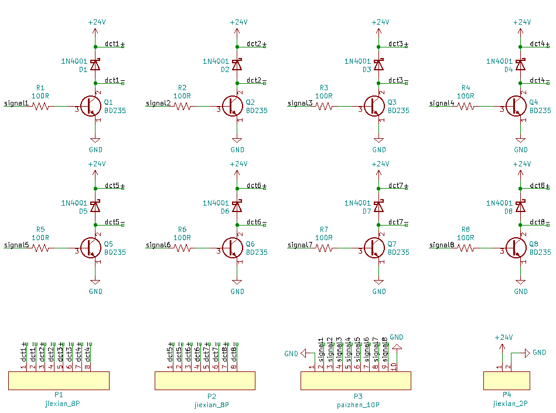

======================
7.3 音乐作曲家
======================

在前面章节的学习中，我们了解了如何借助BlueFi的触摸按钮(P0、P1、P2)和喇叭根据自行设定的midi号和节拍数发出相应的旋律，
这基本满足我们对于编曲的需要。但由于触摸按钮的个数有限，如果要模拟一长串的歌曲旋律，我们需要为BlueFi外接扩展模块来增加“触摸按钮”的个数，
增加的数量与歌曲的长度有关，歌曲的长度越长，所要增加的个数就越多。显然，这是十分不方便的。

为了避免上述情况的发生，同时也为了模拟一个更加真实的编曲环境，在本次项目中我们改用木琴作为发声器件，以木琴上的8个音阶为基础来创作曲目。
使用的敲击器件为推拉式电磁铁，因此，我们的编程思路就从原先的控制喇叭的音调改为了控制电磁铁电流的通断。

下图是“音乐作曲家”的整体展示：

图7-13 音乐作曲家

将模型正面的外壳取下，其内部的示意图如下图所示：

图7-14 内部示意图

下面，我将从电路搭建、外壳模型设计和程序编写三个方面来指导大家如何制作属于自己的“音乐作曲家”。

7.3.1 电路搭建
=================

由于控制电磁铁所需的电流较大，无法使用BlueFi的IO口直接控制电磁铁，因此，我们需要外接电源来提供电磁铁的工作电压，同时也需要一个能满足小信号控制大信号条件的电路。
在本次项目中，选用的是三极管开关电路来控制电磁铁，电路示意图如下：

图7-15 三极管开关电路

由于电磁铁是一种感性的电子元件，在工作时会储存电势能，因此，需要在它的两端并联上一个二极管来释放它储存的电势能。24V电源、电阻R、
二极管和三极管参数的选择取决于你使用的电磁铁的参数，参数选择的目的是让三极管处于饱和导通或截止状态。本次项目使用的电磁铁参数为：
额定工作电压为24V，额定工作电流为700mA，最大推拉力为35N。

如果你会使用AD、KiCad这类电路原理图绘制软件，你可以参考下面的电路原理图去进行绘制pcb板：

图7-16 电路原理图

如果不会使用上述软件也没关系，只需按照图7-15中的电路将各个元器件(共八组)用导线焊接在一起也可以实现控制电路，并不影响最终的实现效果。

本次项目中我们使用的是pcb板，将元器件焊上去之后的展示图如下所示：

图7-17 pcb板

7.3.2 外壳模型设计
===================

为了避免将连接线直接暴露在外面影响美观性，同时也是为了将电磁铁固定在木琴琴键的正上方，我们需要设计相应的外壳模型：

图7-18 外壳模型

模型的设计思路很简单：利用螺钉将电磁铁固定在“外壳二”和“外壳三”上，“外壳三”将电磁铁包住，只露出电磁铁的两端，再将控制电路板和扩展板固定在“外壳二”上，
最后用“外壳一”将电路板和导线包住，“外壳一”与“外壳二”之间固定的螺钉位于二者的侧面。这样，就完成了“音乐作曲家”的外壳设计。

7.3.3 程序编写
================

在本章的开始部分也提到过编程的思路为控制8个电磁铁上电流的通断，也就是控制BlueFi金手指上引出的8个IO口的电平信号。
因此，程序的编写思路可以简单概括为：选出BlueFi的8个IO口->将它们与8个电磁铁对应->控制IO口电平信号(控制电磁铁电流的通断)

下面是“音乐作曲家”的完整程序：

.. code-block::  C
  :linenos:

  import time
  import board
  from digitalio import DigitalInOut, Direction

  do_low = DigitalInOut(board.P1)
  re = DigitalInOut(board.P2)
  mi = DigitalInOut(board.P3)
  fa = DigitalInOut(board.P4)
  so = DigitalInOut(board.P15)
  la = DigitalInOut(board.P6)
  xi = DigitalInOut(board.P7)
  do_high = DigitalInOut(board.P8)

  musical_note = [do_low, re, mi, fa, so, la, xi, do_high]
  for note in musical_note:
      note.direction = Direction.OUTPUT
      note.value = 0

  time_wait = 0.5     #两个音之间的停顿时间
  time_strick = 0.02  #电磁铁的通电时间

  #乐谱
  music = [1,1,5,5,
          6,6,5,
          4,4,3,3,
          2,2,1,
          5,5,4,4,
          3,3,2,
          5,5,4,4,
          3,3,2,
          1,1,5,5,
          6,6,5,
          4,4,3,3,
          2,2,1,
          ]

  def musical_notation(key):
      musical_note[key-1].value = 1
      time.sleep(time_strick)
      musical_note[key-1].value = 0

  while True:
      for bar in music:
          musical_notation(bar)
          time.sleep(time_wait)
      time.sleep(1)

将上述程序保存到BlueFi的磁盘后，把BlueFi连接到扩展板上，接通电源，你将会听到电磁铁敲击木琴发出每个人都熟悉的旋律：一闪一闪亮晶晶，满天都是小星星……

由于木琴上的音阶共有八个，从左到右分别对应于程序中“musical_note”列表内的八个项，因此，在程序的第5～12行中，我们将八个音阶与这8个引脚联系在一起，
既是为了分别控制8个电磁铁，同时也是为了方便后续的编曲工作。

第37～40行程序定义了“musical_notation”函数来控制电磁铁上电流的通断，导通时间为time_strick。在上述程序中可以看到我设置的导通时间为0.02s，
为什么要将导通时间设置的这么短呢？有以下两点原因：一是因为电磁铁不能长时间导通，长时间的导通会导致电磁铁的线圈因发热过高而烧坏，
，通常单次电磁铁的导通时间应小于30s；二是由于木琴的发声原理是靠铁片的振动发声，电磁铁导通时间过长会抑制铁片的发声效果。

在定义完“musical_notation”函数后，只需将现有的music(乐谱)中的音阶依次作为入口参数传入该函数即可实现乐谱的自动播放，具体的实现程序为第80～82行，
使用for循环来遍历music列表。第82行中的“time_wait”变量控制的是相邻两个音阶之间的时间间隔。

7.3.4 小结
=============

在本次的“音乐作曲家”项目中，程序部分的实现是很简单的，只是用到了控制BlueFi的IO口输出高低电平信号的知识，而相对来说较难的部分是电磁铁控制电路的实现，
需要你对三极管或MOS管有一定的了解。从这个项目中也可以看出，创意项目的实现不仅需要你具备编程方面的知识，还要求具备一定的电路设计方面的知识。

借助本次项目的程序，你可以通过上网查找歌曲的乐谱来修改music列表内的项使得木琴演奏相应的歌曲，当然你也可以自己当一回音乐家来编写属于自己的歌曲。

由于程序中两个音之间的时间间隔相等，显然这只适合于具有简单旋律的歌曲，像“小星星”、“两只老虎”等。如果你想要编写旋律更为复杂的歌曲，
就需要对两个音之间的时间间隔进行修改，该如何对上述程序作修改使得任意两个音之间的时间间隔可调呢？
